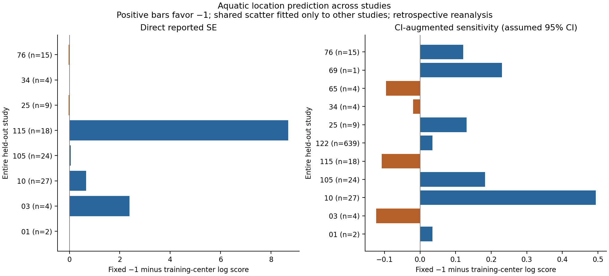

# Aquatic slope prediction across excluded studies

1 October 2026. This test compares a fixed normalized-biomass-spectrum slope of
−1 with a location learned from other studies. It excludes an entire study from
each fit and gives each study equal total weight. It extends the earlier
in-sample ensemble assessment with a transport check on published slope fits.
The source data were previously inspected: this is retrospective validation by
fitting separation, without new observations or a blinding claim.

## Resource, coordinate and eligible measurements

The resource is reported biomass, with object cost proportional to body mass.
The reference measure is logarithmic body mass. If normalized biomass per
linear mass interval is $b(m)\propto m^s$, resource per logarithmic interval is
$m b(m)\propto m^{s+1}$. The specified flat-resource slope is therefore $s=-1$.
This fixes the resource interpretation before fitting a location; it does not
infer a matching cost exponent from the observed slopes.

Selection uses the frozen GLOSSAQUA Size table: body-mass axes, the named
normalized biomass spectrum method, finite slopes and positive ordered size
bounds. All StudyID_07 rows are excluded because of known-invalid bounds;
their values are not corrected from the slopes. Source row numbers, study/sample
identities, mass/biomass units, carbon/dry/wet mass specifications, selection
flags and uncertainty routes are retained in [the membership record](../data/aquatic-study-transfer/2026-10-01/membership.json)
and [selected records](../data/aquatic-study-transfer/2026-10-01/selected-records.json).

| Analysis | Records | Studies | Error treatment |
|---|---:|---:|---|
| Primary | 103 | 8 | Direct finite positive `SlopeSE` |
| CI sensitivity | 747 | 11 | Direct SE preferred; otherwise CI width/3.92 |
| Point sensitivity | 923 | 15 | No error imputation or error model |

The [authors' metadata](https://bura.brunel.ac.uk/bitstream/2438/32237/8/Ersoy_et_al_2025_Metadata_S1.pdf)
distinguishes slope standard deviation from standard error, but does not
specify the confidence-interval levels in the bounds' field definitions.
Width/3.92 assumes a 95% Gaussian interval and belongs in sensitivity analysis.
`SlopeSD` is never substituted for SE. Availability of SE selects a convenience
subset; it does not establish representative coverage. The CI sensitivity adds
other studies, including a 639-record study, so changes between analyses cannot
be attributed solely to interval conversion. Naming one fitting method does
not fully harmonize the underlying sampling and body-mass conventions.

## Training and prediction

For each excluded study, every remaining study has equal total weight and
its rows have equal weights within that study. With $K$ training studies and
$n_s$ rows in study $s$, $w_i=1/(K n_s)$. Training moments give

$$\hat\mu=\sum_iw_i y_i,\qquad
\hat\tau^2=\max\{0,\sum_iw_i(y_i-\hat\mu)^2-\sum_iw_i SE_i^2\}.$$

The primary comparison uses forecasts
$N(-1,\hat\tau^2+SE_i^2)$ and
$N(\hat\mu,\hat\tau^2+SE_i^2)$ for the excluded study. Sharing the same training
spread isolates the location choice. A third diagnostic uses −1 with measurement
error alone, without extra scatter. Held-study slope values enter no training
parameter; their reported SEs condition the predictive diagnostics.

Each study's score is its mean log predictive density, then these scores are
averaged equally across studies. Every fold is retained. Folds have overlapping
training sets, so there is no independent-fold significance test or confidence
interval for the aggregate. The spread estimator is descriptive noise
subtraction, not a proof of unbiased ecological heterogeneity. Plug-in
predictive intervals omit parameter uncertainty.

Secondary checks compare observed reported-slope fractions within
$\log(F)/\log(m_{\max}/m_{\min})$ of −1 with the Gaussian forecast probabilities,
for fixed factors $F=1.25$ and $2$. These are point-slope endpoint-drift diagnostics,
not full-profile equivalence decisions. The uncertainty-free sensitivity uses
all eligible slopes and compares −1 with the training median of study medians,
scored by held-study mean absolute error.

## Results

The [numerical record](../results/aquatic-study-transfer/study.json) and
[fold table](../results/aquatic-study-transfer/folds.csv) retain fitted parameters,
per-study scores, coverage and endpoint checks.

| Analysis | Fixed −1 mean log score | Learned-center mean log score | Fixed minus learned | Fixed wins |
|---|---:|---:|---:|---:|
| Direct-SE primary | −3.3618 | −4.8330 | +1.4712 | 6/8 studies |
| CI sensitivity | −1.8055 | −1.8855 | +0.0800 | 7/11 studies |

The primary average advantage is skewed: StudyID_115 and StudyID_03 account for
about 94% of its total. Its median per-study advantage is only 0.0391. Some
training folds have zero estimated extra scatter after subtraction of large
reported errors; the resulting Gaussian tails make relative scores sensitive
to modest center changes. The supplied errors are retained without inventing
corrections. Source-specific uncertainty auditing could change this model.

An audit of [the author-hosted Sellanes et al. paper, Fig. 4](https://levin.ucsd.edu/people/photos/neira/Sellanes%20et%20al.%20ENSOmacrof_07)
confirms that StudyID_34's large error values match the figure's `SE_slope`
labels. The displayed slope/error pairs do not readily reconcile with its
displayed regression p-values under ordinary slope t-test assumptions. The
uncertainty calibration remains unresolved; directly reported SE is not
independently validated SE. The completed analysis retains the reported values.

Absolute calibration remains poor. The primary nominal 95% interval covers
66.96% of reported slopes under the fixed-center forecast, versus 65.57% under
the learned center, with equal-study weighting. Measurement-only −1 gives
38.21% coverage and mean log score −11.6365. Its failure concerns the joint
assumptions of flat true slopes, calibrated reported errors, Gaussian observation
noise and compatible conventions; it cannot isolate ecological departures.

The CI sensitivity has coverage 86.62% and 84.26% for fixed and learned centers.
In the uncertainty-free sensitivity, mean absolute errors are 0.39830 for −1
and 0.39983 for the learned study-median center: little point-prediction difference.

The fixed center is a useful relative prediction in these declared comparisons.
The results do not establish a well-calibrated universal −1 model, individual
resource flatness or geometric dimensionality. Published slopes do not supply
the full resource profiles needed to distinguish curvature and sampling effects.
A distribution centered near −1 can coexist with highly unequal resources in
individual systems or an unequal pooled arithmetic resource spectrum.

## Reproduction and retained record

The [specification](../data/aquatic-study-transfer/2026-10-01/study-specification.json)
records the input checksum, configuration, code bundle, environment and explicit
retrospective status. Six focused tests check study weighting, excluded-study
leakage, shared scatter, uncertainty routing and retained-source counts.

~~~bash
make aquatic-study-transfer PY=python3.11
make registry-verify PY=python3.11
~~~

Matching results are reused without replacing registered bytes. A changed
analysis requires a new configuration/run ID and fresh data/output directories.
The [registry](run-registry.md) labels these as reanalysis of retained empirical
measurements, with zero newly collected observations. The source-specific notices
in [data/NOTICE.md](../data/NOTICE.md) remain applicable.
