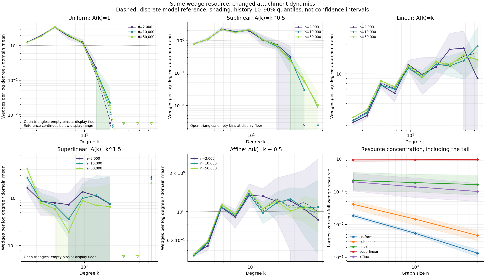
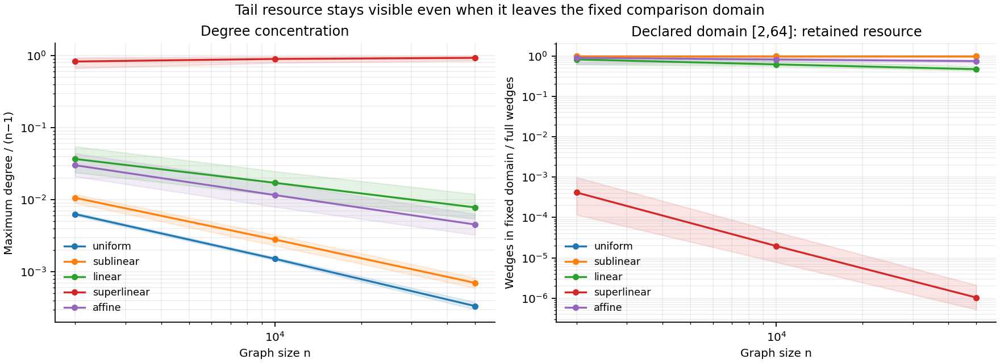

# Transferring wedge resource across attachment dynamics

1 October 2026. The same independently defined wedge resource changes from a
concentrated low-degree profile, through an asymptotically neutral tail, to
condensation when attachment dynamics change. This benchmark makes that transfer
explicit at increasing graph sizes, with discrete references and full-tail
resource accounting.

The [configuration](../configs/attachment_study_2026-10-01.json) was saved before
the benchmark run. Its seed, five kernels, sizes, resource, degree domain, and
reference cutoff are retained in the [numerical report](../results/attachment/attachment-study.json),
along with a SHA-256 of the configuration and software versions. It is an
exploratory computational specification, not an externally registered protocol.

## 1. The resource and growth rule remain explicit

Each graph starts from a single undirected edge. A new vertex adds **one** edge
to an existing vertex, selected with weight

$$A(k)=k^\gamma+a,\qquad k\ge1,\quad \gamma\ge0,\quad a>-1.$$

There are eight independent growth histories per kernel. Each history is sampled
at 2,000, 10,000, and 50,000 vertices, so different sizes within a history are
dependent snapshots. Histories use independent seed streams. A Fenwick tree
implements exact weighted selection in $O(n\log n)$ time and $O(n)$ working
memory. The largest benchmark uses 400,000 insertions per kernel.

Every comparison retains

$$q(k)=\binom{k}{2}=\frac{k(k-1)}2.$$

This counts unordered neighbour pairs centered at a vertex. Summing it counts
centered wedges, whether or not the endpoints are linked. Its asymptotic cost
scaling dimension is two relative to degree. It is a combinatorial resource,
with an additive graph total, rather than a conserved input to graph growth.

The fixed profile domain is degree $[2,64]$, divided into ten logarithmic bins.
Degree-one vertices carry zero wedge resource. Degrees above 64 can carry a
large fraction of the full resource; that fraction is measured explicitly.
Full graph totals, maximum degree, top-vertex and top-one-percent wedge shares,
excluded vertex counts, and excluded resource are recorded. Empty bins remain
in the output. Zero-count bins and zero-resource bins have separate fields.

The model basis is [Krapivsky, Redner, and Leyvraz (2000), *Connectivity of Growing
Random Networks*](https://arxiv.org/html/cond-mat/0005139v2). Their one-link
attachment model has geometric tails for constant attachment, stretched
exponential tails for sublinear kernels, a power-law boundary at linear
attachment, and condensation for superlinear attachment. Its equations 1–4
give the rate equation and linear/sublinear limiting recurrences. This benchmark
uses that one-link setting throughout; the earlier study's two-link graph is a
separate model.

## 2. Exact finite discrete reference where the expectation closes

Let $N_k(t)$ count degree-$k$ vertices when the graph contains $t$ vertices, and
let $S_t=\sum_j A(j)N_j(t)$. Conditional on the graph history $\mathcal F_t$,
the exact expected count increment is

$$E[N_k(t+1)-N_k(t)\mid\mathcal F_t]
=\delta_{k1}+
\frac{A(k-1)N_{k-1}(t)-A(k)N_k(t)}{S_t},$$

with no inflow from degree zero. The seed has $N_1(2)=2$.

For constant attachment, $S_t=(1+a)t$. For affine attachment, $A(k)=k+a$ and
the tree degree budget gives $S_t=(2+a)t-2$. Both normalizers are deterministic.
Writing $C_k(t)=E[N_k(t)]$ therefore gives the **exact finite recurrence**

$$C_k(t+1)=C_k(t)+\delta_{k1}+
\frac{A(k-1)C_{k-1}(t)-A(k)C_k(t)}{S_t}.$$

The forward calculation tracks degrees through 1,024. Lower-degree counts are
exact even when higher degrees are omitted: vertices only move to higher degree,
and the full kernel normalizer is known. Missing expected count and missing
expected degree are reported rather than absorbed into a renormalized law.

The full expected wedge total $W_t=E[\sum_i q(k_i)]$ also closes. Increasing a
target's degree from $k$ to $k+1$ adds $k$ wedges. Consequently,

$$W_{t+1}-W_t=\frac{2(t-1)}t\quad\text{for constant attachment},$$

and

$$W_{t+1}-W_t=
\frac{2W_t+2(1+a)(t-1)}{(2+a)t-2}
\quad\text{for affine attachment},\qquad W_2=0.$$

These are exact expectations for the specified seed-edge tree. Tests check an
enumerable four-vertex case, finite count and degree budgets, and the agreement
between the wedge-moment calculation and the full degree-count calculation.

For nonlinear kernels, $S_t$ is random. Replacing
$E[N_k/S_t]$ by $E[N_k]/E[S_t]$ introduces a closure approximation. The code
rejects requests for a nonlinear exact finite expectation; it does not use that
replacement as an exact comparator.

## 3. Limiting references and prospective differences

For sublinear attachment, set $p_k=\lim N_k(t)/t$ and
$\mu=\lim S_t/t$. The limiting recurrence used by the reference calculation is

$$p_1=\frac{\mu}{\mu+A(1)},\qquad
p_k=\frac{A(k-1)p_{k-1}}{\mu+A(k)},\qquad
\mu=\sum_{k\ge1}A(k)p_k.$$

For $\gamma=0.5$, $a=0$, solving the self-consistency equation gives
$\mu=1.327248834727$. The reference cutoff at 1,024 has omitted probability
at numerical precision; a test verifies stability when doubling a smaller
cutoff. The full-wedge comparator uses $n$ times the cutoff-truncated limiting
second moment, rather than an exact finite expectation. Doubling its cutoff
from 1,024 to 2,048 leaves the per-vertex value
$\sum_k q(k)p_k=2.64928949209306$ unchanged to eleven decimal places in the
test. This is a limiting law, explicitly distinguished from the finite
reference. Constant attachment gives $p_k=2^{-k}$.

For $A(k)=k+a$, $\mu=2+a$, and the limiting density exponent is $3+a$.
In particular, the $a=0$ law is

$$p_k=\frac4{k(k+1)(k+2)}.$$

Using the fixed wedge resource gives

$$kq(k)p_k=2\frac{k(k-1)}{(k+1)(k+2)}\longrightarrow2.$$

Finite degree corrections and integer bin boundaries remain important in the
declared domain. The benchmark compares full binned finite references, without
using a fitted slope as proof of neutrality. With $a=0.5$, the exponent is 3.5
and the same wedge tail instead scales as $k^{-0.5}$ per log degree. The resource
definition and its asymptotic dimension remain fixed while allocation changes.

The superlinear case receives no stationary power-law reference. Its prospective
targets are increasing maximum-degree fraction and wedge concentration, together
with resource leaving the fixed degree domain. At finite sizes, competing large
vertices and delayed concentration remain possible; the simulations measure
them rather than imposing a one-hub outcome.

## 4. Results

At 50,000 vertices, means across the eight histories are:

| Kernel | Maximum degree / $(n-1)$ | Largest vertex's wedge share | Wedge fraction in $[2,64]$ | Empty bins after pooling |
|---|---:|---:|---:|---:|
| $A(k)=1$ | 0.000335 | 0.00134 | 1.000 | 3 |
| $A(k)=k^{0.5}$ | 0.000703 | 0.00463 | 1.000 | 0 |
| $A(k)=k$ | 0.00783 | 0.164 | 0.471 | 0 |
| $A(k)=k^{1.5}$ | 0.932 | 0.955 | $1.04\times10^{-6}$ | 2 |
| $A(k)=k+0.5$ | 0.00454 | 0.101 | 0.746 | 0 |

The fractions in this table are means of per-history ratios. The JSON also
records the resource-weighted pooled domain fraction, and the reference ratio
of expected domain resource to expected full resource. Those quantities can
differ when full resource totals vary between histories. The reference ratio
should be compared with `profile.pooled_domain_wedge_fraction`, which also
divides mean resource totals, rather than the mean per-history ratio.

Across sizes 2,000 to 50,000, sublinear maximum-degree fraction decreases from
0.0106 to 0.000703, and its top wedge share decreases from 0.0412 to 0.00463.
Superlinear maximum-degree fraction increases from 0.830 to 0.932, while top
wedge share increases from 0.931 to 0.955. At the largest size, the superlinear
top-share 10th–90th percentile range is 0.892–1.000. This spread retains finite
history variation, including competition between large vertices.

The fixed domain retains about $4.15\times10^{-4}$ of superlinear wedge resource
at 2,000 vertices and $1.04\times10^{-6}$ at 50,000. The domain-normalized
superlinear profile therefore describes a tiny residual resource population.
The concentration plot keeps the dominant resource visible. Domain normalization
alone would conceal its disappearance from the plotted interval.

At the largest size, pooled degree-count total-variation distances from the
applicable exact finite or limiting references are 0.00136 for uniform,
0.00126 for sublinear, 0.00154 for linear, and 0.00166 for affine attachment.
For the conditional wedge allocation within $[2,64]$, corresponding distances
are 0.00298, 0.00530, 0.0141, and 0.0153. These are descriptive simulation
agreement measures, without general-law significance tests or equivalence
decisions. Resource-weighted tails fluctuate more than the vertex counts.

Dashed curves use exact finite references for constant, linear, and affine
kernels, and the limiting recurrence for sublinear attachment. Shading shows
history 10th–90th percentiles relative to one pooled resource normalizer.
Open triangles mark zero pooled bins at a display floor; their data values
remain zero. The uniform panel uses a lower drawing limit based on its observed
positive profiles; tiny analytic reference tails continue below that display
range and retain their full values in JSON/CSV. The figures were rendered and
visually checked.

## 5. Scientific implication and next test

This transfer test gives a specific applicability condition for one resource
interpretation: pure linear one-link attachment supports asymptotically neutral
wedge allocation. Sublinear and superlinear interventions produce quantitatively
different outcomes with the wedge resource held fixed. Affine attractiveness
also changes tail allocation while retaining a power law. The model predictions
are established results of attachment theory; this benchmark tests their
relationship to the proposed resource framework and supplies reproducible
full-profile and concentration diagnostics.

The resulting programme can seek a larger class of dynamics that preserves the
same wedge allocation, or a separately justified physical invariant that explains
why the kernel approaches the required form. A prospective observational test
would estimate attachment behaviour independently from graph growth events,
freeze the wedge observable and degree domain, then predict a later graph's
degree and resource profiles. A claim that Nature selects linear attachment
would require that additional evidence.

## Reproduction

~~~bash
PYTHONPATH=src python3.11 experiments/run_attachment.py
PYTHONPATH=src python3.11 -m unittest discover -s tests -p 'test_attachment.py' -v
~~~

The [generator and reference implementation](../src/orthopolity/attachment.py),
[runner](../experiments/run_attachment.py), [tests](../tests/test_attachment.py),
and [CSV profiles](../results/attachment/profiles.csv) accompany this report.
All eight focused checks pass. The benchmark's five stochastic/reference
calculations took approximately twelve seconds in the review environment,
excluding plotting and initial font-cache setup.
