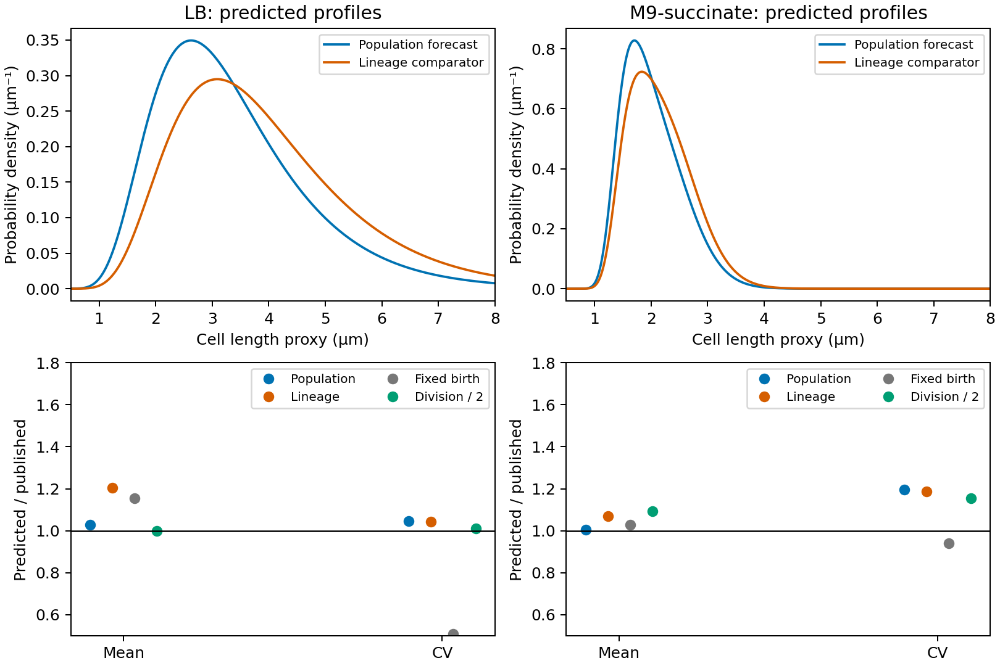

# Growth, division, and resource allocation in bacterial size distributions

Completed 8 October 2026. The mathematical bridge below is established
growth-fragmentation theory expressed in resource-allocation terms. The
empirical addition is an executed, retrospective transfer between published
birth-size measurements and separate population snapshots. No new cells were
measured and no population parameters were fitted.

## A mechanism with a specified comparison measure

Let $x$ be additive cell mass, growing deterministically as $\dot x=gx$ with
the same $g>0$ in every cell. Assume conservative symmetric binary division,
no death, and a balanced asynchronous population with finite mean mass. Total
mass and population number then grow at the same exponential rate $g$.
For division hazard $\beta(x)$, normalized population density $p_P$ satisfies

$$g p_P+(gx p_P)'=-\beta(x)p_P(x)+4\beta(2x)p_P(2x).$$

Multiplying by $x$ shows that $xp_P(x)$ solves the stationary chronological
lineage equation: division has one retained daughter, halved in size. After
normalization,

$$p_L(x)=\frac{xp_P(x)}{E_P[x]}.$$

Thus **the mass-weighted population size distribution equals the chronological
lineage size distribution**. This size tilt is established prior work, explicitly
derived and qualified by [Genthon (2022)](https://doi.org/10.1098/rsif.2022.0405),
Section 2.2 and its [revised exposition](https://arxiv.org/html/2206.06146v2).
It is not introduced here as a new theorem of cell biology.

Let $B,D$ be sizes at the beginning and end of completed lineage cycles.
Stationarity and symmetric division imply $D\overset d=2B$, not necessarily
$D=2B$ within each individual cycle. For monotone growth the fraction of cycles
crossing $x$ is

$$H(x)=P(B\le x<D)=F_B(x)-F_D(x)=F_B(x)-F_B(x/2).$$

Each crossing occupies time $dx/(gx)$, while mean cycle time is $\ln2/g$.
The renewal occupation identity and the size tilt therefore give

$$p_L(x)=\frac{H(x)}{x\ln2},\qquad
p_P(x)=\frac{2H(x)}{E[B^{-1}]x^2},\qquad
E_P[x]=\frac{2\ln2}{E[B^{-1}]}.$$

The normalized mass share per logarithmic size is

$$\frac{x^2p_P(x)}{E_P[x]}=\frac{H(x)}{\ln2}.$$

This identifies both the measure, $d\ln x$, and the constraint profile from
birth/division events. When every cycle crosses an interval, $H=1$ there and
mass is equal across equal logarithmic widths. For fixed birth mass $b$,
$p_P=2b/x^2$ on $[b,2b)$: the familiar inverse-square result. Variable birth
and division sizes alter the envelope; an exact plateau is not generally
present. A lognormal birth law has no strict plateau. The allocation claim
is therefore more informative as an envelope prediction than as a search for
an inverse-square slope over a selected interval.

For normalized probability densities $b_P,d_P$ of population-tree birth/division
event sizes (not event intensities per unit time), population balance also gives

$$\frac{d}{dx}[x^2p_P(x)]=x[2b_P(x)-d_P(x)].$$

Here the total division-event rate per cell equals $g$, which cancels the
common growth factor. Source-free intervals have a flat resource profile. These population event
densities must not be replaced by chronological event densities without the
sampling correction above. The resource profile is a stock across simultaneously
present cells; lineage duration is used to infer it, not counted as extra mass.

## Conditions that matter in nature

The common-growth assumption is stronger than a shared mean rate. Growth noise,
division asymmetry, size-dependent loss, and lineage-specific physiology change
the relation. With asymmetric partition, the corresponding lineage follows a
mass-biased daughter; an ordinary old-pole mother-machine trajectory need not
be that lineage. Genthon derives these distinctions. A balanced phase distribution
is also an assumption: perfectly deterministic synchronized cycles can oscillate
without approaching it. The proof is a statement about a stationary profile,
not a general convergence result.

The empirical source measures length $L$, not mass. Even for constant diameter
$d$, a spherocylinder has volume proportional to $L-d/3$, rather than exactly
$L$. Width, density, polar geometry, and fixation are not independently calibrated
here. The numerical study therefore tests a **length-proxy transfer model**.
It cannot certify a biomass plateau or explain deviations by selecting an
unmeasured correction after seeing the outcomes.

## Source, freeze, and calibration

[Gangan and Athale (2017)](https://doi.org/10.1098/rsos.160417) measured
*E. coli* MG1655 in mother-machine and batch settings at 37°C. We transcribe
the printed arithmetic means and variances of their lognormal fits in
Figure 2 (birth/division) and Figure 1 (batch snapshot), using official NCBI
images. The source authors retain credit for the experiments and original fits.

| Medium | Birth mean | Birth variance | Division mean | Division variance |
|---|---:|---:|---:|---:|
| LB | 2.7391 | 0.9419 | 5.2833 | 3.2094 |
| M9 + succinate | 1.4913 | 0.0540 | 3.2358 | 0.2084 |

Means are in micrometres; variances in square micrometres. These are fitted
moments, not log-space parameters or the slightly different sample statistics
quoted in the article prose. Calibration sample counts are 153/110 (LB
birth/division) and 133/68 (M9). The source summaries do not establish independent
replicates, complete uncensored cycles, or common individual growth rates.

The division mean divided by twice the birth mean is 0.9644 in LB and 1.0849
in M9; division/birth CV ratios are 0.9570 and 0.9054. Exact symmetric stationary
compatibility is therefore not satisfied by the separately fitted laws. We do
not subtract those incompatible lognormal CDFs and clip negative tails. Instead,
the primary conditional model uses the birth fit and imposes $D\overset d=2B$;
a separate, declared sensitivity uses the division fit divided by two.

The [protocol](cell-division-protocol.md), implementation, calibration sources,
and all four forecasts were hashed in
[the freeze](../data/cell-division/2026-10-08/freeze.json) before acquisition
of Figure 1. The source's qualitative findings and calibration measurements
had already been read. This separation protects the numerical comparison from
retuning; it is not external preregistration or global blinding. Dryad's raw
workbook returned HTTP 403, so raw-cell uncertainty and distribution fit are
not evaluated. The archived published summaries remain reproducible offline.

For birth mean $m$ and squared CV $c^2$, the lognormal model gives

$$E_P[x]=\frac{2m\ln2}{1+c^2},\qquad
\operatorname{CV}_P^2=\frac{1+c^2}{2(\ln2)^2}-1.$$

The chronological comparator gives $E_L[x]=m/\ln2$ and
$\operatorname{CV}_L^2=\tfrac32\ln2(1+c^2)-1$.
All forecasts retain the calibration length scale; no target-culture multiplier
is fitted. The fixed-birth comparator sets birth variance to zero.

## Results, including the unsuccessful comparison

| Medium and quantity | Published target | Population | Lineage | Fixed birth | Division / 2 |
|---|---:|---:|---:|---:|---:|
| LB mean | 3.2842 | 3.3737 | 3.9517 | 3.7972 | 3.2845 |
| LB CV | 0.3957 | 0.4139 | 0.4126 | 0.2017 | 0.4004 |
| M9 mean | 2.0094 | 2.0184 | 2.1515 | 2.0674 | 2.1991 |
| M9 CV | 0.2146 | 0.2568 | 0.2549 | 0.2017 | 0.2478 |

Targets come from 1,217 and 3,665 reported cells respectively. Their printed
fit variances are 1.6888 and 0.1859. No inferential interval is manufactured
from those counts and rounded fitted moments.

The primary mean forecast is 2.72% high in LB and 0.447% high in M9, compared
with 20.32% and 7.07% for the lineage comparator. Absolute log errors are
0.02688/0.004456 for the population and 0.18502/0.06832 for the lineage.
Population CV is 4.61% and 19.69% high. The lineage CV errors are slightly
smaller, so the declared requirement of improvement on **both endpoints**
is not met in either medium. No pooled success verdict replaces that result.
The CV advantage is small and structural: the multipliers of $1+c^2$ in the
two squared-CV formulas are 1.04068449 and 1.03972077. This endpoint weakly
distinguishes the sampling schemes.

**Interpretation correction to the frozen protocol:** its statement that failure
"rejects this complete length-proxy transfer model" is too strong. The declared
descriptive criterion establishes no joint predictive superiority; it supplies
no statistical model rejection. The original protocol is preserved, with this
clarification also retained in the registry.

The fixed-birth model also predicts M9 variability more closely than the primary
model. Division-based calibration happens to match LB very closely but raises
the M9 mean error to 9.44%; it remains a sensitivity, not a selected winner.

Top panels are model predictions, not observed histograms. Bottom panels show
predicted/published endpoint ratios for every declared model; unity is exact
agreement. The [machine-readable results](../results/cell-division/summary.json)
retain all errors and calibration diagnostics.

This adds a concrete natural-system mechanism and an independent-experiment
mean prediction to the framework. It does not establish accurate full-profile
transfer, independently verified neutral eligibility, or a general biological
allocation law. The variability discrepancy and calibration mismatch delimit
the model's explanatory scope. Resolving them requires growth, partition,
width and sampling information; naming them possible constraints is not a
measurement of their effects.

## Reproduction and contribution

Run `make cell-division PY=python3.11` for offline source verification and a
replay under `build/reproductions/cell-division`; retained outputs are unchanged.
`make cell-division-registry PY=python3.11` archives/audits this separate study.
Five numerical tests check normalization, independent quadrature of moments,
the mass-weighting identity, the fixed-birth limit, units and invalid inputs.
The local integrity registry preserves the exact executed source bundle.

The inverse-square law and the lineage/population transformation are credited
to their existing literature. The scientific increment here is the explicit
allocation measure and boundary envelope, tied to an executed experimental
transfer with all forecasts and failures retained. It is stronger than another
unqualified slope match, while remaining a narrow test of published length
summaries rather than decisive evidence for the full natural-law claim.
