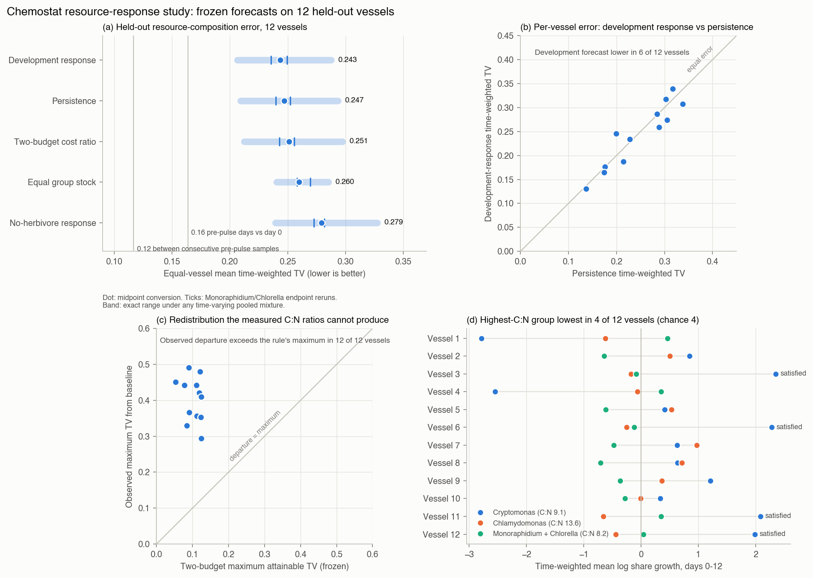

# Chemostat resource-response study

Status on 2 October 2026: complete and registered as
`chemostat-resource-response-2026-10-02`. It reanalyses published measurements
from Wojcik et al. ([doi:10.1098/rspb.2025.1969](https://doi.org/10.1098/rspb.2025.1969));
no new observations were collected. Sources, checksums and measurement methods
are in the [source audit](chemostat-source-audit.md).

**Result in brief.** No frozen forecast predicted how the nitrogen pulse
redistributed resource composition in the twelve held-out vessels better than
persistence. The orthopolic two-budget rule, with separately measured C:N cost
ratios, failed all three of its tests: score, size and direction. Its maximum
attainable redistribution was below every vessel's observed departure; its
ordinal prediction held at the chance rate; and it did not beat persistence.
No held-out vessel returned to its pre-pulse composition within 12 days. These
failures are retained as results.

## Question

Two forecasts of the same held-out communities were compared:

1. **Transfer.** Do separately calibrated algal resource densities, combined
   with the pulse response of other vessels, predict how resource composition
   changes in whole held-out communities?
2. **Theory.** Does the orthopolic two-budget allocation rule
   $N_j=w_j/(\lambda_1q_{1j}+\lambda_2q_{2j})$ from the
   [restriction study](restriction-study.md) predict the direction and size of
   that change? The measured C:N cost ratios $r_j=q_{Cj}/q_{Nj}$ set its
   direction.

Three partly pooled algal groups cannot establish a size spectrum, interval
weights or logarithmic neutrality. The neutrality verdict is therefore *not
applicable*, as the original configuration declared.

## Data, units and design

- **Development:** the twelve rotifer-monoculture vessels (August–October
  2022; *Brachionus*, *Cephalodella* or *Lecane*, four vessels each).
- **Held out:** the twelve rotifer-polyculture vessels (March 2023), pulsed 9
  or 13 days after inoculation. Rotifer assemblage, pulse timing and calendar
  batch all differ from development, so this is a hard transfer test.
- **Calibration:** separate preliminary monocultures. For each species, the
  median of pre-pulse (days −4 and 0) chemically assayed N or C per cell,
  divided by cell volume.
- **Resource proxy:** observed group biovolume (µm³/mL) times density
  (pmol/µm³), giving pmol/mL = nmol/L. Monoraphidium and Chlorella are pooled
  in the main series. Their unknown mixture is run at the lower and upper
  constituent densities and at the midpoint, an equal-biovolume mixture.
- **Variants:** nitrogen (primary) and carbon, each at three pooled
  densities, plus an unconverted biovolume reference.
- **Models:**
  - *Persistence:* baseline composition.
  - *Development mean response:* additive share change, averaged equally across
    development vessels.
  - *No-herbivore response:* the same, from the two preliminary no-herbivore
    mixed cultures.
  - *Equal group stock.*
  - *Two-budget cost ratio:* each baseline share multiplied by $1/(1+\kappa
    r_j)$, then renormalized. The strength $\kappa(t)\ge0$ is fitted on
    development vessels only.
- **Primary score:** equal-vessel mean of the time-weighted total-variation
  (TV) distance between forecast and observed resource shares. It covers days
  0–12 on one common support for all models. Lower is better.
- **Pairwise rule:** model A outperforms model B only if its score is at least
  0.02 lower in all three nitrogen pooled scenarios **and** it is lower in a
  strict majority of vessels at the nitrogen midpoint.

The [configuration](../configs/chemostat_response_2026-10-02.json) set the
partition, models, scores and recovery margin. Two amendments, both recorded
before any main-workbook outcome was decoded, fixed everything else:

- [Amendment 1](../configs/chemostat_response_2026-10-02_amendment-1.json)
  fixed the implementation details. It also added the two-budget model, its
  ordinal endpoint and the biovolume reference.
- [Amendment 2](../configs/chemostat_response_2026-10-02_amendment-2.json)
  added the rule's capacity bound and a nitrogen-budget check.

## Freeze chronology

| Step | Commit | UTC, 2 October 2026 |
|---|---|---|
| Configuration; retained sources | `bc57364`; `220c4d3` | 14:35:13; 14:59:40 |
| Amendment 1 | `a67c6a3` | 15:11:23 |
| Gated runner, tests, amendment 2 | `92d239d` | 15:26:19 |
| Forecast freeze written | — | 15:26:34 |
| Freeze committed and pushed | `180dc6d` | 15:26:45 |
| Held-out evaluation started | — | 15:27:47 |

The freeze stage decoded the calibration tables, every development vessel,
and held-out rows at or before day 0. A gated worksheet reader skipped all
120 held-out post-pulse rows without decoding them. Evaluation refuses to run
if any frozen source, configuration, amendment or input byte has changed, or
if replaying the freeze gives different forecasts.

The reader matched the retained openpyxl copies on 2,960 permitted cells
before the freeze, and on all 480 held-out cells afterwards. Published
summaries had been read during screening, so this is a retrospective
validation, not a blinded prospective test.

## Calibration

| Species | N density (pmol/µm³) | C density (pmol/µm³) | C:N cost ratio |
|---|---:|---:|---:|
| Cryptomonas | 0.00449 | 0.0411 | 9.14 |
| Chlamydomonas | 0.00169 | 0.0229 | 13.55 |
| Monoraphidium | 0.00211 | 0.0205 | 9.68 |
| Chlorella | 0.00333 | 0.0242 | 7.26 |

Stored N quotas have 0.01 pmol/cell resolution. For the two small species
that is a 10–25% relative resolution. Densities from N = C/(C:N ratio), a
diagnostic only, are 0.00207 (Monoraphidium) and 0.00311 (Chlorella). After the
pulse, preliminary-culture N densities rose 10–135% within three days. The
fixed pre-pulse densities do not follow that change.

## Results

### Resource-composition forecasts

Equal-vessel mean time-weighted TV, twelve held-out vessels:

| Model | N lower | **N midpoint** | N upper | C midpoint | Biovolume |
|---|---:|---:|---:|---:|---:|
| Development mean response | 0.249 | **0.243** | 0.235 | 0.237 | 0.223 |
| Persistence | 0.252 | **0.247** | 0.240 | 0.237 | 0.222 |
| Two-budget cost ratio | 0.256 | **0.251** | 0.243 | 0.243 | 0.227 |
| Equal group stock | 0.258 | **0.260** | 0.270 | 0.288 | 0.315 |
| No-herbivore response | 0.282 | **0.279** | 0.273 | 0.265 | 0.251 |

| Pair | Improvement of the first (N lower/mid/upper) | Vessels where the first is lower | Verdict |
|---|---|---:|---|
| Development vs persistence | 0.003 / 0.004 / 0.004 | 6 of 12 | not distinguished |
| No-herbivore vs persistence | −0.030 / −0.032 / −0.033 | 3 of 12 | persistence outperforms |
| Equal stock vs persistence | −0.006 / −0.013 / −0.030 | 4 of 12 | not distinguished |
| Two-budget vs persistence | −0.004 / −0.004 / −0.003 | 4 of 12 | not distinguished |
| Development vs no-herbivore | 0.033 / 0.036 / 0.037 | 8 of 12 | development outperforms |
| Development vs two-budget | 0.007 / 0.008 / 0.008 | 8 of 12 | not distinguished |

The best transfer forecast removed essentially none of the held-out error. Its
0.004 advantage over persistence in nitrogen units disappears in carbon units
(0.237 against 0.237). The biovolume reference reverses it (0.223 against
0.222). The pooled-mixture envelope for any time-varying Monoraphidium/Chlorella
composition spans about 0.08: 0.206–0.288 for the development forecast and
0.209–0.293 for persistence. That is twenty times the gap between them.

Transferring the no-herbivore response made forecasts worse: grazed
communities did not respond like ungrazed cultures. The development response
began with a day-1 rise in Chlamydomonas share, which held-out vessels did not
reproduce. Several of them moved the opposite way
([trajectories figure](../results/chemostat-response/heldout-trajectories.png)).

Total-stock forecasts were poor for every model. The time-weighted absolute
log error at the nitrogen midpoint was 0.74 for the development response, 0.79
for the no-herbivore response and 0.81 for persistence: a typical factor of
about 2.1–2.2. Observed nitrogen-stock factors ranged from 0.17 to 17 times
the baseline.



### The two-budget rule

- **Development fit.** The fitted strength $\kappa(t)$ was zero on day 1 and
  on days 6–11. It was positive only on days 2–5 (0.39, 0.38, 0.068, 0.0074)
  and on day 12 (0.019). Even on development data it lowered the mean TV by at
  most 0.02 on any day; on day 1 the observed shift ran against its direction.
- **Size.** The measured C:N ratios span only 7.3–13.6. At any strength, the
  rule can move a held-out vessel's composition by at most 0.05–0.12 TV, a
  bound frozen per vessel. Observed maximum departures were 0.29–0.49, so all
  twelve vessels exceeded the bound in every variant.
- **Direction.** The rule predicts that Chlamydomonas, the group with the
  highest C:N, loses most share. That held in 4 of 12 held-out vessels,
  exactly the chance count, as well as in 2 of 12 development vessels and 1 of
  2 no-herbivore cultures. The ordering does not depend on the resource
  conversion.

The rule therefore fails as an explanation of this short-term, grazed
redistribution. The failure is informative. Measured cost ratios are too
similar to produce redistribution on the observed scale, and their direction
did not identify which group lost share.

### Recovery

Every held-out vessel departed beyond the 0.1 TV margin. None returned within
it for two consecutive observations by day 12, so all twelve are
right-censored. In contrast, 9 of 12 development vessels recovered (confirmed
on days 3–11), 2 were right-censored and 1 never departed.

The development and no-herbivore models predicted recovery in all twelve
held-out vessels. Persistence, and the two-budget model in 10 vessels,
predicted no departure. Not one of these status forecasts matched. Equal
group stock matched trivially: a constant composition that differs from the
baseline can never count as recovered. Recovery toward the baseline is not
recovery toward neutrality, and censoring at day 12 does not establish
non-recovery.

## Post-hoc diagnostics

These analyses were specified after the evaluation. They change no forecast,
score or verdict. The [post-hoc file](../results/chemostat-response/posthoc-diagnostics.json)
and both figures come from `experiments/report_chemostat_response.py`.

**Noise floor.** Before the pulse, consecutive held-out samples differed by
0.117 TV on average. Pre-pulse days −6 to −1 differed by 0.164 from the day-0
composition (nitrogen midpoint; 0.103 and 0.158 in biovolume). The post-pulse
persistence error of 0.247 therefore reflects a real redistribution, about 1.5
times the pre-pulse variation around the baseline. Every model anchors on a
single day-0 sample, and that sample carries roughly 0.1 TV of sampling and
fast-dynamics variation.

**Nitrogen budget, with an erratum.** The frozen diagnostic field
`baseline_algal_nitrogen_umol_per_l` is mislabelled. Its values are nmol/L,
because pmol/µm³ × µm³/mL = pmol/mL. Nothing that is scored uses it: every
stock error is a log ratio. In µmol/L, reconstructed baseline algal nitrogen
is:

- 8.0–97.0 in development vessels;
- 9.3–55.6 in held-out vessels;
- 58.8 and 88.4 in the two no-herbivore mixed cultures.

The inflow supplies 80 µmol N/L. At the midpoint, vessel Ce2 and mixed culture
Mi1 exceed it; at the lower pooled density only Mi1 does. The transferred
pre-pulse quotas therefore place nearly all supplied nitrogen in algae in
high-biomass vessels, and slightly more than the supply in two of them.
Either quota transfer overestimates N per biovolume there, or those vessels
were not at steady state. The proxy sits at the edge of mass-balance
feasibility. The error is recorded rather than corrected in frozen code.

## What this establishes

- Responses of resource composition to a nutrient pulse did not transfer from
  rotifer-monoculture to rotifer-polyculture food webs. This held in nitrogen,
  carbon and biovolume units. These are retrospective point scores from one
  published experiment, without intervals or significance claims.
- Independently measured C:N cost ratios do not explain the short-term
  redistribution through the two-budget rule. They bound its effect far below
  what was observed, and its direction was at chance.
- The study says nothing about equilibrium allocation neutrality, which three
  groups, a transient 12-day window and active grazing cannot test.

For the next available-data test:

- Prefer datasets with resource stocks measured in the evaluated vessels.
- Use a multi-sample pre-perturbation baseline, declared before evaluation.
- Treat grazer composition as part of the forcing.
- Use a window long enough for recovery endpoints to resolve.

## Replay and files

```bash
make chemostat-response PY=python3.11          # offline audit: replays freeze and evaluation
make chemostat-response-report PY=python3.11   # post-hoc diagnostics and figures; refuses changed outputs
```

- Frozen runner and modules: `experiments/run_chemostat_response.py`,
  `src/orthopolity/chemostat_response.py`, `src/orthopolity/gated_xlsx.py`.
  Byte copies are in `data/chemostat-response/2026-10-02/original-sources/`.
- Freeze: `data/chemostat-response/2026-10-02/frozen-forecasts.json` and
  `development-records.json`. Held-out records: `evaluation-records.json`.
- Report: `results/chemostat-response/study.json` and the output manifests.
  Figures: `heldout-trajectories.png` and `scores.png`, with SVG copies.
- Registry entry: `data/chemostat-response/2026-10-02/registry-entry.json`.
  Its lineage links to `restrictions-2026-10-01`, the constructed two-budget
  prediction this study tests.
