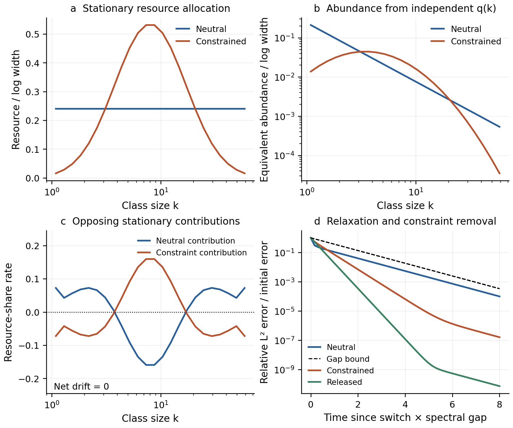

# Equalization, constraints, and recovery in a class-resource model

Started 5 October 2026; integrated and verified 6 October 2026. This is a worked mathematical and computational demonstration
for the [orthopolity programme](research-brief.md). A local exchange mechanism
selects equal resource per declared class measure. An additional transport
mechanism produces a nonuniform allocation while the equalizing contribution
remains active. Removing that mechanism predicts recovery, including a bound
on its timescale.

The mathematics uses standard reversible finite-state transport, including
detailed balance and spectral relaxation; see
[Levin and Peres, *Markov Chains and Mixing Times*, second edition](https://pages.uoregon.edu/dlevin/MARKOV/mcmt2e.pdf).
The contribution here is an explicit orthopolity interpretation, proof, and
reproducible intervention demonstration. It is a conditional toy mechanism,
with no claim of a new mathematical theorem or new natural-system observations.

## 1. Resource, concentrations, and comparison classes

Fix $K$ resource-bearing size classes before running the model. Class $i$ has
a prescribed characteristic object size $k_i$, a positive reference width
$w_i$, and a positive per-object resource cost $q_i$. Its resource stock is
$R_i\ge0$, and the total $B=\sum_iR_i>0$ is conserved. The classes are
non-overlapping allocations. Their resource densities are $x_i=R_i/w_i$.

Here the comparison units are **classes of concentrations**, not individual
objects or spatial sites. Resource exchanges between class reservoirs, with
continuous equivalent object counts $N_i=R_i/q_i$. Assembly, disassembly, or
replacement of objects is implicit in this effective description: object
number is not conserved, and the model supplies no individual-object collision
or demographic mechanism. The stochastic implementation below tracks equal-resource
packets, not integer objects of unequal cost.

For size classes, $w_i$ can be their linear or logarithmic widths. The worked
run chooses logarithmic widths $\Delta\ln k$. Nothing in conservation alone
selects that measure. It is a constitutive choice of this model, expressed in
its local exchange rates and held fixed through the intervention.

## 2. A local mechanism that selects neutrality

Let $g_{ij}=g_{ji}\ge0$ be fixed conductances with $g_{ii}=0$, and suppose
their undirected graph is connected. With $w_i$ dimensionless, $g_{ij}$ has
units of inverse model time. Define the neutral net current from $i$ to $j$ by

$$J^0_{ij}=g_{ij}(x_i-x_j),\qquad
\dot R_i=-\sum_jJ^0_{ij}.$$

Equivalently, each resource packet in class $i$ jumps to class $j$ at rate
$a^0_{ij}=g_{ij}/w_i$. Equal resource per unit reference measure gives equal
opposing flows. The rate rule is specified locally without sampling a target
abundance distribution.

**Neutral equalization proposition.** From any nonnegative initial allocation
with total $B$, the solution remains nonnegative, conserves $B$, and converges
to the unique fixed point

$$R_i^0=\frac{B w_i}{\sum_jw_j},\qquad
\frac{N_i^0}{w_i}=\frac{B}{q_i\sum_jw_j}.$$

To prove this, define the graph Laplacian $L_g$ and $W=\operatorname{diag}(w_i)$.
Then $\dot R=-L_gW^{-1}R$. Its generator has nonnegative off-diagonal rates
and zero column sums. Hence its exponential preserves positivity and total
resource. At a fixed point, $L_gx=0$. Connectedness makes the kernel constant,
and conservation fixes the constant. The Lyapunov calculation in Section 4
proves convergence from every allowed initial condition.

This identifies why equalization occurs in this model: the exchange is driven
by differences in resource per reference width, and every class communicates
with every other through the graph. Conserving the same total under a different
exchange rule need not give this equilibrium.

## 3. A constraint that preserves the equalizing mechanism

Prescribe a finite dimensionless preference $V_i$ for each class. Define rates

$$a_{ij}=\frac{g_{ij}}{w_i}
\exp\!\left(\max\{V_i-V_j,0\}\right).$$

All neutral jumps remain. Additional jumps occur toward lower $V$:

$$a_{ij}=a^0_{ij}+a^{\mathrm c}_{ij},\qquad
a^{\mathrm c}_{ij}=\frac{g_{ij}}{w_i}
\left[\exp\!\left(\max\{V_i-V_j,0\}\right)-1\right]\ge0.$$

This is an explicit kinetic model of a medium or system preference. $V$ is
not inferred from the resulting allocation and is not asserted to be a
physical energy or a measured biological restriction. The exponential rule
specifies one possible bias mechanism; other mechanisms have their own
stationary predictions. The constraint redistributes resource without adding
or removing it from the modeled budget.

Write $A_{ji}=a_{ij}$ for $j\ne i$ and $A_{ii}=-\sum_{j\ne i}a_{ij}$, so
$\dot R=AR$ acts on column vectors. Put

$$h_i=w_i e^{-V_i},\qquad Z=\sum_ih_i,
\qquad b_{ij}=g_{ij}e^{-\min\{V_i,V_j\}}.$$

Then $h_i a_{ij}=h_j a_{ji}=b_{ij}$. Thus $A=-L_bH^{-1}$, with
$H=\operatorname{diag}(h_i)$, and detailed balance gives

$$R_i^V=B\pi_i^V,\qquad
\pi_i^V=\frac{w_i e^{-V_i}}{Z},\qquad
\frac{N_i^V}{w_i}=\frac{B e^{-V_i}}{Zq_i}.$$

The neutral form is recovered when $V$ is constant. Adding a common constant
to $V$ changes neither the rates nor the allocation. A nonconstant $V$ gives
a non-neutral resource profile on the connected graph.

### The equalizing flow is balanced, not extinguished

At this constrained fixed point, the neutral current is

$$J^0_{ij}=\frac{B g_{ij}}{Z}
\left(e^{-V_i}-e^{-V_j}\right).$$

It is nonzero on any edge whose endpoints have different preferences. The
added current satisfies $J^{\mathrm c}_{ij}=-J^0_{ij}$ there, so the total
current vanishes. In matrix form,

$$A_0R^V\ne0,\qquad A_{\mathrm c}R^V=-A_0R^V,
\qquad (A_0+A_{\mathrm c})R^V=0.$$

Here the nonzero statement assumes nonconstant $V$ on a connected graph.
This is a precise instance of the investigators' support analogy: a stationary
outcome can conceal two active, opposing contributions. Removing the added
transport exposes the equalizing evolution without resetting the state.

## 4. Convergence and recovery times

For any fixed phase, let $p=R/B$, let $\pi$ be its equilibrium, and define

$$E(p,\pi)^2=\sum_i\frac{(p_i-\pi_i)^2}{\pi_i}.$$

Set $z_i=p_i/\pi_i$ and $c_{ij}=\pi_i a_{ij}=\pi_j a_{ji}$. Direct
differentiation of the master equation gives

$$\frac{d}{dt}E^2=-2\sum_{i<j}c_{ij}(z_i-z_j)^2.$$

The real symmetric matrix
$S=-D_\pi^{-1/2}AD_\pi^{1/2}$, with
$D_\pi=\operatorname{diag}(\pi_i)$, is positive semidefinite. On a connected
graph it has one zero eigenvalue and a positive smallest nonzero eigenvalue
$\lambda$. Conservation makes $p-\pi$ orthogonal to the zero mode after
this change of variables. The Rayleigh bound therefore gives

$$E(p(t),\pi)\le e^{-\lambda t}E(p(0),\pi),\qquad
\operatorname{TV}(p(t),\pi)\le\tfrac12 E(p(t),\pi).$$

For an initial error $E_0>\epsilon>0$, the sufficient time to achieve
$E\le\epsilon$ is $\lambda^{-1}\ln(E_0/\epsilon)$. This is a bound, not
an assertion that every initial condition decays at precisely that rate.

If the constraint is removed at $t_*$, the allocation is continuous at the
switch. The subsequent solution is

$$p(t_*+s)=e^{A_0s}p(t_*),\qquad
E(p(t_*+s),\pi^0)\le e^{-\lambda_0s}E(p(t_*),\pi^0).$$

The recovery starts from the actual constrained state, including any residual
transient. The neutral comparison measure and conductances remain fixed.

### A structural obstruction

If edges are removed so that the graph is disconnected, each connected
component $C$ preserves its own total $B_C$. Neutral exchange then gives only

$$R_i^*=\frac{B_C w_i}{\sum_{j\in C}w_j},\qquad i\in C.$$

Component resource densities need not agree. Equalization continues within
components; a global equalization bound has zero gap. Restoring a preference
to zero does not repair a missing connection. Connectivity is an explicit
system condition, not a label assigned after viewing the distribution.

## 5. Abundance laws and a curved constrained profile

In a continuous log-size representation $u=\ln(k/k_0)$, with
$q(k)=q_0(k/k_0)^d$, the corresponding stationary resource and count forms are

$$\frac{dR}{du}=C e^{-V(u)},\qquad
\frac{dN}{dk}=\frac{C e^{-V(\ln(k/k_0))}}{kq(k)}.$$

Thus neutrality gives exponent $d+1$. A linear preference $V(u)=\theta u$
changes it to $d+1+\theta$. A quadratic preference
$V(u)=(u-u_c)^2/(2\sigma^2)$ supplies a curved, lognormal-shaped abundance
density on the finite domain after completing the square. Both departures
follow from the prescribed rates and the same resource cost.

The numerical demonstration uses finite classes, with $q_i=k_i^d$ declared at
their geometric centers. On an equal-log grid, the linear bin width is exactly
proportional to $k_i$, so neutral $N_i/\Delta k_i$ has exponent $d+1$ at those
centers. The continuous formula is a representation of the corresponding
profile, not a proof about within-bin object sizes.

## 6. Finite resource and stochastic realizations

Let $M$ independent packets each carry $B/M$ resource units and follow the
same jump process. Their mean allocation obeys the deterministic equation.
At equilibrium their class counts $X$ have distribution
$\operatorname{Multinomial}(M,\pi)$, giving

$$\operatorname{Cov}(X/M)=\frac{\operatorname{diag}(\pi)-\pi\pi^T}{M},
\qquad E[E(X/M,\pi)^2]=\frac{K-1}{M}.$$

Even when the mean is exactly neutral, a finite snapshot is generally uneven.
The snapshot fluctuation scale is fixed by the packet model; it does not
vanish by waiting longer at fixed $M$.

In this run, every packet starts in the same class. This degenerate initial
state still gives independent, identically distributed packets, so the same
multinomial covariance formula holds at later checkpoints with $p(t)$ replacing
$\pi$, including across the two switches. For general fixed heterogeneous
initial counts $x$ and transition matrix $P$, the transient count covariance is
instead $\operatorname{Cov}(X(t))=\operatorname{diag}(Px)-P\operatorname{diag}(x)P^T$;
the share covariance divides this expression by $M^2$. The script's
checkpoint transitions are sampled from $e^{A\Delta t}$; there is no Euler
step approximation or independent reinitialization at intervention times.

## 7. Computational specification and reproduction

The [configuration](../configs/class_exchange_2026-10-05.json) fixes 24
equal-log classes on $[1,64]$, $d=1.5$, unit model diffusivity, and a quadratic
preference centered at $k=8$ with log-size width $0.75$. Adjacent conductances
are $1/\Delta u$, giving neutral jump rates $1/(\Delta u)^2$. Each of the
neutral, constrained, and released phases lasts eight of its own relaxation
times and has 50 intervals. There are 4,096 resource packets, 128 independent
realizations, and seed 20261005. Time units are model units, not calibrated
seconds for a biological system.

The runner writes the rate-derived stationary profiles, gaps, and bounds before
generating the packet trajectories. This is an internal calculation order, not
external preregistration or an empirical prediction freeze. Its source and
configuration hashes identify the computation. Numerical checks compare the
matrix-exponential trajectory, packet means and variances, and exact predictions.

```bash
make class-exchange PY=python3.11
make class-exchange-report PY=python3.11
make class-exchange-registry PY=python3.11
```

Reproductions write to `build/reproductions/class-exchange/`. The retained
outputs are in `results/class-exchange/`; the implementation is
[class_exchange.py](../src/orthopolity/class_exchange.py) and its runner is
[run_class_exchange.py](../experiments/run_class_exchange.py).

### Executed result

| Phase | Spectral gap | Duration in model units | Final relative error $E$ | Predicted upper bound |
|---|---:|---:|---:|---:|
| Neutral | 0.569805 | 14.039896 | $4.7340\times10^{-4}$ | $1.6088\times10^{-3}$ |
| Constrained | 1.991712 | 4.016646 | $2.4088\times10^{-7}$ | $5.0535\times10^{-4}$ |
| Released | 0.569805 | 14.039896 | $5.5100\times10^{-11}$ | $2.5578\times10^{-4}$ |

Every recorded deterministic checkpoint satisfies its phase's bound. The two
stationary component drift vectors each have Euclidean norm 0.400493 resource
share per model time; their sum has norm $3.22\times10^{-15}$. Deterministic
total-resource error never exceeds $2.45\times10^{-15}$. All integer packet
totals are exactly conserved, and both deterministic and stochastic states are
unchanged at the instant of each switch.

Endpoint mean absolute class-share errors between the 128-realization mean
and the exact expectation are 0.000190, 0.000206, and 0.000270. These sampling
errors concern the finite ensemble, not the deterministic convergence error.
The predicted equilibrium root-mean-square relative error of a single finite
snapshot is $\sqrt{23/4096}\simeq0.075$. Ten new tests check the independent
two-class solution, conservation and detailed balance, nonuniform weights,
constraint additivity and release, disconnected components, the spectral
bound, and packet means/covariances. All 362 repository tests pass.



The [full six-panel figure](../results/class-exchange/class-exchange.png) also
shows the trajectory through both switches and exact pointwise 95% binomial
intervals for one realization. Those intervals are neither simultaneous bands
nor confidence intervals on a fitted law. The compact figure above is a
[separate presentation](../experiments/report_class_exchange.py) of retained
outputs; it does not rerun the simulation.

The [numerical summary](../results/class-exchange/summary.json),
[predictions](../results/class-exchange/predictions.json),
[class trajectories](../results/class-exchange/trajectories.csv), raw integer
packet arrays, and source hashes are retained. The run is registered as
`class-exchange-2026-10-05`; its date identifies the start of the calculation.
The append-only registry now has 24 records and 603 verified file references.
The registry separately identifies the post-hoc manuscript presentation.

## 8. Physical and empirical interpretation

The demonstration establishes a complete implication: declared class-exchange
kinetics select neutrality, an explicit added mechanism changes the stationary
profile, opposing component currents explain the constrained state, and removing
the mechanism predicts recovery. Symmetric exchange and its reference measure
are the physical assumptions of the toy system. Application to a natural system
requires identifying those kinetics or another mechanism with the same result.

The [radiation derivation](physical-realizations.md) supplies an independent
worked physical example from electromagnetic energy balance, with a specified
absorber and causal recovery. Its transported power and shell energy have
different comparison units from the class stocks here. The same note maps the
retained empirical studies to their actual predictions and unresolved causes.
Neither the model's lognormal-shaped profile nor the radiation example is a
completed explanation of human age or height distributions.
