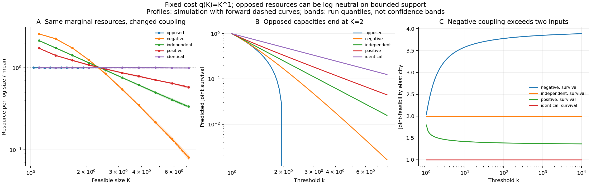

# Competing resources and the limits of counting inputs

1 October 2026. Five constructed-model scenarios compare two resources with the
same unit-Pareto marginal capacities under negative, independent, positive, and
singular endpoint coupling. This is a probability benchmark, not a natural-system
experiment or a claim of new copula mathematics.

## Exact forward predictions

For correlated standard normals $Y_1,Y_2$ with correlation $\rho$, set
$X_a=1/\overline\Phi(Y_a)$ and $K=\min(X_1,X_2)$. Every capacity has survival
$P(X_a\ge k)=1/k$ for $k\ge1$. The realized size is the bottleneck by definition
in this benchmark. For $-1<\rho<1$, let $z=\overline\Phi^{-1}(1/k)$ and
$a=\sqrt{(1-\rho)/(1+\rho)}$. Conditional normal integration gives

$$S(k)=\int_z^\infty\phi(y)\overline\Phi\left(
\frac{z-\rho y}{\sqrt{1-\rho^2}}\right)dy,
\qquad f(k)=\frac{2\overline\Phi(az)}{k^2}.$$

The exact Gaussian diagonal-copula integral and its derivative are given in
[Meyer (2009), equations 3.19–3.21](https://arxiv.org/abs/0912.2816).
The formula here follows by substituting the marginal survival coordinate
$u=1/k$ and using the normal copula's symmetry. Density and survival are
calculated independently and checked against each other's derivatives.

Mills asymptotics give

$$S(k)\sim C k^{-\kappa_\infty}(\log k)^{-(2-\kappa_\infty)/2},
\qquad \kappa_\infty=\frac{2}{1+\rho}.$$

This derivation applies to negative correlation as well as positive correlation,
excluding the singular endpoints. At $\rho=-0.5$, the feasibility index is four,
which exceeds the number of inputs. A dimension bounded by the input count
therefore needs an assumption about positive dependence and marginal scaling.
The result does not make additive resource cost four-dimensional: this study
keeps its audited cost $q(K)=K$, of dimension one.

## A neutral bounded profile with nonconstant survival dimension

At $\rho=-1$, the two capacities are countermonotone. Equivalently, for uniform
$U$, $X_1=1/U$ and $X_2=1/(1-U)$. Both marginal survival laws remain unchanged,
but the maximum feasible size is two:

$$S(k)=2/k-1\quad(1\le k\le2),\qquad S(k)=0\quad(k>2).$$

The density is $f(k)=2/k^2$ on the interior interval, with no atom at two.
Consequently the primary resource per log size is exactly

$$O(k)=kq(k)f(k)=2,$$

even though the local joint-feasibility elasticity is
$\kappa(k)=2/(2-k)$, which grows without bound at the endpoint. Its log derivative
is $d\log\kappa/d\log k=k/(2-k)=\kappa-1$. The exact bridge from the
[dimensionality note](resource-dimensionality.md) therefore gives

$$\alpha=1+\kappa-\frac{d\log\kappa}{d\log k}=2,
\qquad \beta=1-\kappa+\frac{d\log\kappa}{d\log k}=0.$$

This provides an exact illustration of why finite-range survival elasticity
cannot be substituted directly for the count-density exponent. The bounded
density is a power law; its survival is a power minus an endpoint constant,
and it has no unlimited tail index. Equal resource allocation is compatible
with this specified model, while counting inputs or reading its survival
elasticity alone would misidentify the dimension.

The other singular endpoint, $\rho=1$, gives identical capacities and unlimited
survival $1/k$, also neutral for $q(K)=K$. Opposed and identical inputs therefore
can both yield neutral resource profiles under different supports and joint
laws. The Gaussian copula endpoints are the standard Frechet–Hoeffding bounds
reviewed by Meyer, equations 2.2–2.4; they are not distributions discovered here.

## Executed benchmark

The [configuration](../configs/competition_study_2026-10-01.json) was written
before the run. It uses six independent runs of 120,000 opportunities per
scenario and ten logarithmic bins. The fully opposed case has declared domain
$[1,2]$; the other cases use $[1,8]$. These different domains are explicit and
follow from the opposed model's support, rather than fitted slopes.

| Coupling | Unlimited feasibility index | Support | Pooled resource-profile log-RMSE |
|---|---:|---|---:|
| Fully opposed | Undefined | $[1,2]$ | 0.00397 |
| Gaussian, $\rho=-0.5$ | 4 | $[1,\infty)$ | 0.01013 |
| Independent | 2 | $[1,\infty)$ | 0.00595 |
| Gaussian, $\rho=0.5$ | $4/3$ | $[1,\infty)$ | 0.00643 |
| Identical | 1 | $[1,\infty)$ | 0.00464 |

The largest absolute survival-profile error across scenarios is approximately
0.00101. These are descriptive simulation errors, not empirical equivalence
decisions. Forward resource profiles integrate the exact density in log size;
raw sampled resource densities are pooled and normalized once on each declared
domain. Run bands are 10th–90th percentiles, not confidence bands. Deep-tail
dimensions are forward calculations, not estimates supported by the finite
sample counts.

Uncapped individual capacities still have infinite means. Opposed realized
sizes are bounded and have finite primary mean resource $2\ln2$; other bounded
profile domains also have finite expected resource. Available capacity and
resource actually consumed by the realized unit are different observables.

## Scientific target

This extension qualifies a simple input-count interpretation and supports a
more precise statement: joint resource dependence, marginal laws, support,
requirements, and realization rules can predict a size distribution. A cost
dimension is independently defined by resource use. Relating it to the observed
exponent requires the allocation condition or the complete feasibility-to-density
mapping. Successful predictions do not alone establish that Nature generally
selects neutrality.

## Reproduction

~~~bash
PYTHONPATH=src MPLCONFIGDIR=build/matplotlib python3.11 experiments/run_competition.py
PYTHONPATH=src python3.11 -m unittest discover -s tests -p test_competition.py -v
~~~

Seven tests verify density normalization, independent survival derivatives,
fixed marginal laws, support, the exact neutral opposed profile, finite-scale
dimension corrections, and the simulated negative-dependence joint law.
Full output is in [competition-study.json](../results/competition/competition-study.json)
with [profiles.csv](../results/competition/profiles.csv). The model definitions,
support choices, software versions, and all numerical values are retained.
