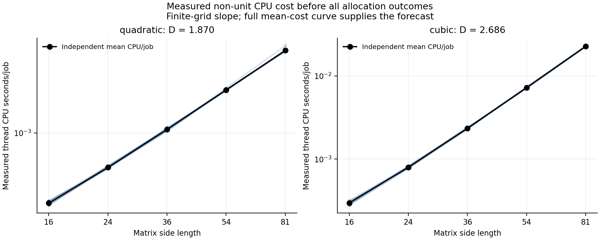
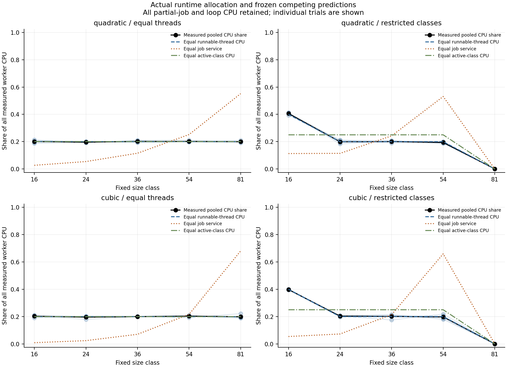
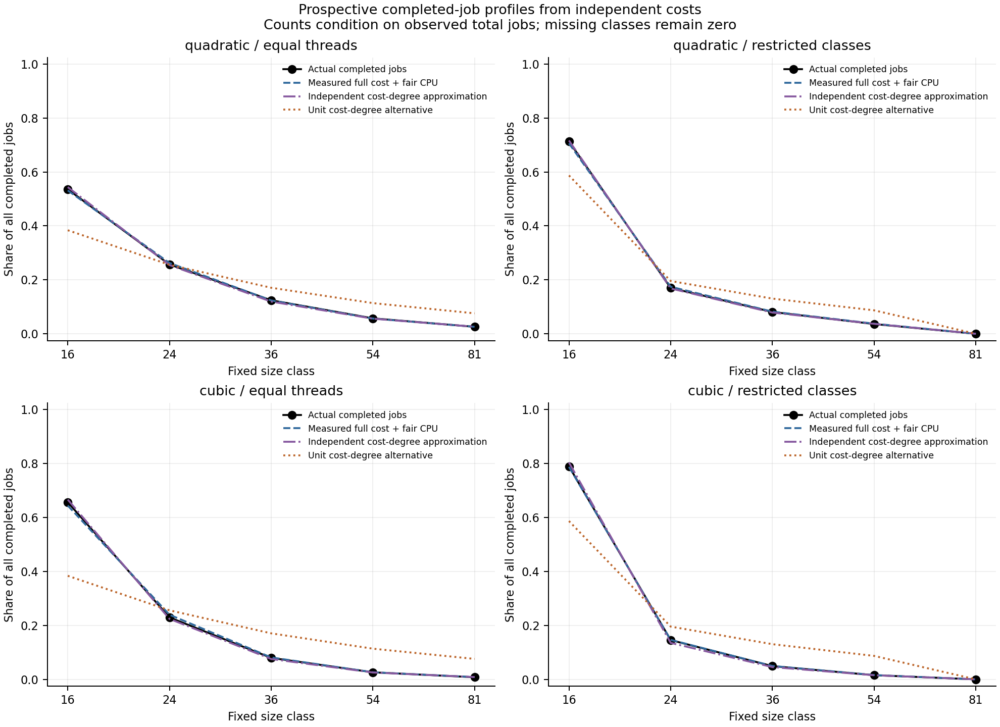

# Measured cost dimensions and an actual allocation restriction

2 October 2026. This study independently measures a non-unit resource-cost
dimension, freezes complete profiles, and then observes an actual allocation
mechanism under a changed availability pattern. The resource is thread CPU time;
the mechanism is the unmodified CPython interpreter lock interacting with OS
scheduling. It is an engineered runtime experiment, not a natural-system law.

## Why this system

The prior memory/CPU pilot assigned acceptance quotas. Here no worker is given
a CPU quota or a target number of completed jobs. Continuously runnable threads
compete for execution. This gives a new allocation observation rather than
another outcome defined as a minimum of assigned capacities.

The existing host has ten logical CPUs, which prevented establishing OS CPU
scarcity with three independent single-thread processes. In standard CPython,
the [global interpreter lock permits only one thread to execute Python code at
a time](https://docs.python.org/3.11/library/threading.html). This provides an
independently identified execution bottleneck within one process. Both workloads
use Python arithmetic and lists; neither invokes BLAS or a parallel numerical
library. We retain the reported GIL state and clock implementation.

The interpreter does **not** guarantee equal CPU shares. Python documents an
ideal switch interval and says the subsequent thread choice depends on the
[operating system](https://docs.python.org/3.11/library/sys.html#sys.setswitchinterval).
Equal runnable-thread CPU time is therefore a conditional hypothesis tested by
measurements. No affinity, priority, or switch-interval setting is changed.

A natural candidate was also checked: the primary metadata for the
[Baltic Si:N/grazing mesocosm dataset](https://doi.pangaea.de/10.1594/PANGAEA.912143)
contains cell volume, carbon per cell, abundance and intervention labels.
These fields are promising for raw resource profiles, but they do not directly
supply per-cell nitrogen and silica requirements needed for a nutrient-budget
forecast without further physiological assumptions. No natural outcome data
were downloaded or analyzed here; their restriction model remains future work.

## Resource, coordinate and independent dimension

The coordinate $k$ is matrix side length, with fixed representatives 16, 24,
36, 54 and 81. Fixed geometric boundaries give equal logarithmic widths. One
kernel repeats a quadratic matrix transformation sixteen times. The other
computes a cubic dense matrix product and checks it by comparing the product's
action on a probe with two successive input-matrix/vector products.

Each job includes input construction, calculation, deadline checks and numerical
verification. Leading operation counts scale as $k^2$ and $k^3$, but measured
CPU seconds need not have those degrees. The CPU clock is
[user plus system CPU time for the current thread](https://docs.python.org/3.11/library/time.html#time.thread_time),
excluding sleeping/waiting time. It is distinct from wall time and from the
process-wide clock. The saved Darwin clock reports
`clock_gettime(CLOCK_THREAD_CPUTIME_ID)`.

Before any allocation outcome, twelve randomized complete calibration blocks
run three verified jobs for each kernel and size: 360 actual calibration jobs.
The independent mean CPU cost per job is $q_j$. A regression of $\log q_j$ on
$\log k_j$ summarizes its finite-range cost degree $D_q$. Whole-block resampling
gives a nominal percentile interval; the blocks can remain correlated, so this
interval does not cover every form of thermal or temporal drift.

The actual calibration froze at **08:44:33 UTC**. The measured degrees were
**1.8701** for the quadratic kernel, with nominal interval **[1.8591, 1.8814]**,
and **2.6864** for the cubic kernel, with interval **[2.6757, 2.6970]**. Both
exclude one. The forecast uses the complete mean-cost curve, not just these
regression slopes. Its separate pure-degree approximation is also retained.

These are resource-cost elasticities in a declared coordinate. They are not
measurements of a spatial dimension or of the number of independent inputs.
If the coordinate becomes matrix area $z=k^2$, the same fitted cost degree is
$D_q/2$. No new physical resource appears from that change of coordinate.

## Frozen allocation and restriction predictions

All classes are declared before outcomes. The baseline has one continuously
runnable thread per class, $m=(1,1,1,1,1)$. The restriction replaces the largest
thread with a second smallest thread: $m=(2,1,1,1,0)$. Total runnable opportunity
count remains five. This is an imposed availability intervention; the ensuing
CPU shares and completed jobs are measured, not assigned.

The equal-runnable-thread hypothesis predicts

$$s_j^{\rm CPU}=m_j/\sum_lm_l,\qquad
p_j^{\rm jobs}=\frac{m_j/q_j}{\sum_lm_l/q_l}.$$

It therefore predicts baseline CPU shares $(0.2,0.2,0.2,0.2,0.2)$ and restricted
shares $(0.4,0.2,0.2,0.2,0)$. Completed-job profiles are predicted independently
from measured costs, conditional on the observed total completed jobs. Absolute
job rate and total CPU availability are not guaranteed by this profile model.

Two allocation rivals are fixed before validation. Equal job service per
runnable thread predicts job shares proportional to $m_j$ and CPU shares to
$m_jq_j$. Equal resource per active class predicts equal CPU shares among
occupied classes and job shares proportional to $1/q_j$, regardless of worker
multiplicity. A unit-cost-degree alternative uses $m_j/k_j$ for job shares;
the fitted-cost-degree approximation uses $m_jk_j^{-D_q}$. No target counts
enter any of these forecasts.

Neither the inverse-cost formula nor its coordinate conversion is a new
mathematical identity. The empirical target is whether independently measured
non-unit costs and a declared opportunity change predict actual full profiles
under this runtime mechanism, and where allocation tilt or cost transfer fails.

## Exposure, accounting and decision criteria

Each allocation trial lasts four seconds. Four repetitions of both conditions
for both kernels give sixteen trials, with five worker records per trial.
Kernel/condition order is randomized within each repetition; worker creation
order has separate frozen seeds. Workers warm up, synchronize, use the same
future monotonic start and stop times, and then remain runnable until the common
deadline. The controller normally blocks in joins.

The primary class resource is **all measured worker CPU**, partitioned into
CPU inside completed jobs, censored partial jobs, and loop overhead. A partial
job contributes CPU but no completed-job count. Measured CPU charged to complete
jobs is separately compared with $N_jq_j$; disagreement can reveal cost drift,
instrumentation differences or runtime contention. We do not turn that
reconstruction into the primary resource observation.

Process CPU is measured over an enclosing control interval that also includes
common pre-start waits, controller bookkeeping and final joins. Its difference
from summed worker CPU is reported as unassigned process CPU. This is not
silently attributed to size classes. Actual start/stop lags are retained, and
every trial remains in the record even if timing assumptions fail.

The predeclared exploratory tolerances are **0.10 maximum absolute class CPU
share error** and **0.10 total variation in completed-job shares**. They are
engineering criteria, not calibrated equivalence intervals or significance
thresholds. Raw resources and counts are pooled once across equal exposures;
individual trial profiles remain visible. A failed forecast is preserved and
does not trigger new bins, fairness controls, selected trials or revised costs.

The sparse task classes are not a continuous tail sample. Descriptive slopes
use counts divided by actual log-bin widths or linear-bin widths. Equal
geometric spacing gives the familiar one-unit difference between these slopes;
arbitrary binning would not. Absent classes remain zero in all full profiles,
and their exclusion from slope diagnostics is explicitly labelled. The measured
allocation tilt is a separate observation, not a redefinition of resource cost
chosen to recover a desired exponent.

## Actual results

All sixteen allocation trials were executed, producing 80 worker records,
104,133 completed jobs and 79 censored partial jobs. All start/stop lags meet
the frozen 0.10-second timing criterion; the largest observed start lag was
0.0861 seconds. No trial was dropped or repeated to improve a result.

The worker CPU total was **63.7767 seconds**: 63.5833 seconds inside completed
jobs, 0.1553 seconds inside partial jobs and 0.0382 seconds of loop overhead.
The enclosing process interval measured 63.8940 seconds, leaving **0.1173
seconds** unassigned to workload classes. These are CPU-time charges, not wall
time or an interpretation of consumed energy.

The prospective pooled profile comparisons are:

| Kernel | Availability | Main CPU-share maximum error | Main job-share TV | Unit-degree job-share TV |
|---|---|---:|---:|---:|
| Quadratic | Equal threads | 0.00361 | 0.00556 | 0.15282 |
| Quadratic | Restricted classes | 0.00627 | 0.00705 | 0.12606 |
| Cubic | Equal threads | 0.00425 | 0.01241 | 0.27292 |
| Cubic | Restricted classes | 0.00346 | 0.00209 | 0.20289 |

All main comparisons satisfy the frozen exploratory 0.10 tolerances. Individual
CPU-share errors range from 0.00650 to 0.02547. Four repetitions are not enough
to establish population-level equivalence or cross-session stability.

The predicted CPU-share change was $(0.2,0,0,0,-0.2)$. Actual changes differed
from it by at most **0.00764** for the quadratic kernel and **0.00771** for the
cubic kernel. Equal job service gives CPU-share errors of 0.336–0.482. Under
the restriction, equal resource per active class gives errors of 0.156 for
quadratic work and 0.148 for cubic work. In the equal-thread baseline that
active-class rival coincides with the main CPU prediction; the intervention
supplies the discrimination.

The measured-cost-degree approximation's count TV errors are 0.00432–0.01408,
and it remains competitive with the whole-curve forecast. The full curve does
not win every point comparison. The unit-degree alternative is clearly a
poorer descriptive prediction in all four cases, but the exploratory margins
do not turn that difference into a universal dimension-identification theorem.

Actual complete-job CPU and $N_jq_j$ differ by approximately −3.44% to +2.06%
across occupied classes. That diagnostic is retained separately from observed
CPU allocation and from partial-job consumption.

The baseline descriptive log-class count degrees are **1.865** and **2.723**,
near the independently calibrated **1.870** and **2.686**. The corresponding
linear-bin density degrees are **2.865** and **3.723**. These are finite-class
slope summaries; no continuous power-law exponent was fitted or validated.

After restricting availability, the apparent count degrees become **2.389**
and **3.177** on the four occupied classes, while independently calibrated
cost degrees on that same shorter domain are **1.844** and **2.632**. The
measured full-CPU allocation tilts are approximately **−0.546** and **−0.522**.
Thus a size-count slope alone would now give a different apparent dimension,
even though the task kernels and resource definition have not changed. Partial
work, overhead and small cost-transfer differences prevent treating those
diagnostics as an exact finite-sample identity.







The root agent subsequently confirmed that another research agent's development
benchmark was collecting numerical simulations during this allocation window;
its final evaluation stage had not started. The concurrent activity is a known
cost-transfer covariate, not a reason to erase this realization. CPU accounting
remains per thread, but processor frequency, thermal state and other background
load were not monitored. The report records this disclosure without changing
the frozen source, resource definitions, forecasts or criteria.

## Retained protocol and reproduction

The [configuration](../configs/dimensionality_intervention_2026-10-02.json),
[module](../src/orthopolity/dimensionality_intervention.py), and
[runner](../experiments/run_dimensionality_intervention.py) retain the numerical
criteria, seeds and observation policy. Original source/configuration bytes
were archived before calibration and allocation in the new run directory.
The [frozen plan](../data/dimensionality-intervention/2026-10-02/frozen-plan.json)
contains measured costs, full predictions, environment and source hashes.
The [calibration](../data/dimensionality-intervention/2026-10-02/calibration.json),
[actual trials](../data/dimensionality-intervention/2026-10-02/trials.json), and
[complete result](../results/dimensionality-intervention/study.json) retain the
observations and accounting. Hash audits verify calibration, original source
snapshots, freeze references, validation records and rendered artifacts.

```bash
PYTHONPATH=src python3.11 experiments/run_dimensionality_intervention.py
PYTHONPATH=src python3.11 -m unittest discover -s tests -p test_dimensionality_intervention.py
```

The default command audits and reuses an existing complete run. It does not
collect another realization. A fresh actual run requires a separate configuration,
run identifier and data/output directory. Interrupted attempts are retained.

Successful prediction would support this independently calibrated cost and
conditional runtime-allocation model. Equal shares would still reflect an
engineered interpreter/OS mechanism and declared opportunities. Natural-system
selection of neutral allocation, a universal exponent law, and geometric or
latent-resource dimensionality remain separate questions.
