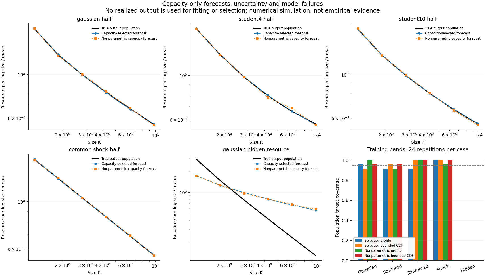

# Capacity-only forecasts when the dependence family is unknown

1 October 2026. This exploratory benchmark extends the
[dependence study](resource-dimensionality.md) by selecting a candidate family
from capacity observations, adding a nonparametric predictor, and assessing
training uncertainty. It uses simulated observations of known mathematical
constructions. It supplies no independent empirical evidence that real units
are governed by the bottleneck mechanism or an allocation principle.

## 1. What is predicted and what remains assumed

Two observed capacities have fixed unit-Pareto marginal laws. Realized output
size is constructed as their minimum. Gaussian, Student-4, common-shock, and
independence candidates are available to the forecasting procedure; the true
family is not passed to fitting or selection. Candidate Student degrees of
freedom remain fixed at four, and the marginal laws remain known.

Five generating scenarios use Gaussian dependence with latent correlation 0.5,
Student dependence with the same correlation and either four or ten degrees of
freedom, common shocks with shared hazard 0.5, and Gaussian observed capacities
with an additional unobserved independent requirement. That final scenario
constructs realized output as the minimum of all three capacities while exposing
only two to fitting and selection. It tests completeness of the measured
resource constraints rather than finite-sample uncertainty alone.

The audited additive resource is fixed as $q(K)=K$ throughout. Population
resource profiles use six fixed logarithmic bins on $[1,12]$. Their target is
the ratio of bounded resource means

$$
\phi_j=\frac{E[K\mathbf1\{K\in B_j\}]/\Delta\log k_j}
{\sum_iE[K\mathbf1\{K\in B_i\}]/\sum_i\Delta\log k_i}.
$$

Resource above the domain is excluded from this target rather than assumed
absent from the generating law. The unconditioned CDF on the bounded domain
is a second target. It retains the probability of lying above that domain;
it is not renormalized to a truncated distribution. Neither target certifies
flatness or determines an unlimited tail exponent.

## 2. Independent stages and capacity-only selection

For each scenario, 24 independent outer repetitions use three independent
samples: 4,000 capacity observations for fitting, 4,000 for family selection,
and 16,000 independently simulated realized outputs for forecast assessment.
Outputs never enter fitting or selection.

Gaussian and Student candidate correlation parameters are estimated from
Kendall correlation. A fixed capacity exceedance threshold estimates the
common-shock parameter, and the independence candidate adds no parameter.
Selection uses mean binary Brier scores on seven fixed joint-exceedance
thresholds, $1.5,2,3,4,6,8,12$. If the true event probability is $p_0$, the
expected binary score at prediction $p$ is
$(p-p_0)^2+p_0(1-p_0)$, so its probability target is explicit.

This procedure selects a candidate description of the feasible-capacity
distribution at the declared thresholds. It does not identify the entire
copula from its diagonal probabilities. Selection between a finite list also
does not establish that the selected model is adequate or that its asymptotic
dimension is identified.

The nonparametric predictor directly uses minima of the fitting capacities.
It estimates bounded resource means and the empirical CDF without choosing a
copula. This removes the family assumption over the declared range but retains
the observed-resource completeness and bottleneck assumptions. It supplies
no extrapolation beyond the range supported by those measurements.

## 3. Training bands and their population coverage

Each repetition draws 100 bootstrap samples of both capacity stages. Candidate
parameters and family selection are recomputed in each draw. Centered sup-norm
bootstrap radii produce separate nominal 95% simultaneous bands for the entire
declared resource-bin vector and the bounded CDF. The two targets are not
combined into a claimed joint 95% band.

The selected-model CDF is a piecewise-linear function in log size on an audited
forward grid. The largest bootstrap difference between two such functions is
attained at a grid knot, so all knots enter its sup radius. The nonparametric
CDF radius uses the full empirical step functions, evaluating whole tied-value
groups rather than treating their repetitions as distinct thresholds.

Coverage is assessed against known population resource profiles and population
CDFs in the simulation. It is not assessed against a noisy realized-output
profile. The latter has separate forecast-error statistics. The bounded
population CDF calculation checks both sides of empirical jumps and the upper
domain boundary, using an independently audited fine population interpolant.
Numerical CDF evaluations remain approximate rather than a certified continuum
inequality proof.

Bootstrap bands after family selection are approximate. Their nominal level
is not assumed valid; the repeated simulations assess it. Twenty-four outer
repetitions supply wide binomial intervals, preserved in the numerical record,
and cannot establish precise calibration. These bands propagate sampling in
the two capacity stages. They do not account for an unobserved requirement,
incorrect marginal laws, measured-cost errors, or failure of the bottleneck
mechanism.

The [configuration](../configs/forecast_study_2026-10-01.json) records all
scenario and score choices. Numerical CDF resolution was refined during
development after an interpolation audit, before the final run. The resource
bins, score thresholds, and forecasting scenarios were unchanged. This is a
local exploratory specification, not an externally registered or blinded
confirmatory protocol. The runner records its configuration checksum and
package versions.

The final forward interpolation audit has a maximum absolute CDF error of
$1.75\times10^{-4}$ at the audited midpoints and a maximum absolute resource
profile error of $3.56\times10^{-4}$. The fine population interpolant's
audited CDF error is at most $2.59\times10^{-5}$. These are declared numerical
checks at specified parameters and points, rather than proven global bounds.

## 4. What the benchmark shows

With all required resources observed, mean held-out resource-profile log errors
are about 0.028–0.029 for the capacity-selected models and 0.049–0.074 for the
nonparametric predictor. Lower parametric error in this finite range does not
identify a true unlimited tail law. In Gaussian-generated data, Gaussian is
selected in 15 of 24 repetitions, Student-4 in seven, and common shocks in two.
These candidates can give close bounded predictions while implying different
limiting feasibility dimensions.

Student-10 is absent from the candidate list. It is represented by Gaussian
in 15 repetitions and Student-4 in nine. Useful finite-range prediction can
therefore coexist with a misspecified candidate family. The procedure must
not turn that prediction performance into confidence about its asymptotic
dimension or a unique underlying resource geometry.

When an unobserved third capacity restricts realized output, mean profile
errors increase to about 0.843 for selected models and 0.855 for the
nonparametric predictor. Both methods miss the output population profile
and CDF in all 24 repetitions. Their bands can still cover the measured
two-capacity population. Correct sampling uncertainty for the measured
inputs does not repair an omitted physical constraint.

| Generating scenario | Selected-profile coverage | Selected-CDF coverage | Nonparametric-profile coverage | Nonparametric-CDF coverage |
|---|---:|---:|---:|---:|
| Gaussian, correlation 0.5 | 23/24 | 22/24 | 24/24 | 23/24 |
| Student-4, correlation 0.5 | 22/24 | 23/24 | 22/24 | 23/24 |
| Student-10, correlation 0.5 | 22/24 | 24/24 | 24/24 | 24/24 |
| Common shock, shared hazard 0.5 | 24/24 | 24/24 | 23/24 | 24/24 |
| Gaussian with omitted third resource | 0/24 | 0/24 | 0/24 | 0/24 |

These assess simultaneous coverage of each realized-output population target.
They do not establish exact 95% calibration. All resource bins were positive
in this run; undefined log errors were therefore never dropped from an aggregate.



The full per-repetition record in
[forecast-study.json](../results/forecast/forecast-study.json) preserves family
selection, capacity-only scores, bounded forecast errors, bootstrap family
counts, band radii, and coverage of both measured-capacity and realized-output
populations. [profiles.csv](../results/forecast/profiles.csv) identifies every
scenario and repetition. Zero bins remain explicit; whole-profile log error
is undefined if a necessary bin is zero.

The scientific implication is constructive: independently measured capacities
can forecast complete resource profiles without fitting the observed output
exponent. Accurate forecasts do not alone identify asymptotic dimensionality,
and resource completeness is an independently testable condition. A physical
study should therefore measure realized sizes separately, audit all required
inputs, compare alternative mechanisms, and retain interventions where both
candidate models and nonparametric capacity forecasts fail.

## Reproduction and checks

```bash
PYTHONPATH=src python3.11 -m unittest discover -s tests -p 'test_forecast.py' -v
PYTHONPATH=src MPLCONFIGDIR=/tmp/orthopolity-mpl python3.11 experiments/run_forecast.py
```

Eight targeted tests pass. They check bounded resource means and empty bins,
independent survival-to-resource integration, proper probability scoring,
interpolation before normalization, full-vector band radii, empirical CDF
jumps and ties, and capacity-only fitting. PNG and SVG artifacts were rendered
and inspected. These are computational checks of a constructed forecasting
study, rather than empirical confirmation of resource neutrality.
