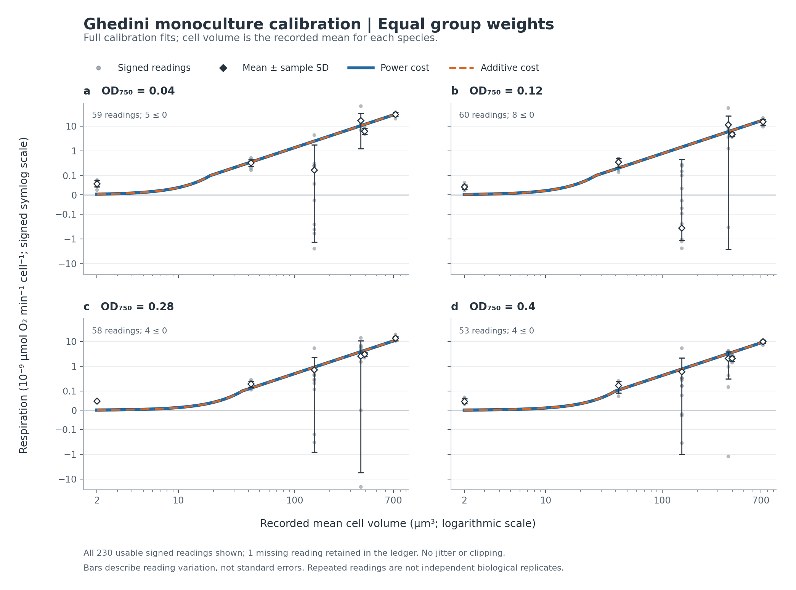
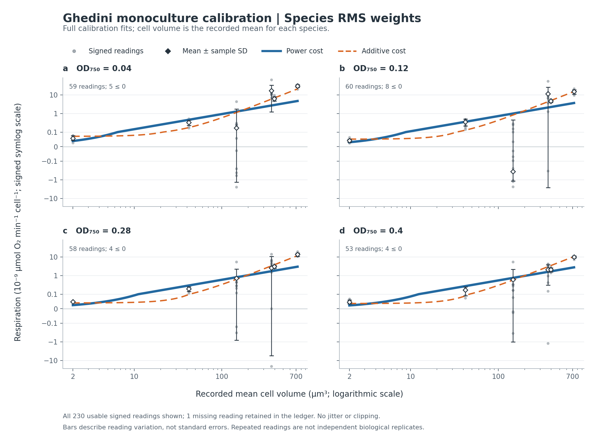

# Respiration calibration does not qualify the size-versus-cost test

5 October 2026. Completed calibration-only analysis,
`ghedini-cost-calibration-2026-10-05`. This is a retrospective analysis of
published measurements, with choices committed before fitting. It supplies
neither an allocation-law verdict nor external preregistration.

**The frozen numerical gate failed.** A positive additive overhead changes
predictions under one weighting, but the conclusion does not persist across
the declared fitting sensitivities. Numerical community outcomes remain closed.
The result closes this particular calibration route; it does not reject every
non-power cost function or either allocation hypothesis.

## Question and measurements

The [reference-measure design](measure-intervention.md) compares equal expected
resource per logarithmic size (S) with equal expected resource per logarithmic
cost (Q). Their count profiles agree under a power cost. An independently
supported non-power cost could make them distinguishable. The
[candidate audit](measure-candidate-audit.md) recovered separate monoculture
respiration measurements for species used in a coexisting-community experiment.

[Ghedini, Malerba and Marshall (2020)](https://doi.org/10.1098/rspb.2020.0995)
redistributed the calibration from
[Malerba, White and Marshall (2017)](https://doi.org/10.1002/ecy.2032).
The retained [source deposit](https://doi.org/10.26180/5e30e9e2b02b3),
provider-checksummed ZIP and receipts remain unchanged. The analysis reads only
the previously exposed [231-row calibration ledger](../data/measure-candidates/2026-10-04/ghedini-calibration-rows.json).
It opens no XLSX worksheet and decodes no numerical community row.

Six species have one recorded mean cell volume each, spanning
2.002144–728.9686366 µm³. Four OD750 conditions produce 24 species-by-OD
groups. Of the 231 readings, 230 are finite: 209 positive, 20 negative and one
zero. One rate is missing. Every signed reading contributes to its group's
arithmetic mean; no logarithm, clipping or positivity exclusion is applied.
One *Dunaliella* group has a negative mean. Source-row memberships, sample SDs,
ranges and missingness remain in the [group ledger](../data/ghedini-cost-calibration/2026-10-05/group-ledger.json).

The repeated dark periods lack culture/vial/window identifiers in this table.
They are not 231 independent biological replicates. SD bars describe the
readings and are never divided by the square root of their count. OD750 is an
assay condition, not a common physical biomass: undiluted biovolume
concentration differs approximately 11.7-fold across species.

## Protocol and fitting

Commit `d49f0e6` retained the [configuration](../configs/ghedini_cost_calibration_2026-10-05.json),
[algorithms](../src/orthopolity/cost_calibration.py),
[runner](../experiments/run_ghedini_cost_calibration.py), group ledger,
fold membership and content-addressed source snapshots before the first fit.
Calibration readings and published summaries had already been inspected.
This checkpoint prevents result-driven revisions; it does not restore blinding.

The nested families are

$$q_P(V,z)=A(V/V_0)^d(z/0.4)^\beta,$$
$$q_A(V,z)=[A(V/V_0)^d+C](z/0.4)^\beta,$$

with $A,d>0$, $C\geq0$ and a fixed geometric-midpoint $V_0$ of the calibration
size span. Positive conditional expected rates are fitted to the signed group
means using squared residuals on the original rate scale. This is a working
loss, without an iid likelihood or confidence-coverage claim. An inferred
$C$ does not establish a physical overhead intervention.

Two declared weightings are used: one equal weight per group, and residuals
scaled by each species' training-only RMS of mean and sample SD. The latter
keeps small-rate species influential without treating SD as a standard error.
All six species are held out in turn, including every OD group for that
species; the smallest and largest species are flagged as extrapolations.
Each OD is also held out across species. Separate-OD fits test the assumption
that assay conditions alter cost by a common multiplier.

The fixed bounds and multistart recipes are in the configuration. An exact
$C=0$ power fit is included as an additive candidate. Thus training loss cannot
increase merely by adding the overhead parameter. Predictive performance can
still worsen. Synthetic checks verify grouping, nested fitting, independent
quadrature, unit invariance and technical-bound flags. Changing held-out means
and SDs leaves fitted coefficients and forecasts byte-for-byte identical.

## Held-out cost prediction

Raw-rate RMSE below is in $10^{-9}$ µmol O₂ min⁻¹ cell⁻¹. Positive improvement
means lower additive-model error. Both models score the same groups.

| Fitting weights | Held-out unit | Power RMSE | Additive RMSE | Improvement |
|---|---|---:|---:|---:|
| Equal groups | Species, all six | 3.675 | 3.679 | −0.11% |
| Equal groups | Species, four interior | 4.330 | 4.335 | −0.12% |
| Equal groups | OD condition | 2.633 | 2.633 | Numerically negligible |
| Species RMS | Species, all six | 7.812 | 5.022 | 35.72% |
| Species RMS | Species, four interior | 4.786 | 3.567 | 25.46% |
| Species RMS | OD condition | 6.183 | 4.118 | 33.40% |

The equal-group models are effectively tied; the tiny difference is not
substantive inferiority. The species-RMS additive model improves raw error for
five of six species, but not uniformly across taxa. Its species-balanced standardized
species-holdout RMSE worsens from 0.835 to 1.713. Holding out the smallest
species raises its standardized error from 0.950 to 3.980; that is an
endpoint extrapolation. Interior-species standardized RMSE improves from
0.795 to 0.610. Every fold and forecast is retained in
[study.json](../results/ghedini-cost-calibration/study.json) and
[heldout-predictions.json](../results/ghedini-cost-calibration/heldout-predictions.json).
Neither aggregate score establishes that the working cost model is adequate.

The full equal-group fit has $d=1.558$, $\beta=-0.505$ and overhead
$C\approx4.4\times10^{-31}$ in rate units, effectively the power boundary.
The species-RMS additive fit instead has $d=1.854$, $\beta=-0.294$ and
$C=3.59\times10^{-11}$. Its power comparator has $d=0.813$.
This weighting dependence changes the scientific prediction.





Gray points are all usable signed readings; black points and bars are group
means and descriptive sample SDs. Curves are the full fits, not holdout
forecasts. The signed logarithmic display preserves negative values. The
two curves almost coincide in the equal-group figure.

## Conditional mean-size separation

For a deterministic increasing cost on a fixed domain $[a,b]$, the predicted
mean volumes are

$$m_S=\frac{\int_a^b q(V)^{-1}\,dV}
                {\int_a^b[Vq(V)]^{-1}\,dV},\qquad
m_Q=\frac{\int_a^b Vq'(V)q(V)^{-2}\,dV}
                {1/q(a)-1/q(b)}.$$

Shared budget and the common OD multiplier cancel. A power gives $m_S=m_Q$.
These are diagnostics on the calibration mean-size span, not predictions
authorized for actual communities or bounds on all individual cells.

| Full fit | S mean volume, µm³ | Q mean volume, µm³ |
|---|---:|---:|
| Equal-group additive | 5.383 | 5.383 |
| Species-RMS power | 17.653 | 17.653 |
| Species-RMS additive | 18.775 | 53.190 |

The gate uses full fits, four interior species deletions, four OD deletions,
four separate-OD fits and their converged near-optimal starts under both
weightings. Endpoint species deletions are reported but excluded from this
within-domain moment-stability screen. Across that union:

- S mean-volume sensitivity range: **3.408–45.038 µm³**.
- Q mean-volume sensitivity range: **3.408–187.360 µm³**.
- Minimum paired relative gap: **zero**.
- Cross-fit range separation, $\min(m_Q)/\max(m_S)-1$: **−92.43%**.

Both moment criteria fail the fixed 10% margins. Several equal-group fits
retain the exact nested power candidate. Within species-RMS fits alone, ranges
are narrower and disjoint (S 15.248–28.435, Q 32.383–108.637 µm³); selecting
that weighting after seeing outcomes would abandon the declared robustness
requirement. No best robust fit hits a technical bound other than the allowed
zero-overhead boundary.

The margins are pragmatic design choices, not physical constants or
significance levels. The retained multistart solutions do not exhaust the
whole near-optimal parameter region. Deletion/weighting/condition ranges are
deterministic sensitivity diagnostics, without statistical coverage. They do
not resolve latent biological variation, assay dependence or culture-to-community
transfer. Failure already occurs within this limited sensitivity set.

## Consequence and reproduction

This published calibration does not qualify the proposed S-versus-Q community
test under the frozen additive-family screen. It supplies no stronger evidence
for a natural allocation law and no new contradiction of such a law. A new
curve, weighting, domain or threshold would require a new protocol; this result
will not be repaired by choosing the favorable fit.

Numerical community rows remain uninterpreted. Even a passing calibration
screen would still need independently justified community-domain coverage,
biological cost variation and transfer assumptions, outcome-independent regime
eligibility and forecasts fixed before community access. The earlier bounded
source screen did not recover the full 21-species calibration as a separate
table; recovering it would be new evidence, not an automatic qualification.

Exact replay uses the versions retained in
[frozen-plan.json](../data/ghedini-cost-calibration/2026-10-05/frozen-plan.json):
Python 3.11.6, NumPy 2.3.5 and SciPy 1.16.3. Figures use Matplotlib 3.10.7.
The registry records this as a
published-measurement **calibration diagnostic**, distinct from an allocation
study. Registration itself requires exact numerical replay.

```bash
make ghedini-cost-calibration PY=python3.11  # exact offline numerical replay
make ghedini-cost-calibration-report PY=python3.11  # retained-results figures
make registry-verify PY=python3.11
```
