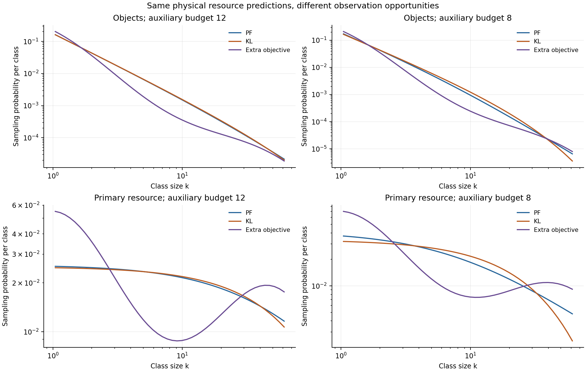
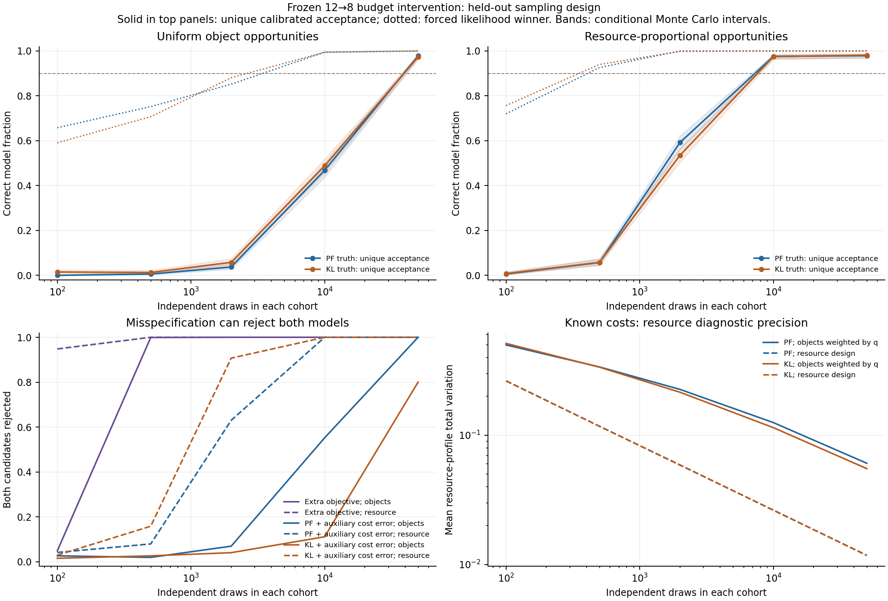
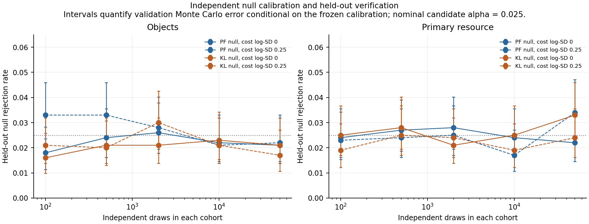

# Forward identifiability of the budget intervention

1 October 2026. The frozen proportional-fairness (PF) and relative-entropy (KL)
responses can be distinguished with independent observations, but the number
and kind of observation opportunities matter. In this sampling-design study,
the first tested sample size meeting the declared identification criterion is
50,000 uniformly sampled objects per cohort, versus 10,000 resource-proportional
opportunities per cohort. Both figures apply to the exact-cost model scenarios.

The [configuration](../configs/intervention_study_2026-10-01.json) specifies the
design before the benchmark run. The [report](../results/interventions/study.json)
records its SHA-256, all costs and predictions, 60 held-out scenarios, 40 null
checks, and software versions. The truth models are imposed; these are forward
power calculations for planning observations.

## 1. Common constraints and frozen predictions

The class domain, costs, and intervention continue the
[restriction study](restriction-study.md): 48 logarithmic classes on $[1,64]$,
midpoint costs $q_1=k^2$, $q_2=k^3$, primary total one, and auxiliary budget
changing from 12 to 8. Both PF and KL use the same binding totals before and
after the intervention. The code verifies that compatibility before constructing
an observation distribution. All multipliers follow from the declared budgets;
evaluation data fit no allocation parameter.

Counts $N_j$ are continuous allocation intensities. The unit primary total
normalizes the model: scaling all budgets and intensities together produces the
same categorical sampling law. Evaluation cohorts contain $n$ independent draws
before and $n$ after intervention. Those sampled subsets have varying physical
resource totals; no sample is forced to satisfy the population allocation budget.
The calculation assumes independent observations and does not measure the
effective sample size of a spatially or temporally correlated natural survey.

The original PF and KL optimization sources are linked in the restriction study.
This extension supplies the finite sampling and adequacy calculation rather than
a new physical optimization principle.

## 2. Object counts and resource opportunities have different laws

Uniformly sampled objects have class probabilities

$$p_j^{\rm object}=\frac{N_j}{\sum_iN_i}.$$

Primary-resource-proportional sampling instead uses

$$p_j^{\rm resource}=\frac{q_{1j}N_j}{\sum_iq_{1i}N_i}.$$

The likelihood always uses the probability of its actual sampling design.
Replacing the object probability by the resource probability would give a
different experiment. The simulation produces multinomial counts from each
legitimate law and retains zero-count classes in likelihood calculations.

For a resource diagnostic, a sampled object with known sampling propensity
$s_j$ contributes inverse-propensity weight $q_{1j}/s_j$. Uniform objects have
$s_j=1$ and explicitly contribute their measured cost $q_{1j}$. Resource sampling
has $s_j=q_{1j}$, so this weight is one. Applying $q_1$ again to resource-sampled
counts would estimate a second-moment allocation. The normalized uniform-object
resource estimator has finite-sample ratio bias; its actual error is measured in
the simulation rather than assumed away.

Resource-proportional sampling here is an ideal observation design with known
primary costs and inclusion propensities. Its acquisition effort can differ
from uniform object sampling. The results compare independent draws, not
financial or fieldwork cost per successful experiment.



## 3. A comparison that can reject both candidates

The primary adequacy statistic is joint before/after multinomial deviance:

$$G_m^2=2\sum_{t,j} C_{tj}\ln\frac{C_{tj}}{n_tp_{m,tj}},$$

where zero observed counts contribute zero. Each frozen candidate gets 4,000
independent null-calibration draws for each observation design, sample size,
and cost condition. Its upper-tail Monte Carlo p-value is

$$\widehat p_m=\frac{1+\#\{G^2_{m,\rm null}\ge G^2_{m,\rm observed}\}}{4001}.$$

Including the observed statistic in its exchangeability rank supplies the
$+1$ correction; ties make the procedure conservative. Calibration draws and
evaluation draws use separate seed streams. Evaluation has 1,000 independent
replicates per scenario. The JSON and calibration CSV retain each calibrated
deviance cutoff; rejection requires strictly exceeding it.

Each candidate is rejected at 0.025. The two-test Bonferroni error bound is
0.05 for rejection of any true frozen candidate, marginal over calibration
and observation draws. Four outcomes are retained: only PF passes, only KL
passes, both pass, or both are rejected. Passing means passing this specified
adequacy test. A unique passing candidate is the declared identification outcome.

Forced likelihood selection is reported separately. Its PF-minus-KL score is

$$L=\sum_{t,j} C_{tj}\ln\frac{p_{\rm PF,tj}}{p_{\rm KL,tj}}.$$

For a known simulation law $p_*$, its exact mean is
$n\sum_{t,j}p_{*,tj}\ln(p_{\rm PF,tj}/p_{\rm KL,tj})$, and its variance is
$n\sum_t\operatorname{Var}_{p_{*,t}}[\ln(p_{\rm PF,tj}/p_{\rm KL,tj})]$.
The code records these expectations and the observed values. Tests check the
likelihood moments against exhaustive enumeration of a small experiment.

Both the joint score and the deviance evaluate complete frozen before/after
profiles. Their information includes pre-intervention shape differences. The
JSON also records forced likelihood fractions separately for before and after;
this study does not isolate a response-only test with an unknown baseline as a
nuisance parameter.

## 4. Held-out rates and sample-grid requirements

With exact costs, observed unique-identification rates are:

| Draws per cohort | PF truth, uniform objects | KL truth, uniform objects | PF truth, resource opportunities | KL truth, resource opportunities |
|---:|---:|---:|---:|---:|
| 100 | 0.000 | 0.015 | 0.006 | 0.008 |
| 500 | 0.006 | 0.013 | 0.057 | 0.058 |
| 2,000 | 0.037 | 0.058 | 0.592 | 0.535 |
| 10,000 | 0.468 | 0.488 | 0.976 | 0.975 |
| 50,000 | 0.978 | 0.973 | 0.979 | 0.981 |

The criterion is a unique-identification rate whose 95% conditional Monte Carlo
lower bound reaches 0.90. The first passing grid sizes are 50,000 per cohort
for both uniform-object truths and 10,000 per cohort for both resource-sampling
truths. These are first passing **tested** sizes, with no claim that the exact
minimum lies at a grid point. The total observation count is twice the
per-cohort number.

At 10,000 uniform objects per cohort, forced likelihood picks the generating
model in 99.5% of PF runs and 99.4% of KL runs. Yet only 46.8% and 48.8%
uniquely pass the two-candidate adequacy comparison; most of the remainder are
ambiguous. A preference between candidates therefore carries less evidential
content than the declared identification outcome.

For post-intervention resource profiles, mean total-variation error at 10,000
draws is 0.125 for uniform PF objects and 0.115 for uniform KL objects, versus
0.0263 and 0.0264 under resource-proportional sampling. The object diagnostic
weights every sampled object by known primary cost; sparse high-cost classes
account for its slower improvement.



Held-out null rejection rates across the 40 independent checks have mean
0.02375 and range 0.016–0.034, against candidate alpha 0.025. The calibration
figure retains all checks and their Monte Carlo intervals. Intervals quantify
evaluation replication error conditional on each frozen calibration set; they
do not include calibration-set randomness or uncertainty in real-system costs.



## 5. Extra objectives and cost errors remain visible

A third imposed truth maximizes proportional fairness with class weights

$$w_j^{\rm extra}=w_j\exp\!\left[0.8\cos\!\left(
\frac{2\pi\ln k_j}{\ln64}\right)\right].$$

It keeps the same costs and the same binding before/after budgets. Neither
frozen candidate includes this additional class preference. At 10,000 draws
per cohort, both candidates are rejected in every held-out third-truth run
under either observation design, even while forced likelihood chooses PF in
every run. The score still produces a preferred approximation when neither
candidate is adequate.

The cost-error condition preserves known primary cost $q_1$ and perturbs only
the reported auxiliary cost:

$$\widehat q_{2j}=q_{2j}e^{0.25\eta_j}.$$

One seeded centered Gaussian class-error pattern is shared before and after.
Candidates are forecast using $\widehat q_2$; the underlying allocations still
use true $q_2$. This is a fixed instrument-miscalibration stress test, not an
error-marginalized likelihood or an average over all possible instruments.
Keeping primary cost known makes both sampling designs and their resource
diagnostics internally consistent.

At 10,000 draws per cohort, resource-proportional observations reject both
erroneous candidates in every PF and KL truth run. Under uniform objects,
both are rejected in 55.2% of PF runs and 11.1% of KL runs. Measurement quality
and observation design therefore affect what a model failure can establish.
The decision target for these wrong-cost scenarios is rejecting both frozen
predictions, rather than crediting the original mechanism's name as an adequate
forecast.

## 6. What the calculation enables

The benchmark supplies a concrete prospective protocol: measure costs and
budgets independently, specify inclusion probabilities, freeze both before/after
predictions, obtain independent opportunities of the declared kind, and retain
ambiguous and reject-both decisions. It quantifies how much weaker ordinary
object sampling can be when the discriminating primary resource lives in sparse,
high-cost classes.

A real experiment needs its own cost uncertainty, acquisition design, dependency
structure, and scientifically meaningful alternative objectives. The current
sample-grid requirements guide that calculation. Successful prediction of a real
intervention would add empirical content to the resource framework; synthetic
identification of an imposed objective establishes design feasibility.

## Reproduction and checks

```bash
PYTHONPATH=src python3.11 -m unittest discover -s tests -p test_interventions.py -v
PYTHONPATH=src MPLCONFIGDIR=build/matplotlib python3.11 experiments/run_interventions.py
```

All eight focused tests pass: object/resource target distinction, proper
inverse-propensity weighting, zero-count deviance, enumerated likelihood moments,
finite Monte Carlo ranks and ties, independent false-positive and power checks,
common budgets under the three objectives, and four-way decisions. The benchmark
completed in approximately 4.5 seconds including plotting. All three figures were
rendered and visually checked.

The [implementation](../src/orthopolity/interventions.py),
[runner](../experiments/run_interventions.py), [tests](../tests/test_interventions.py),
[power CSV](../results/interventions/power.csv), and
[calibration CSV](../results/interventions/calibration.csv) accompany the report.
