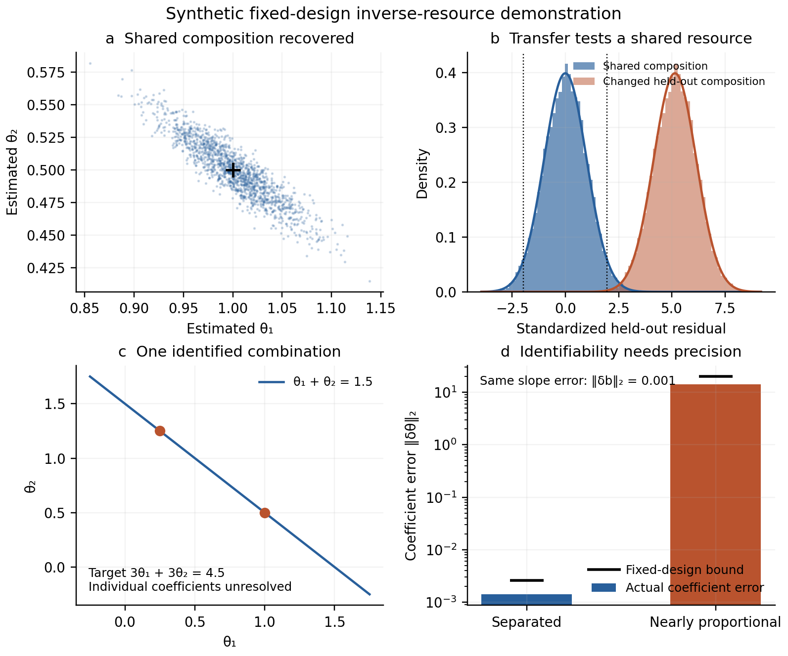

# Composite-resource identification and predictions across environments

This completed synthetic demonstration turns the product-resource example into
an explicit inference and prediction calculation. It supports Sections 7–8 of
the [effective-resource derivation](effective-resources.md) and Section 2.3 of
the [article](paper.md). The retained run is
[`inverse-resources-2026-10-06`](../results/inverse-resources/summary.json),
configured on 6 October and completed on 7 October 2026. Its inputs are
constructed mathematical values. It introduces no observations of natural
systems and supplies no empirical confirmation of a general law.

The calculation establishes what the assumed resource family predicts,
which parts can be recovered, and when recovery becomes unreliable. The
rank, null-space, least-squares, and covariance results are standard linear
algebra. Their role here is to make the inverse orthopolity proposal precise
enough to produce a prediction that was not used in its calibration.

## Fixed model and analytic predictions

Prespecify a dimensionless product resource
$Q=Q_0X^{\theta_1}Y^{\theta_2}$ and the logarithmic size measure. Deterministic
constituents scale as $X_s\propto k^{D_{s1}}$ and $Y_s\propto k^{D_{s2}}$.
The known allocation factor is $a_s(k)\propto k^{-v_s}$. A count density
$dN_s/dk\propto k^{-(1+\alpha_s)}$ therefore has corrected slope
$b_s=\alpha_s-v_s=D_{s1}\theta_1+D_{s2}\theta_2$.

| Environment | Constituent exponents | Known offset $v_s$ | Corrected slope $b_s$ | Abundance slope $\alpha_s$ | Role |
| --- | --- | --- | --- | --- | --- |
| 1 | $(1,1)$ | $0.15$ | $1.5$ | $1.65$ | Calibration |
| 2 | $(1,2)$ | $-0.10$ | $2.0$ | $1.90$ | Calibration |
| 3 | $(2,1)$ | $0.20$ | $2.5$ | $2.70$ | Held-out prediction |

The first two rows recover $\theta=(1,1/2)$, or $Q=Q_0X\sqrt Y$.
Since $D_3=3D_1-D_2$, the prediction fixed without the third abundance slope is

$$b_3=3b_1-b_2,\qquad
\alpha_3=3(\alpha_1-v_1)-(\alpha_2-v_2)+v_3.$$

The scalar $Q_0$ is not identified by slopes. No resource amplitude or
conservation principle is inferred from its omission. The composition
is assumed shared across environments, while the known constituent scalings
and known constraint offsets change.

## Correlated uncertainty and deliberate misspecification

Every estimated slope has Gaussian marginal standard error $0.02$. The
joint correlation is

$$\mathcal C=\begin{pmatrix}
1&0.35&0.20\\
0.35&1&0.40\\
0.20&0.40&1
\end{pmatrix},\qquad \Sigma_b=0.02^2\mathcal C.$$

The design and offsets are exact in this experiment. The calibration estimate
uses generalized least squares. Its analytic covariance is

$$\operatorname{Cov}(\widehat\theta)=
\begin{pmatrix}0.00144&-0.00078\\-0.00078&0.00052\end{pmatrix}.$$

For the held-out residual, $c=(-3,1,1)^\top$ gives
$\operatorname{Var}(r)=c^\top\Sigma_bc=0.0034$ and
$\operatorname{SE}(r)=0.0583095$. Retaining the correlations is essential:
the prediction uncertainty and held-out observation uncertainty cannot simply
be added as if independent. The reported intervals are centered on the
calibration prediction and assessed against the noisy held-out slope; they
include both sources of uncertainty. Coverage is unconditional across the
specified joint repetitions.

The run generates 20,000 independent joint error vectors with seed 20261006.
Each error vector is reused in a paired alternative where only the held-out
composition changes to $(1,0.8)$; its true $\alpha_3$ is then $3.0$ instead
of $2.7$. The same frozen calibration forecast is used for both scenarios.
No parameter is refitted to the third slope.

| Quantity | Analytic prediction | Seeded outcome |
| --- | ---: | ---: |
| Mean recovered $\theta_1$ | 1 | 0.999741 |
| Mean recovered $\theta_2$ | 0.5 | 0.500149 |
| Shared-model standardized residual mean | 0 | 0.009145 |
| Shared-model standardized residual variance | 1 | 1.011435 |
| Shared-model 95% interval coverage | 95% | 94.815% |
| Changed-composition standardized residual mean | 5.144958 | 5.154103 |
| Changed-composition two-sided rejection fraction | 99.9276% | 99.915% |

The Monte Carlo standard error of nominal 95% coverage is 0.1541 percentage
points. These results check the inference calculation under its declared
Gaussian model. The high rejection fraction is the power for one specified
alternative and one selected noise level; it does not establish general
sensitivity to changes in effective resources. In empirical work a failed
forecast could also arise from an incorrect offset, constituent measurement,
sampling model, or heterogeneity correction.

## Partial identification and conditioning

With calibration rows $(1,1)$ and $(2,2)$, the data identify only
$\theta_1+\theta_2=1.5$. For example, $(1,0.5)$ and $(0.25,1.25)$ give
exactly the same two corrected slopes. The target row $(3,3)$ nevertheless
predicts $4.5$. A target row $(1,0)$ cannot be determined. The implementation
rejects unidentified components and targets instead of interpreting a
minimum-norm coefficient vector as a discovered physical composition.

Formal uniqueness also need not imply useful precision. Compare the original
calibration design to rows $(1,1)$ and $(1,1.0001)$, and perturb the second
corrected slope by $0.001$ in both cases:

| Design | Condition number | Coefficient change | Error norm | Fixed-design bound |
| --- | ---: | --- | ---: | ---: |
| Original distinct scalings | 6.8541 | $(-0.001,0.001)$ | 0.0014142 | 0.0026180 |
| Nearly proportional scalings | 40002.0 | $(-10,10)$ | 14.1421 | 20.0005 |

Both matrices have full column rank at the declared relative SVD threshold
$10^{-12}$. This separates rank from precision. The error bound is
$\|\delta b\|_2/\sigma_{\min}(D)$; the tests also verify attainment along
the weakest singular direction. The [derivation](effective-resources.md)
states a separate deterministic bound for perturbed constituent exponents,
but this run does not simulate or estimate error in $D$.



## Reproduction and provenance

The [configuration](../configs/inverse_resources_2026-10-06.json) fixes all
parameters and both scenarios. The
[runner](../experiments/run_inverse_resources.py) writes
[`predictions.json`](../results/inverse-resources/predictions.json) before
drawing any random values. This is an auditable execution order within a
constructed demonstration, not external preregistration or an unexposed
empirical holdout. The illustrative values and analytic results were already
known during protocol construction.

```bash
PYTHONPATH=src python3.11 -m unittest discover -s tests -p test_inverse_resources.py -v
MPLCONFIGDIR=build/matplotlib PYTHONPATH=src python3.11 experiments/run_inverse_resources.py \
  --output build/reproductions/inverse-resources
```

The [implementation](../src/orthopolity/inverse_resources.py) uses SVD rank
and null spaces, whitening-based generalized least squares, identifiable
target estimation, covariance propagation, and a fixed-design error bound.
Eleven tests include independent analytic solutions, deficient and zero-rank
cases, uncertain correlated offsets, Gaussian coverage, and worst-direction
perturbations.

The retained output contains the copied configuration, analytic predictions,
all 20,000 replicate rows in deterministic gzip CSV, summary, PNG and SVG
figures, and a provenance manifest. The manifest records hashes of the
configuration, runner, numerical module, tests, and every result artifact;
it records runtime versions and generation time separately. Invoking the
runner on an existing retained directory audits the inputs and outputs,
and refuses to overwrite changed artifacts. A fresh directory reruns the
calculation. Byte-level reproducibility was checked in the recorded runtime;
different numerical libraries may introduce floating-point differences.

The synthetic result makes an empirical next step concrete: independently
characterize constituents and constraints, estimate a restricted shared
composition on calibration environments, and test the resulting forecast
elsewhere with uncertainty propagated. It supplies a method for that step,
not a substitute for the observations.
