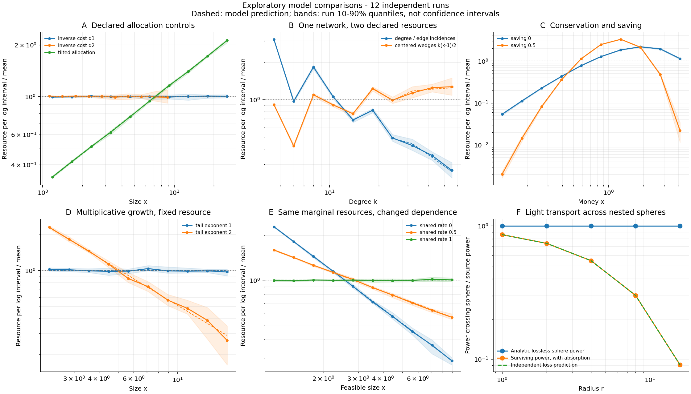
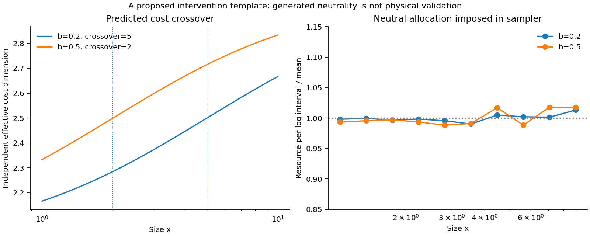

# Resource dimensionality across models: a first simulation study

1 October 2026. Exploratory theoretical and computational work, with twelve
independent seeded runs per scenario. This study adds no observations of natural
systems and makes no new-law discovery claim. It develops the original ambition
by comparing resource interpretations across different generative models.

The [configuration](../configs/model_study_2026-10-01.json) was written before
this run. It is a local computational specification, not an externally registered
or blinded research protocol. Parameters and domains were chosen for illustrative
model comparisons. The [source catalogue](model-sources.md) distinguishes exact,
asymptotic, and approximate predictions and provides primary references.

## 1. A common mathematical structure with physical interpretations

Let $h(k)>0$ be an observed intensity or density and $G(k)>0$ an independently
defined geometric support or resource weight. Define

$$H(k)=G(k)h(k),\qquad
D_G(k)=\frac{d\ln G}{d\ln k}.$$

Then, wherever these derivatives exist,

$$-\frac{d\ln h}{d\ln k}
=D_G(k)-\frac{d\ln H}{d\ln k}.$$

If $H$ is constant and $G$ is homogeneous of degree $D$, then $h\propto k^{-D}$.
This is a shared form connecting several legitimate physical interpretations:

| Setting | Observable $h$ | Independent weight $G$ | Aggregate $H$ |
|---|---|---|---|
| Allocation | Count density per declared class measure | Mean additive cost per object | Resource per class measure |
| Capacity and occupancy | Mean occupied-unit count | Cost per unit | Occupied resource or utilization |
| Complete hierarchy | Number of units at one level | Mean resource per unit | Same total resource represented at that level |
| Transport | Flux intensity | Intercepting surface area | Power transported across a surface |

The common form is a useful organizing framework. The physical reason for
constancy differs between settings and is not supplied by multiplication itself.
Hierarchy levels and nested transport surfaces reuse the same underlying resource;
summing their totals would not count disjoint stocks. A broad theory can include
these settings without treating their observables as identical measurements.

For an abundance density $n(k)=dN/dk$, choose mean additive resource $\bar q(k)$.
Resource per log interval is $O(k)=k\bar q(k)n(k)$. If costs scale as $k^D$,
abundance as $k^{-\alpha}$, and $O$ as $k^\beta$, then

$$\alpha-1=D-\beta.$$

The exponent measures resource scaling dimension under the specified allocation
condition. A dimension inferred from abundance alone cannot distinguish cost
scaling from allocation tilt. This is a conditional interpretation, compatible
with developing a substantive new allocation principle.

## 2. Outcome-defined classes and the status of a principle

Defining a class by its power-law behaviour is legitimate. It can support
classification, mathematical representation, discovery of regimes, and comparisons
among apparently different mechanisms. It is not automatically unscientific to
identify a regime through the output being studied.

What matters is which claims remain independently testable. Selecting power-law
ranges and then testing an independently specified resource exponent can still
discriminate models, with range selection accounted for. Selecting precisely the
ranges where equal resource allocation holds establishes a descriptive class.
Evidence for a general physical tendency would then have to come from additional
predictions, other observables, interventions, or transfer to new systems.

For every positive $n$, choosing $\bar q(k)=C/[kn(k)]$ makes log-resource allocation
flat. This applies to exponential and other non-power densities too. Therefore
the existence of a balancing weight is a general representation result. Identifying
that weight as an actual resource, support measure, capacity, or conserved flux
is the additional scientific content. Independently recognizable combinatorial
resources are legitimate candidates; a resource need not be energy or dynamically
conserved to have an additive total.

There is no universally fixed hierarchy between a natural law and a principle.
A useful working distinction is that a law states a regularity or relation with
specified conditions, while a principle states a more general constraint or
organizing assumption from which particular relations may follow. A principle
can itself be considered a law; philosophical accounts of lawhood differ
([Stanford Encyclopedia of Philosophy](https://plato.stanford.edu/entries/laws-of-nature/)).

Here "cosmological principle" can denote the author's broader philosophical
proposal of a principle governing Nature or Reality. That usage should be stated
explicitly and distinguished from the conventional spatial-statistical
cosmological principle of large-scale homogeneity and isotropy
([ESA](https://www.esa.int/Science_Exploration/Space_Science/Planck/Planck_and_the_cosmic_microwave_background)).
It does not require a spacetime-only research programme.
The proposed hierarchy of a general principle and its derived laws is coherent;
their empirical status must still be established separately. Neither terminology
nor a shared mathematical representation establishes that Nature generally selects
the required resource symmetry.

Restrictions can be part of the proposed principle. To make that extension
predictive, specify how independently measured restrictions change $H$, rather
than assigning an unspecified restriction to each observed departure. This
would allow the theory to predict both power-law and non-power-law regimes.

## 3. Models, resources, and computational targets

The suite uses six stochastic model families: inverse-cost allocation,
preferential attachment, independent-edge random graphs, pair exchange,
multiplicative growth with a floor, and common-shock joint feasibility. Compound
costs extend the allocation sampler. Spherical radiation supplies a transport
comparison rather than an object-abundance model.

| Model or variation | Declared resource | Target prediction | Status |
|---|---|---|---|
| Inverse-cost controls, $D=1,2$ | $q=k^D$ | Density exponent $D+1$, flat log-resource profile | Allocation built into generator |
| Tilted allocation | $q=k$ | Density exponent 1.4, resource tilt 0.6 | Departure built into generator |
| Barabasi-Albert growth | Degree, or centered wedges $k(k-1)/2$ | Tail exponent 3; edge incidence declines, wedges approach flatness | Independent growth rule; limiting prediction |
| Independent-edge random graph | Same two resources | Binomial degree law; no generic flat spectrum | Independent comparator |
| Uniform random pair exchange | Money $q=k$ | Conserved total; large-population exponential equilibrium | Independent exchange dynamics |
| Pair exchange with saving 0.5 | Same money | Conserved total; narrower peaked distribution | Phenomenological extension; no exact Gamma claim |
| Floor multiplicative growth | Same size/wealth resource $q=k$ | Tail exponent set by multiplier moments | Independent dynamics; asymptotic prediction |
| Joint feasibility with changed dependence | Realized capacity $q=k$ | Marginal resource laws fixed; joint survival exponent changes | Constructed resource mechanism |
| Surface-plus-volume costs | $q=k^2(1+bk)$ | Predicted effective dimension and movable crossover | Allocation built into generator |
| Spherical radiation with and without absorption | Outgoing source power | Inverse-square intensity; predicted attenuation | Transport conservation and loss model |

Calling a model established does not establish its adequacy for every real system.
The catalogue includes less commonly used phenomenological comparisons and further
leads, including heterogeneous saving and latent-variable Zipf models. Those two
extensions have not been simulated in this first suite.

Each stochastic scenario has twelve independent runs. Comparisons use declared
domains and ten logarithmic bins. Continuous bounded power fits are descriptive;
they do not test goodness of fit. Discrete graph degrees are compared with their
discrete model law rather than fitted with an inappropriate continuous likelihood.
Empty bins remain in the results; a full-profile log slope is undefined if any
bin is empty, rather than estimated after dropping those bins.

Resource profiles are averaged as raw resource densities across independent
runs with equal initial population or exposure and normalized once on the
declared domain. This is a
resource-weighted pooled profile, not an equal average of separately normalized
systems. Shading shows run 10th to 90th percentiles relative to the common pooled
normalizer. It is not a confidence band or an equivalence decision. Finite-time
effects, finite populations, and the cost definition remain relevant.

The unbounded feasibility-capacity marginals have infinite population means.
Realized feasible size at fully shared dependence, and the stationary growth
model with survival exponent one, also have infinite means. Their resource
profiles on the declared bounded domains remain finite. Reported full-run resource
totals are finite Monte Carlo sample totals; their sample averages do not establish
a finite population expectation or a fixed resource budget.

## 4. Results from the specified run

Full numerical output is in [model-study.json](../results/models/model-study.json),
with [binned profiles](../results/models/profiles.csv). Both outputs identify each
scenario and its generating parameters. The runner records Python and package
versions. Density exponents below are means of the twelve descriptive
fits; resource slopes describe the pooled binned profile.

| Scenario | Predicted density exponent | Observed density exponent | Predicted resource slope | Observed resource slope |
|---|---:|---:|---:|---:|
| Neutral inverse cost, $D=1$ | 2 | 1.997 | 0 | 0.003 |
| Neutral inverse cost, $D=2$ | 3 | 3.003 | 0 | -0.006 |
| Tilted allocation | 1.4 | 1.402 | 0.6 | 0.598 |
| Multiplicative growth, $\kappa=1$ | 2, asymptotically | 2.017 | 0, asymptotically | -0.014 |
| Multiplicative growth, $\kappa=2$ | 3, asymptotically | 3.009 | -1, asymptotically | -1.005 |
| Independent feasibility capacities | 3 | 3.004 | -1 | -1.003 |
| Half shared feasibility shocks | 2.5 | 2.505 | -0.5 | -0.506 |
| Fully shared feasibility capacities | 2 | 1.995 | 0 | 0.005 |

### An independently defined resource can match a familiar power law

Preferential attachment makes an especially informative comparison. The limiting
degree law is $P(k)=2m(m+1)/[k(k+1)(k+2)]$. Degree counts incident edge ends. Its
resource per log degree declines asymptotically as $k^{-1}$. A different resource,
the number of centered wedges or unordered neighbour pairs, is defined by the
graph independently of its measured exponent. It satisfies

$$k\binom{k}{2}P(k)
=m(m+1)\frac{k(k-1)}{(k+1)(k+2)}\longrightarrow m(m+1).$$

This is a constructive compatibility result: the tail has asymptotically equal
wedges per log degree. The finite domain $[4,64]$ is not exactly flat. Its observed
pooled slope is 0.252, versus 0.247 predicted by the limiting discrete law with
the same bins; integer bin effects and finite-degree corrections matter. The
edge-incidence slopes are -0.841 observed and -0.847 from that law. Agreement
with the limiting profiles is therefore more informative here than comparing
the finite-range wedge profile with a perfectly flat line.

Wedges are a structural quantity, not a conserved input to the growth rule.
The comparison does not establish that wedge neutrality causes preferential
attachment. Holding the wedge resource fixed while changing attachment dynamics
would turn this observation into a prospective compatibility test. Selecting a
different motif for each new fitted exponent would answer a different question.

### Conserved resources need not be neutral across concentration

Uniform pair exchange preserves 12,000 money units to numerical precision. Its
full-population variance is 1.0004, consistent with the mean-one exponential
reference. Saving half the holdings reduces the variance to 0.2499 while preserving
the same money total. Both profiles are peaked rather than flat. Independent-edge
graphs likewise show concentrated degree spectra and empty upper bins.

These observations do not refute every proposed general resource interpretation.
They show that conservation, stationarity, and a declared additive resource do
not alone select neutrality across resource concentration. A broader principle
must predict the relevant restriction or explain its choice of invariant.

### Dependence can give a fractional resulting exponent

Let shared log-capacity $Z$ have exponential rate $\theta$ and each independent
log-capacity $U_a$ have rate $1-\theta$. Set
$X_a=\exp[\min(Z,U_a)]$ and realized feasible size $K=\min_a X_a$. For $k\ge1$,

$$P(X_a\ge k)=k^{-1},\qquad
P(K\ge k)=k^{-[m-(m-1)\theta]}.$$

The individual resource laws are unchanged while the joint-feasibility survival
exponent varies. For two resources at $\theta=0,0.5,1$, predicted density exponents
are 3, 2.5, and 2; observed fits are 3.004, 2.505, and 1.995. Observed individual
capacity survival probabilities at $k=2$ remain between 0.4991 and 0.5003, close
to the common prediction 0.5.

This makes the dependence intuition mathematically precise in one particular
model. Its exponent measures simultaneous feasibility, not automatically the
scaling dimension of additive resource cost. With the same audited resource
$q=K$ in all three cases, we assume that a realized unit of size $K$ uses $K$
normalized units of one required resource (or of each, giving the same profile
up to a constant). Unused capacity $X_a-K$ is excluded from that resource audit.
Log-resource neutrality occurs only at the fully shared
endpoint. Both the positive dimensional result and this allocation distinction
are retained.

### The light-source example supplies genuine equal throughput

For a steady isotropic source in a transparent medium,

$$F(r)4\pi r^2=P.$$

The analytic lossless construction imposes unit power through all five enclosing
spheres and computes intensity with slope -2 from their areas. This verifies the
arithmetic, rather than independently deriving the physical conservation law.
With independently imposed absorption rate 0.15, Monte Carlo surviving
power follows $e^{-0.15r}$; the maximum difference between pooled simulation
and that prediction is 0.000262 in source-power units. The same photons cross
nested surfaces. In the lossless steady case, shell-resident energy is
$dE=P\,dr/c$: stock is equal per linear radial thickness, while stock per log
radius grows as $r$.

Thus this example belongs in a broader resource framework. It identifies a
specific physical invariant and geometry, rather than supplying an extra sample
of resource-allocation populations.

### Compound costs predict a scale-dependent dimension

The declared cost $q=k^2(1+bk)$ has

$$D_{\rm eff}(k)=2+\frac{bk}{1+bk}.$$

Changing $b$ from 0.2 to 0.5 moves the equal-contribution crossover from 5 to 2.
The corresponding generated log-resource slopes are 0.005 and 0.011. Neutrality
was imposed by the sampler; this checks a proposed intervention template, not
that actual systems choose its allocation. A physical test would measure the
costs independently and predict the changed abundance profile.

## 5. The next scientific increment

The [follow-up programme](research-programme.md) now implements the dependence,
attachment, and restriction benchmarks and supplies an independent empirical
protocol. The tests below explain their scientific targets.

The suite now permits comparisons without restricting the programme to one
ecological spectrum or to the name of a particular law. The shared mathematical
structure can include allocation, capacity, hierarchy, and conserved transport.
Their physical content must come from independent identification of resources and
invariants, and from predictions that survive changes in the system.

Three focused next tests have different targets:

1. Freeze wedge resource and the degree domain, then predict how nonlinear
   attachment or fitness-dependent growth changes wedge allocation. Compare
   model-specific full profiles, retaining non-power and finite-cutoff cases.
2. Hold resource-capacity marginal laws fixed and change their joint dependence.
   Use independently measured joint availability to predict the feasible-size
   spectrum, and test whether real units are governed by the assumed bottleneck.
3. Measure two resource costs and change one budget or geometric restriction.
   Compare the multi-budget and relative-entropy models in the assessment on an
   intervention where their prospective profile predictions differ.

Developing a model that produces neutrality is useful construction. A stronger
theoretical contribution would establish independently identifiable conditions
under which a nontrivial class of models shares that behaviour, and predict which
changes preserve or break it. A stronger empirical contribution would demonstrate
those predictions on an independently measured natural system. A primitive
empirical resource principle remains possible without a deeper microscopic
mechanism; it still needs independent content beyond its representation identity.

## Reproduction and verification

~~~bash
make models PY=python3.11
make test PY=python3.11
~~~

The [model implementations](../src/orthopolity/models.py) use explicit NumPy
generators and independent seed streams. Structural and distribution checks cover
graph budgets, sparse random-graph statistics, resource conservation, saving,
boundary atoms, fixed marginal resource distributions, predicted joint tails,
and bounded inverse-cost controls. The existing and new tests total 83 passing
checks in the review environment. These verify the computations and selected
model properties, not empirical universality or the philosophical status of a
proposed principle.
