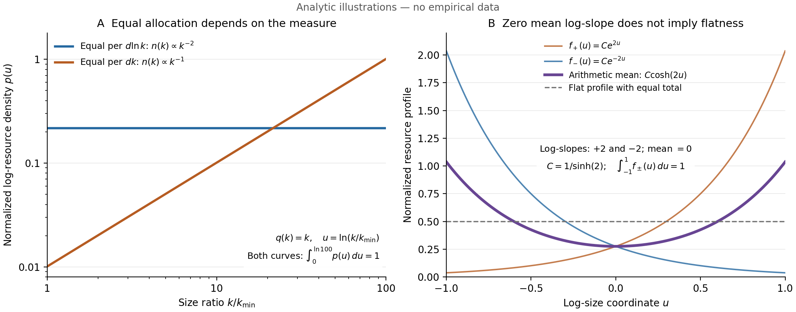

# Orthopolity as a resource-allocation hypothesis

**Reference measures, counterexamples, and an exploratory assessment of aquatic size spectra**

> Research manuscript, revised 9 September 2026. Empirical analyses are exploratory or governed
> by a locally recorded analysis plan; this is not an externally preregistered study.
> Authorship and submission declarations require agreement before submission. Historical drafts
> remain in Git history. Computational details accompany the manuscript in
> [evidence.md](evidence.md) and [source-audit.md](source-audit.md).

## Abstract

Orthopolity proposes that equally allocated resources can produce unequal abundances: classes
whose objects require more resource contain fewer objects. We reconstruct this idea as a
conditional allocation hypothesis and distinguish it from a universal explanation of power laws.
The defining accounting identity depends on a reference measure. With resource cost proportional
to size raised to power $d$, equal resource per logarithmic size interval implies a count-density
exponent $d+1$; equal resource per linear interval implies exponent $d$. Conservation alone
selects neither allocation. We examine frozen earthquake and solar-flare catalogues, a published
ocean biomass reconstruction, and 1,300 aquatic size-spectrum estimates from 16 studies.
Earthquake magnitudes imply a Gutenberg–Richter coefficient of 0.998, far from the 1.5 required
by logarithmic equipartition of the chosen energy proxy. Solar-flare estimates also disagree
with the joint allocation-and-scaling prediction on the selected domain. Aquatic normalized
biomass slopes have median −1.015, close to the predicted −1, but their study-block bootstrap
interval does not establish the planned equivalence. A range-metadata audit identifies
implausible bounds in 377 records. Excluding them, 9.3% of remaining reported slopes meet
a factor-1.25 drift criterion; this is not a count of statistically equivalent systems.
We show why centred slopes, fitted dispersion, and conservation cannot
establish ensemble equipartition. Orthopolity supports a useful synthesis and testing framework;
the available evidence does not establish a new natural or cosmological law.

## 1. Introduction

An allocation can be equal when counted in resources and unequal when counted in objects.
For example, equal biomass in successive body-mass classes requires fewer large organisms.
This observation motivates the term *orthopolity* in Fabbri's
[2024 essay](https://ttm.github.io/2024/08/14/power.html), following an earlier manuscript by
Fabbri and Oliveira Jr. (2017). The earlier manuscript assumes uniform resource allocation
across component-wealth values; the later essay proposes a much broader natural and
cosmological principle. The useful question is which allocation statement can be defined and
tested independently of the abundance distribution it seeks to explain.

The ecological precedent is substantial. Sheldon, Prakash and Sutcliffe (1972) studied ocean
particle size distributions; Gaedke (1993) explicitly related equal biomass in logarithmic
classes to normalized biomass spectra; Hatton et al. (2021) reconstructed the ocean spectrum
from bacteria to whales. Arranz et al. (2022) studied variation among hundreds of lake fish
communities and its ecological correlates. Variation among individual systems is therefore
already a research topic. Energetic equivalence (Damuth, 1981) is related, but its
species-population sampling unit differs from community abundance per size interval.
Species richness across sizes prevents automatic interchange of those statements.

Power laws arise under different generative mechanisms, and apparent straight lines in
logarithmic plots do not establish a power-law distribution (Newman, 2005; Clauset, Shalizi
and Newman, 2009). Rewriting a distribution as inverse resource cost does not identify a new
mechanism. Our contribution is a critical reconstruction: we specify the measure and resource,
derive their conditional consequences, give counterexamples to stronger interpretations, and
assess what the repository's existing data can support. We make no priority claim for the
accounting identity or for ecological biomass equivalence.

## 2. Mathematical formulation

### 2.1 Objects, resources, and a reference measure

Let $k$ be a positive size coordinate on a finite domain $D=[a,b]$, with $0<a<b<\infty$.
Choose a reference measure $\mu$, with $0<\mu(D)<\infty$, for the classes being compared.
Let $n_\mu(k)=dN/d\mu$ denote object abundance and $\bar q(k)=E[q\mid k]>0$ the conditional
arithmetic mean of an additive resource per object. Then

$$\mathcal O_\mu(k)=\frac{dR}{d\mu}=\bar q(k)n_\mu(k). \tag{1}$$

For an observed class, the corresponding identity is simply
$\sum_i q_i=N_{\rm class}\bar q_{\rm class}$. Resources may be a standing stock, such as
biomass, or an accumulated event quantity over a declared observation period. The latter
is not a stock resident in a size class, and neither is a flux through size classes.
Additivity is needed for (1); a dynamical conservation law is not.

Define **orthopolity relative to $\mu$**, denoted $O_\mu$, by

$$\mathcal O_\mu(k)=C>0\quad\text{for }\mu\text{-almost every }k\in D. \tag{2}$$

This is an assumption about allocation. It gives $n_\mu=C/\bar q$. Equivalently, if an object
is sampled uniformly from the population, its size density with respect to $\mu$ is

$$p_N(k)=\frac{1}{Z\bar q(k)},\qquad
Z=\int_D\frac{d\mu(k)}{\bar q(k)}<\infty. \tag{3}$$

Sampling instead in proportion to the resource held gives
$p_R(k)=\bar q(k)p_N(k)/E_N[q]=1/\mu(D)$. Thus uniform resource-weighted size and inverse-cost
object abundance are equivalent statements, under the same reference measure. This is an
accounting equivalence, not a derivation of the allocation assumption. The count, resource
total, and constants also satisfy $N=CZ$ and $R=C\mu(D)$. For a finite observed population,
the identity is exact for class totals; a smooth density is a population model or approximation.

### 2.2 The measure changes the exponent

Write $u=\ln(k/k_0)$ for a fixed reference size $k_0$. For
$\bar q(k)=q_0(k/k_0)^d$, with $d>0$, two different hypotheses give:

| Equal resource with respect to | Resource spectrum | Count density with respect to $dk$ |
|---|---|---|
| Linear size, $d\mu=dk$ | $\bar q(k)dN/dk=C$ | $dN/dk\propto k^{-d}$ |
| Logarithmic size, $d\mu=du=dk/k$ | $\bar q(k)dN/du=C$ | $dN/dk\propto k^{-(d+1)}$ |

The second row follows because $dN/du=k\,dN/dk$. For biomass with $q=k=m$, the
predictions are consequently density exponents 1 and 2, respectively. The 2017 manuscript's
explicit uniform density over a linear wealth interval is not interchangeable with the
logarithmic convention used in the empirical analyses below. Adopting logarithmic classes
is a substantive specification, motivated by size-spectrum practice.

Logarithmic allocation is unchanged by changing size units or logarithm base, apart from a
constant density multiplier. It also survives $z=(k/k_0)^c$ for constant $c>0$, since
$d\ln z=c\,d\ln k$. It is not invariant under arbitrary nonlinear coordinates. In general,
$dR/dv=(dR/du)|du/dv|$. Choosing a transformation after observing $R$ can therefore manufacture
flatness; the coordinate and measure must be fixed independently.

Under $O_{\log}$ and the power-cost assumption, the slope of abundance per log interval is
$-d$, the ordinary density exponent is $d+1$, and the survival function on $[a,b]$ is

$$P(K\ge k)=\frac{k^{-d}-b^{-d}}{a^{-d}-b^{-d}}. \tag{4}$$

The familiar survival exponent $d$ and rank-size exponent $1/d$ are approximations away
from the upper boundary, not exact finite-domain identities. For an unbounded domain with
$d>0$, count can be finite while logarithmically uniform resource has infinite total.
Finite boundaries are essential to a finite-budget interpretation.

### 2.3 Assumptions that cannot be derived from the accounting

**Conservation does not imply equal allocation.** On any bounded logarithmic domain,
$\mathcal O(u)=A\exp(\beta u)$ can be normalized to the same resource total for every
$\beta$. Conservation fixes the integral and leaves its shape undetermined. Likewise,
maximum entropy over finitely many equally weighted object classes, constrained by a mean
cost, yields $p_j\propto\exp(-\lambda q_j)$. Different reference measures or constraints
give different distributions (Jaynes, 1957; Visser, 2013).

**Equipartition does not imply a power law without a cost law.** If
$\bar q(k)=q_0\exp(k/k_0)$, then $O_{\log}$ gives
$dN/du\propto\exp(-k/k_0)$ and $dN/dk\propto\exp(-k/k_0)/k$. Neither is a power law.
Geometric dimension supplies $d$ only in a specified geometric model such as similar objects
with volume proportional to length cubed. It does not establish the number of independent
resource inputs in an arbitrary system.

**Independent inputs do not generally add tail exponents.** For example, two independent
unit-scale Pareto variables with densities $h x^{-h-1}$, $x\ge1$, $h>0$, have product
density $h^2 z^{-h-1}\ln z$, $z\ge1$. Integration over the possible factorizations introduces
a logarithmic factor. This limits the independent-input argument in the 2017 essay.

**The resource must not be fitted to force the conclusion.** For any positive abundance,
defining $\bar q=C/n_\mu$ makes (2) hold identically. A test must instead specify the
resource through measurements, definitions, or an independently justified cost model.
An unrestricted residual multiplier called “friction” is equally uninformative unless its
form or parameters are predicted independently.

### 2.4 What an ensemble statement would mean

Suppose a system has a power-shaped resource spectrum
$\mathcal O_i(u)=A_i\exp(\beta_i u)$. A proposed ensemble condition
$E[\beta_i]=0$ concerns mean slopes. It does not imply
$E[\mathcal O_i(u)]$ is constant. With equal $A_i=A$ and
$\beta_i\sim N(0,\tau^2)$,

$$E[\mathcal O_i(u)]=A\exp(\tau^2u^2/2), \tag{5}$$

which is curved whenever $\tau>0$. Equal-total normalization changes this formula but does
not make mean-zero slopes sufficient: averaging normalized spectra proportional to
$\exp(cu)$ and $\exp(-cu)$ on a symmetric domain produces a nonconstant hyperbolic cosine.
A median slope is a different estimand again. A claim about average resource occupancy
requires spectra, a common domain, and an explicit weighting of systems; slopes alone do
not identify it.

Mean and variance also do not require a Gaussian distribution. Gaussianity is an additional
maximum-entropy modelling choice, and selecting it by AIC is not a goodness-of-fit test.
If $\beta_i\sim N(\mu_\beta,\tau^2)$ and reported slope error is independent
$N(0,\sigma_i^2)$, the predicted probability that the *reported slope* lies in
$[-c_i,c_i]$ is

$$\Phi_{\rm N}\!\left(\frac{c_i-\mu_\beta}{\sqrt{\tau^2+\sigma_i^2}}\right)
-\Phi_{\rm N}\!\left(\frac{-c_i-\mu_\beta}{\sqrt{\tau^2+\sigma_i^2}}\right). \tag{6}$$

The expression $2\Phi_{\rm N}(c_i/\tau)-1$ applies to zero-centred *latent* slopes.
Comparing it to observed estimates without their errors is a different calculation.
Fitting $\tau$ on the same slopes makes either comparison an internal diagnostic, not
independent validation.

There is a valid simultaneous-resource restriction for an individual system:
$\mathcal O_1/\mathcal O_2=\bar q_1/\bar q_2$. Both spectra can be exactly flat only if
their mean resource ratio is size-independent. Across systems, however,
$\beta_{1i}-\beta_{2i}=d_{1i}-d_{2i}$ for power cost laws. Equal variances and correlation
one follow only if that difference is constant and slope variance is nonzero, whether or
not equipartition holds. They are not a general test of ensemble equipartition.

*Figure 1. Analytic illustrations, not empirical data. (A) With resource equal to size,
linear and logarithmic resource equipartition produce different count exponents. Both
curves show unit-total resource density in the logarithmic coordinate. (B) Two unit-total
resource profiles on a common domain have opposite log-slopes and therefore zero mean
log-slope, but their arithmetic mean is not flat. Generated by
[run_theory.py](../experiments/run_theory.py); a [vector version](../results/theory.svg)
is available.*

## 3. Data and methods

### 3.1 Sources and scope

| Data source | Analysed material | Resource and size coordinate |
|---|---|---|
| NOAA GOES XRS flare reports, 2022–2024 | 10,501 catalogue events; 1,168 paired events in the primary evaluation domain | End fluence in J/m²; peak irradiance in W/m² |
| USGS ComCat, 2010–2024 | 6,639 events after retaining moment-magnitude types and rounding to 0.1 at threshold 5.5 | Magnitude-derived energy proxy as both resource and coordinate |
| Hatton et al. (2021) | 23 one-decade biomass bins, upper 200 m and full water column | Body mass for both |
| GLOSSAQUA (Ersoy et al., 2025) | 1,300 normalized biomass-spectrum estimates from 16 study identifiers | Body mass for both |

These are four data sources; the two ocean domains are related reconstructions. GLOSSAQUA
contains published estimates rather than organism-level observations. Study identifiers do
not guarantee independent authors, methods, sites, or measurement errors. The sources are
convenience cases for evaluating a hypothesis, not a representative sample of natural systems.
Input bytes are fixed by SHA-256 manifests; provenance and source notices accompany the data.

### 3.2 Analysis-plan provenance

The pilot configuration explicitly labels itself exploratory. The subsequent aquatic/ocean
plan is retained as [prereg_2026-09-09.json](../configs/prereg_2026-09-09.json). In local
history, commit 6df364f contains the plan and raw slope data, preceding analysis commit
a0c9973. This records an order of commits. It does not establish an immutable public
registration, independently verified blinding, or when values were first viewed.
Statements of blinding in the historical file are author reports. The current corrections
are retrospective, and the later ensemble, stratification, and variance analyses are
exploratory. No claim of confirmatory preregistration is needed for the descriptive and
mathematical results here.

### 3.3 Accounting and uncertainty

For bins $B_j$ of logarithmic width $w_j$, compute
$\widehat{\mathcal O}_j=\sum_{i\in B_j}q_i/w_j$ and
$\widehat C=\sum_j\sum_{i\in B_j}q_i/\sum_j w_j$. The normalized profile
$\phi_j=\widehat{\mathcal O}_j/\widehat C$ has width-weighted mean one by construction.
This is not evidence of flatness. Empty bins remain in the profile, the final boundary is
included, and missing resources require an explicit exclusion policy.

A factor-$F$ endpoint drift across log-domain width $L$ corresponds, for a power-shaped
spectrum, to slope tolerance $c=\ln(F)/L$. This differs from requiring every
$\phi_j\in[1/F,F]$: the latter permits a maximum-to-minimum ratio of $F^2$. Both slope
and profile deviations matter. A slope equivalence interval combined with a point-estimate
profile screen is not full simultaneous equivalence; that would require uncertainty for
the whole profile. Failure to establish equivalence is not, by itself, evidence of a
nonzero departure.

For flares, the arithmetic mean resource exponent is fitted by Gamma quasi-likelihood on
2022 data, with bounded count-density fitting on 2023–2024 over $[10^{-5},10^{-3}]$ W/m².
Log-resource least squares would target a different conditional quantity unless an appropriate
retransformation were justified. Pilot intervals use 600 calendar-month block resamples for
flares and calendar-year blocks for earthquakes. These do not capture all dependence or
selection bias. The temporal split separates estimation samples but does not make the
exploratory domain choice a prospective prediction.

Power-law diagnostics use maximum likelihood and a refitted parametric-bootstrap KS
statistic on declared support, following the approach of Clauset et al. (2009). The
rounded earthquake magnitudes are tested on their integer grid: for
$K=(M-M_0)/\Delta$, $P(K=k)=(1-r)r^k$ with $r=10^{-b\Delta}$. Continuous-reference KS
calibration is unsuitable for these ties. Parametric-bootstrap probabilities remain
conditional on an independent-event working model; catalogue clustering is a limitation.

### 3.4 Aquatic estimates and reconstruction uncertainty

The primary GLOSSAQUA subset requires body mass on the size axis, finite slopes and positive
ordered size limits, and the normalized biomass-spectrum convention. For biomass per unit
linear mass $B(m)\propto m^t$, equal biomass per log mass requires $t=-1$. We examine
$\beta=t+1$ and each estimate's reported size span. The historical plan uses $F=1.25$
and $F=2$, a 2,000-replicate study-block bootstrap for the pooled median, and a joint
criterion involving its interval and the fraction of slopes inside their tolerances.
That fraction ignores individual slope uncertainty and must not be interpreted as formal
individual equivalence. Slope summaries cannot detect within-spectrum curvature. A post-audit
sensitivity explicitly excludes StudyID_07 from range-dependent assessment because its
reported bounds are physically implausible; no replacement bounds are imputed (§4.4).

For the ocean reconstruction, 20,000 simulated profiles propagate reported multiplicative
uncertainty factors using lognormal draws centred on the published log estimates, with
log-scale standard deviation $\ln(f)/1.96$. The published bounds match estimate divided
and multiplied by $f$. Independent errors across groups and bins are a working assumption,
not a property established by those bounds. The reconstruction is not a sample of independent
organisms, and its plateau was selected after inspecting the upper-ocean estimates.

Exploratory random-effects and latent-distribution fits use reported errors where available.
Intervals converted to standard errors assume their advertised coverage and approximate
normality. Size-spectrum estimators can have biased estimates and miscalibrated intervals
(Edwards et al., 2017, 2020). Repeated spectra within studies and estimated error variances
further limit inference; independence-based pooled intervals are not primary evidence
of a population mean.

## 4. Results

### 4.1 Earthquakes contradict the specified energy-proxy allocation

Gutenberg–Richter scaling $N(\ge M)\propto10^{-bM}$ and proxy
$E\propto10^{\gamma M}$ give resource per log energy proportional to
$E^{1-b/\gamma}$. Flatness therefore requires $b=\gamma$. At threshold 5.5, the fitted
$b=0.998$ has year-block 95% interval [0.973, 1.024], far below the chosen $\gamma=1.5$.
Thresholds 6.0 and 6.5 give 0.984 and 0.977. Using conversion exponent 1.44 also leaves a
substantial discrepancy.

At threshold 5.5 the discrete KS statistic is approximately 0.0077, with a parametric-bootstrap
probability about 0.26. This is non-rejection of the fitted geometric model, not proof that
the model is exact. A power-like tail can thus coexist with a resource-proxy allocation that
disagrees with $O_{\log}$. No discrete lognormal comparison was conducted. Magnitude-derived
energy is not independently measured radiated energy; the finding is restricted to the
specified proxy and catalogue, without declustering or a regional completeness model.

### 4.2 Flares disagree with the joint prediction on the selected domain

The fitted resource exponent is $d=0.858$ with 95% interval [0.697, 1.054]. The implied
density exponent is 1.858, compared with 2.239 [2.085, 2.399] in the paired evaluation
sample. The estimated gap is 0.382 [0.125, 0.620]. A rise-phase fluence sensitivity gives
gap 0.411 [0.208, 0.604]. This alternate resource has no missing values in the domain,
but does not prove the primary end-fluence analysis free of missingness bias.

For all 1,306 in-domain evaluation events, peak irradiance has fitted exponent 2.274 and
KS statistic about 0.032; its bootstrap probability is about 0.02. The power law is
therefore inadequate under this working test. Its likelihood cannot clearly distinguish
it from the fitted lognormal. Exponent mismatch tests the conjunction of equipartition,
power-shaped mean cost, transfer between years, and the count model; it cannot isolate
equipartition from all those assumptions.

The gaps at four lower cutoffs are −0.480, 0.191, 0.382, and 0.960. This substantial
sensitivity discourages treating one selected range as a universal scaling regime.
Fluence is instrument-band irradiance integrated over an event, not total flare energy.

### 4.3 The ocean reconstruction is compatible with a broad, uneven plateau

The upper-ocean summary reproduces the published abundance slope at approximately −1.039.
Its maximum-to-minimum biomass ratio is 38.8 across all 23 bins, and 1.7 within the selected
plateau of 16 bins. The corresponding full-water-column plateau ratio is 4.3. The 23
one-decade bins span 23 decades between outer edges; their centres are 22 decades apart.
Similarly, the plateau covers 16 decades between edges and 15 between centres.

Under the stated uncertainty propagation, only 2 of 23 upper-ocean bin intervals lie
wholly outside the factor-1.25 band; the corresponding full-column count is 3. These are
pointwise intervals without multiplicity adjustment. The remaining intervals can include
both near-flat and materially non-flat values, so their overlap with the band establishes
neither equality nor absence of departures. Correlated reconstruction errors and post hoc
range selection further limit the assessment. These results re-express Hatton et al.'s
reconstruction; they do not independently replicate it.

The full upper-ocean range has a fitted biomass log-slope of −0.0392 and a propagated
90% interval approximately [−0.058, −0.026], outside the factor-1.25 slope tolerance
of 0.00421. Thus the assumed uncertainty model indicates a systematic gradient even
though most individual bin intervals overlap the pointwise band. Pointwise overlap
does not make the whole-profile question uninformative; its interpretation remains
conditional on the reconstruction error model.

### 4.4 Aquatic slopes are close in location, without established equivalence

Among 1,300 normalized biomass spectra from 16 study identifiers, the pooled median slope
is −1.015. The study-block 95% interval for its departure from −1 is [−0.100, 0.010].
The median slope tolerance is 0.0317 at $F=1.25$ and 0.0984 at $F=2$. This interval is
not wholly within either band. Under the historical joint criteria, the result is
**not supported**.

The reported-slope fractions inside their individual drift tolerances are 0.07846
($F=1.25$) and 0.24231 ($F=2$), counting boundary cases inclusively. These are descriptive compatibility fractions. Their
complements are not estimates of the fraction of true spectra violating equipartition,
because measurement error and within-spectrum shape are not accounted for.

These historical fractions also depend on a metadata defect: all 377 StudyID_07 records
report bounds of $2\times10^{-8}$ to $2\times10^{27}$ pg C, a 35-decade range with a
physically implausible upper body mass of $2\times10^{12}$ kg C. Excluding those records
from this range-dependent calculation leaves 923 slopes from 15 studies. Their point-slope
compatibility fractions are 9.32% at $F=1.25$ and 28.93% at $F=2$. The source-derived
replacement bounds are unknown; the original slopes remain in the location summary.
The remaining records also require a methods and units audit. Consequently neither version
of the pass fraction should be treated as a validated estimate of ecological prevalence.

Two studies supply 1,016 of the 1,300 estimates, approximately 78%. A central estimate
near −1 is worth investigating, but it neither establishes a mean of −1 in a defined
population nor establishes equal average biomass occupancy. The stronger ensemble
interpretation fails on both statistical and mathematical grounds (§2.4).

### 4.5 Exploratory diagnostics identify further limits

Latent-shape fits and random-effects summaries describe appreciable variation in the
error-reporting subset. Their fitted dispersion includes ecological differences, study
methods, and potentially unmodelled dependence. An $I^2$ estimate is not a measured
fraction of variance caused by ecosystem differences. AIC rankings among Gaussian,
Laplace, and Student families do not establish adequacy or identify ecological classes.
Error-aware, matched-sample pass fractions are internal model checks, not independent
predictions of individual failure.

The cross-study comparison of 639 lake-fish estimates with 377 records associated with
Gaedke's Lake Constance study does not partition spatial and temporal variance. Different
taxa, sampling designs, fitting methods, and measurement uncertainties prevent treating
their variance ratio as a bound on one population. Reproducing Arranz et al.'s reported
summary statistics from the same underlying observations checks extraction, not independent
replication of a dispersion parameter.

Exponent metadata also need source verification. Counts in equal-log bins and abundance
divided by linear bin width have slopes differing by one under power scaling. The
Perkins et al. (2018) count-bin method illustrates why a database category alone may not
identify the estimand. Choosing a mapping because it makes a slope closer to −1 or −2
would bias the test. Secondary conventions remain sensitivity analyses; a complete
study-level methods audit is needed before pooling them. Checks of two dominant primary
studies do not validate every record in the primary subset.

## 5. Discussion

The conditional identity is useful because it forces a researcher to name the resource,
sampling unit, coordinate, and reference measure before interpreting a slope. It also
separates a distributional question from an allocation question: a power-law model can fit
without the specified resource being equally allocated. Conversely, equal allocation can
hold with a non-power cost law and yield a different abundance shape.

Neither this identity nor the current case studies establishes a universal tendency.
The original linear-allocation assumption and the ecological logarithmic-allocation
assumption must be treated separately. The physical examples contradict selected proxy
versions, while the ecological summaries contain suggestive locations and substantial
uncertainty. No result here explains why a dynamical system should approach equal
allocation, proves an equilibrium or time arrow, or quantifies the work needed to change
social inequality. No spacetime model or cosmological prediction has been supplied.

A narrower empirical claim remains possible. It would specify a population of systems,
one independently justified resource and measure, a sampling frame, a common or explicitly
varying size domain, and an equivalence tolerance with scientific meaning. Raw resource
totals would permit testing profile shape as well as slope. A design with multiple sites
and repeat visits could separate sources of variation using a model appropriate to its
sampling structure. A new dataset could test a frozen conditional prediction, including
its uncertainty; numerical proximity to a dispersion fitted on the original sample is
not sufficient.

The principal limitation is therefore not simply a lack of additional examples. It is a
lack of an independently motivated allocation mechanism and of data/design sufficient to
test the proposed generalization. Prior ecological work already supplies models and
environmental explanations (Cuesta, Delius and Law, 2018; Arranz et al., 2022). Further
orthopolity research needs a demonstrable benefit over those accounts, such as a new
conditional prediction or a useful diagnostic comparison, rather than new terminology
for their established findings.

## 6. Conclusion

Orthopolity can be stated as a mathematically coherent, falsifiable hypothesis once its
resource, measure, and domain are fixed. Its inverse-cost consequence is an accounting
identity shared with established size-spectrum theory. The stronger universal,
cosmological, and ensemble-confirmation claims are not justified by the available
arguments or evidence. A scientific document is warranted as a critical synthesis with
reproducible exploratory tests and explicit counterexamples. A paper announcing a new
natural law is not warranted.

## Data and code availability

Code, frozen inputs, configurations, and generated results are in this repository.
The make all target verifies input checksums, runs tests, and regenerates the empirical
analyses; see the [README](../README.md) for setup. Pilot estimates originate in
[results.json](../results/results.json); distribution diagnostics in
[gof.json](../results/gof.json); aquatic median, compatibility fractions, and ocean
intervals in [independent.json](../results/independent.json). Remaining JSON files contain
explicitly exploratory diagnostics. Source-specific conditions are recorded in
[data/NOTICE.md](../data/NOTICE.md); there is no blanket licence for all inputs.
The supplied 2017 manuscript was inspected privately and is not redistributed.

## References

Arranz, I., Fournier, B., Lester, N. P., Shuter, B. J., and Peres-Neto, P. R. (2022).
Species compositions mediate biomass conservation: The case of lake fish communities.
*Ecology*, 103, e3608. <https://doi.org/10.1002/ecy.3608>.

Clauset, A., Shalizi, C. R., and Newman, M. E. J. (2009). Power-law distributions in
empirical data. *SIAM Review*, 51, 661–703. <https://doi.org/10.1137/070710111>.

Cuesta, J. A., Delius, G. W., and Law, R. (2018). Sheldon spectrum and the plankton paradox:
two sides of the same coin—a trait-based plankton size-spectrum model.
*Journal of Mathematical Biology*, 76, 67–96. <https://arxiv.org/abs/1607.04158>.

Damuth, J. (1981). Population density and body size in mammals. *Nature*, 290, 699–700.
<https://doi.org/10.1038/290699a0>.

Edwards, A. M., Robinson, J. P. W., Plank, M. J., Baum, J. K., and Blanchard, J. L. (2017).
Testing and recommending methods for fitting size spectra to data.
*Methods in Ecology and Evolution*, 8, 57–67. <https://doi.org/10.1111/2041-210X.12641>.

Edwards, A. M., Robinson, J. P. W., Blanchard, J. L., Baum, J. K., and Plank, M. J. (2020).
Accounting for the bin structure of data removes bias when fitting size spectra.
*Marine Ecology Progress Series*, 636, 19–33. <https://doi.org/10.3354/meps13230>.

Ersoy, Z., et al. (2025). GLOSSAQUA: A global dataset of size spectra across aquatic
ecosystems. *Ecology*, 106, e70050. <https://doi.org/10.1002/ecy.70050>.

Fabbri, R., and Oliveira Jr., O. N. (2017). *A simple model that explains why inequality
is ubiquitous*. Supplied manuscript dated 17 March 2017, 13 pp.; publication status unverified.

Fabbri, R. (2024). The Orthopolity cosmological principle and the Natural distribution law.
Author's essay, 14 August. <https://ttm.github.io/2024/08/14/power.html>.

Gaedke, U. (1993). Ecosystem analysis based on biomass size distributions: A case study
of a plankton community in a large lake. *Limnology and Oceanography*, 38, 112–127.
<https://doi.org/10.4319/lo.1993.38.1.0112>.

Hatton, I. A., Heneghan, R. F., Bar-On, Y. M., and Galbraith, E. D. (2021). The global
ocean size spectrum from bacteria to whales. *Science Advances*, 7, eabh3732.
<https://doi.org/10.1126/sciadv.abh3732>.

Jaynes, E. T. (1957). Information theory and statistical mechanics. *Physical Review*,
106, 620–630. <https://doi.org/10.1103/PhysRev.106.620>.

Newman, M. E. J. (2005). Power laws, Pareto distributions and Zipf's law.
*Contemporary Physics*, 46, 323–351. <https://arxiv.org/abs/cond-mat/0412004>.

Perkins, D. M., et al. (2018). Bending the rules: exploitation of allochthonous resources
by a top-predator modifies size-abundance scaling in stream food webs.
*Ecology Letters*, 21, 1771–1780. <https://doi.org/10.1111/ele.13147>.

Sheldon, R. W., Prakash, A., and Sutcliffe, W. H., Jr. (1972). The size distribution of
particles in the ocean. *Limnology and Oceanography*, 17, 327–340.
<https://doi.org/10.4319/lo.1972.17.3.0327>.

Visser, M. (2013). Zipf's law, power laws and maximum entropy. *New Journal of Physics*,
15, 043021. <https://arxiv.org/abs/1212.5567>.
