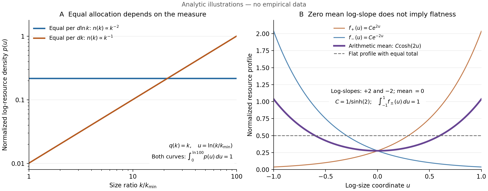
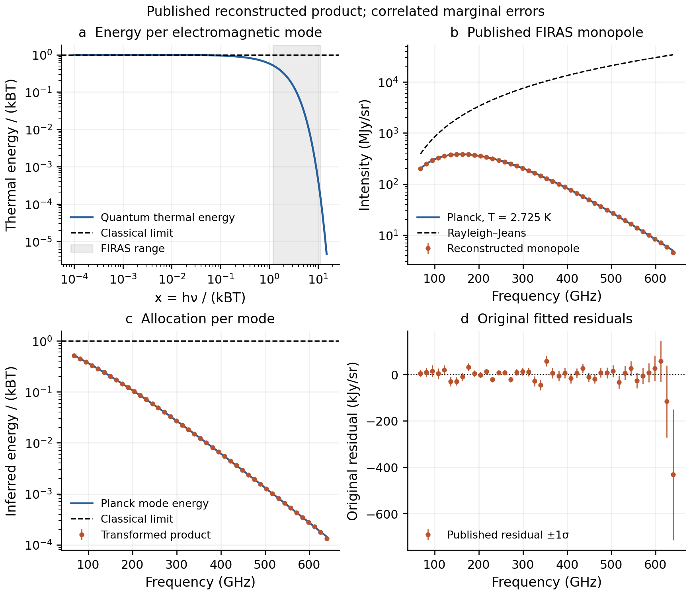
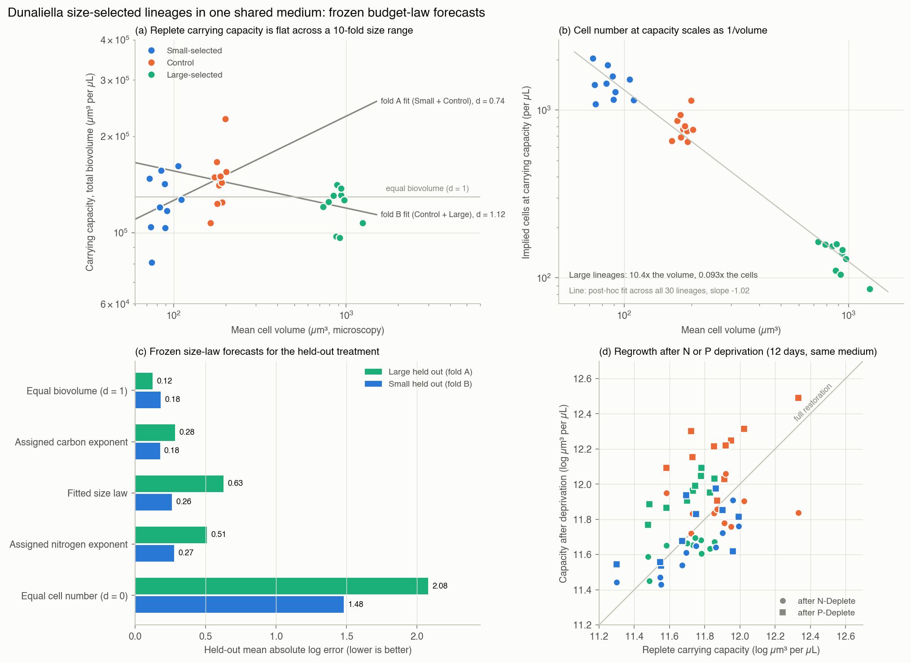
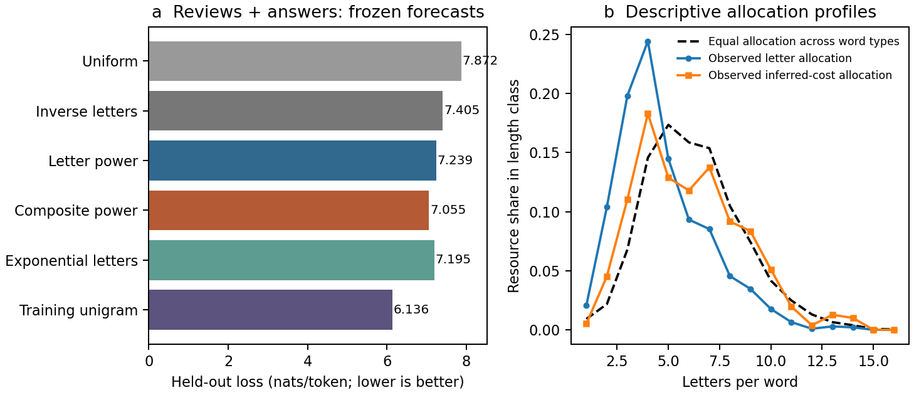

# Orthopolity: a general law of resource allocation

**Effective resources, constrained distributions, and inverse inference**

> Research manuscript, revised 7 October 2026. The analyses of Sections 3 and 4 are exploratory
> or governed by a locally recorded plan. Section 5 distinguishes forecasts frozen before
> outcome decoding from a plant transfer study frozen after raw outcome exposure.
> None is an externally preregistered study.
> Authorship and submission declarations require agreement before submission. Historical drafts
> remain in Git history. Computational details accompany the manuscript in
> [evidence.md](evidence.md) and [source-audit.md](source-audit.md).

## Abstract

We propose orthopolity as a new general natural law: Nature tends to distribute resources
equally among concentrations of those resources. Its expression depends on the comparison
measure, interactions, and system and medium constraints. The operative resource may
combine several constituents nonlinearly, so equality in one separately measured resource
is only one possible manifestation. We formulate neutral and constrained allocation,
forward prediction, and inverse inference of effective resources. A distribution identifies
effective resource divided by its constraint profile, conditional on the measure.
A shared product-resource family yields identification conditions, uncertainty bounds,
and parameter-free predictions across environments. A reproducible synthetic study
demonstrates recovery, partial identification, instability and detection of changed
composition. A class-exchange mechanism proves equalization, an unequal equilibrium
with opposing contributions, and recovery after release. Electromagnetic transport and
thermal radiation supply established physical realizations with explicit measures and
quantitative departures. A retrospective FIRAS calculation preserves the published
product's reconstruction and uncertainty assumptions. Retained empirical studies provide
conditional budget-closure successes, failed response forecasts and unresolved natural
size-class neutrality. A new linguistic application infers a letter/phoneme resource
combination and predicts withheld genres better than letter-only models, while training
word frequencies remain substantially more predictive. City and linguistic Zipf relations
supply distinct inverse targets. The contribution is the general-law proposal and its
mathematical, physical and inferential framework; established component results retain
their precedents, and the law's broader empirical scope remains to be determined.

## 1. Introduction

We propose **orthopolity as a general natural law** governing the allocation of resources
among their concentrations. Its central statement is:

**Nature tends to distribute resources equally among concentrations of those resources.**

The law concerns a physical tendency whose observed expression depends on the system.
Equal resource allocation can require unequal numbers of objects: concentrations that
require more effective resource can be less abundant. This article develops the proposal's
basis, mathematical consequences, mechanisms, physical realizations, empirical evidence,
and inverse use for identifying the resources underlying observed systems. The general
statement is a proposed law; each worked result specifies the conditions under which it
has been derived or observed.

The term follows Fabbri's [2024 essay](https://ttm.github.io/2024/08/14/power.html) and
an earlier manuscript by Fabbri and Oliveira Jr. (2017). The earlier account assumes
uniform resource allocation across component-wealth values; the later essay proposes a
broader natural and cosmological principle. Here we develop a common formulation while
keeping each physical comparison explicit.

Real concentrations depend on several resources together. Algae develop within available
space, light, water and multiple nutrients over time; cities depend on land, people,
buildings, transport, energy, money, food and water. These quantities interact and may
substitute for, complement, or limit one another. The operative resource may therefore be
a nonlinear effective combination. Deriving it from individual inputs can be difficult.
Orthopolity also motivates the reverse direction: use an observed allocation to infer
properties of the effective resource, then test the resulting resource model through
independent measurements or predictions in other conditions. Forward prediction and
inverse inference are complementary uses of the law, developed in Sections 2.2--2.3.

The proposed tendency must be distinguished from the resulting distribution. A standing
tree experiences gravity while its structure and anchorage support it. An apple thrown
upward initially rises while gravity acts; catching it or lodging it against a ceiling
introduces an interaction that can prevent its return to the ground. These outcomes reflect
gravity together with other interactions and initial conditions. The same logical distinction
guides orthopolity: its visible signature can be altered or obscured by the construction of
the system and its medium. Human age and height distributions motivate analyses of such
constraints. Their lack of an apparent neutral signature would not, by itself, establish a
general absence of evidence for orthopolity in Nature. Section 2.7 states how this distinction
enters the research programme.

The ecological precedent is substantial. Sheldon, Prakash and Sutcliffe (1972) studied ocean
particle size distributions; Gaedke (1993) explicitly related equal biomass in logarithmic
classes to normalized biomass spectra; Hatton et al. (2021) reconstructed the ocean spectrum
from bacteria to whales. Arranz et al. (2022) studied variation among hundreds of lake fish
communities and its ecological correlates. Variation among individual systems is therefore
already a research topic. Energetic equivalence (Damuth, 1981) is related, but its
species-population sampling unit differs from community abundance per size interval.
Species richness across sizes prevents automatic interchange of those statements.

Power laws arise under different generative mechanisms, so an observed exponent supplies
an inverse constraint rather than a unique causal explanation (Newman, 2005; Clauset,
Shalizi and Newman, 2009). Our formulation specifies what a distribution can reveal about
effective resources and what additional information resolves competing interpretations.
The class-exchange model demonstrates an equalizing contribution that persists under a
constraint. Electromagnetic transport and thermal radiation connect the proposed law to
known physical equations, with different physically defined comparison measures. The
empirical cases establish the successes and limits of specific resource and response
models. The accounting identity, reversible transport, classical equipartition and quantum
radiation law are established results; their organization into a general allocation
proposal and its forward and inverse programme is the contribution developed here.
Inverse optimization already estimates objectives from observed decisions
(Keshavarz, Wang and Boyd, 2011), and inverse statistical mechanics estimates
interactions from ensemble properties (Habeck, 2014). Our inverse contribution
concerns the resource interpretation and the consequences of sharing an
allocation model across environments. A
[comparison with these foundations](contribution-positioning.md) makes the
distinction explicit.

## 2. Mathematical formulation

### 2.1 Objects, resources, and a reference measure

Let $k$ be a positive size coordinate on a finite domain $D=[a,b]$, with $0<a<b<\infty$.
Choose a reference measure $\mu$, with $0<\mu(D)<\infty$, for the classes being compared.
Let $n_\mu(k)=dN/d\mu$ denote object abundance and $\bar q(k)=E[q\mid k]>0$ the conditional
arithmetic mean of an additive resource per object. Then

$$\mathcal O_\mu(k)=\frac{dR}{d\mu}=\bar q(k)n_\mu(k). \tag{1}$$

For an observed class, the corresponding identity is simply
$\sum_i q_i=N_{\rm class}\bar q_{\rm class}$. Resources may be a standing stock, such as
biomass, or an accumulated event quantity over a declared observation period. The latter
is not a stock resident in a size class, and neither is a flux through size classes.
Additivity is needed for (1); a dynamical conservation law is not.

Define the **neutral allocation form of orthopolity relative to $\mu$**, denoted $O_\mu$, by

$$\mathcal O_\mu(k)=C>0\quad\text{for }\mu\text{-almost every }k\in D. \tag{2}$$

This is an assumption about the neutral allocation, rather than a claim that every
constrained system has this profile. It gives $n_\mu=C/\bar q$. Equivalently, if an object
is sampled uniformly from the population, its size density with respect to $\mu$ is

$$p_N(k)=\frac{1}{Z\bar q(k)},\qquad
Z=\int_D\frac{d\mu(k)}{\bar q(k)}<\infty. \tag{3}$$

Sampling instead in proportion to the resource held gives
$p_R(k)=\bar q(k)p_N(k)/E_N[q]=1/\mu(D)$. Thus uniform resource-weighted size and inverse-cost
object abundance are equivalent statements, under the same reference measure. This is an
accounting equivalence, not a derivation of the allocation assumption. The count, resource
total, and constants also satisfy $N=CZ$ and $R=C\mu(D)$. For a finite observed population,
the identity is exact for class totals; a smooth density is a population model or approximation.

### 2.2 Effective resources in systems with coupled requirements

An effective resource can combine several constituent requirements. For an object $i$,
let $q_{i\ell}$ be its requirement or assigned amount of constituent $\ell$, and let
$s_\ell>0$ be a fixed reference quantity in the same units. A general representation is

$$Q_i=Q_0 F\!\left(\frac{q_{i1}}{s_1},\ldots,
\frac{q_{im}}{s_m};z_i,\theta\right)>0,\qquad
\bar q_{\mathrm{eff}}(k)=E[Q_i\mid k].$$

Here $Q_0$ supplies effective-resource units, $z_i$ records relevant environmental or
historical conditions, and $\theta$ specifies the combination rule. The reference scales
are declared independently of the observed abundance. Nonlinearity can represent
complementarity, substitution, saturation, or a bottleneck. The arithmetic class mean is
taken after combining the constituent resources. In general,
$E[F(X,Y)\mid k]\ne F(E[X\mid k],E[Y\mid k])$; for $F(X,Y)=XY$, the difference
is the conditional covariance. Marginal resource means alone may therefore miss a
dependence that changes the effective resource.

The quantity $R_{\mathrm{eff}}=\sum_i Q_i$ is additive over the declared object
partition, so equation (1) still holds with $\bar q=\bar q_{\mathrm{eff}}$.
Nonlinearity within an object does not prevent this additivity across objects. It does,
however, make the physical partition important: $\sum_iF(\mathbf q_i)$ need not equal
$F(\sum_i\mathbf q_i)$. Splitting or merging objects can change the effective total.
Nor is $R_{\mathrm{eff}}$ automatically conserved merely because some constituent
resources are conserved. The proposed combination must be interpreted as a physical
stock, an accumulated requirement, an opportunity cost, or another explicitly defined
quantity, with its appropriate balance law.
Collective interaction terms must be included or assigned to objects through a physical
accounting convention without double counting.

For algae, nutrient stocks per cell and available nutrient budgets differ; light can be
an absorbed photon flux or an exposure integrated over a specified interval. Space and
water can be capacities or environmental conditions. Time can enter through residence
time, growth history, or an additive occupancy such as cell-hours; elapsed time is not
automatically a divisible stock. For cities, land, buildings and people are stocks,
while food, water, energy and money can involve stocks, flows and exchanges over the
chosen observation horizon. The combination rule must respect those distinctions and
avoid counting a resource twice along a supply chain.

Multiple physical budgets remain explicit. For fixed class requirements, feasibility
can require $\sum_jN_jq_{\ell j}\le B_\ell$ for each constituent $\ell$.
A scalar $Q$ does not generally replace all these inequalities. A specified optimization
model can produce a local effective cost $Q_i=\sum_\ell\lambda_\ell q_{i\ell}$,
with dimensionally compatible scarcity prices $\lambda_\ell$, but those prices and
their range of validity belong to that model (Boyd and Vandenberghe, 2004). A bottleneck gives another illustration:
for a separately supported population of identical objects with fixed requirements,
$N_{\max}=\min_\ell B_\ell/q_\ell$ depends nonlinearly on the budgets. It does
not prescribe the allocation among competing types. These are ways to derive candidate
effective quantities; neither scalarization nor feasibility by itself proves neutrality.

A simple nonlinear candidate is a product of positive normalized inputs,
$Q=Q_0\prod_\ell(q_\ell/s_\ell)^{\theta_\ell}$. If constituent requirements
are deterministic functions $q_\ell(k)\propto k^{d_\ell}$, then
$Q(k)\propto k^{d_{\mathrm{eff}}}$ with
$d_{\mathrm{eff}}=\sum_\ell\theta_\ell d_\ell$. Under logarithmic neutrality
the abundance density exponent is $1+d_{\mathrm{eff}}$. For differentiable $F$,
the more general local elasticity is

$$\frac{d\ln Q}{d\ln k}
=\sum_\ell\frac{\partial\ln F}{\partial\ln(q_\ell/s_\ell)}
\frac{d\ln q_\ell}{d\ln k},$$

when the environment and parameters are fixed and $F$ has no further explicit size
dependence. Varying constituent elasticities or interactions can generate curvature.
This chain rule for specified functions is distinct from a claim that independent random
resource distributions have additive tail exponents. With heterogeneous objects, the
class mean $E[Q\mid k]$ remains the relevant quantity. The
[effective-resource derivation](effective-resources.md) develops the finite-bin and
heterogeneity implications.

### 2.3 Inverse identification and Zipf examples

The law can be used in two directions. Given a resource model and a specified constraint,
it predicts abundance. Given an abundance profile, it supplies information about the
effective resource required by that allocation. Write a positive constrained profile as

$$\bar q_{\mathrm{eff}}(k)n_\mu(k)=C a(k),\qquad a(k)>0,$$

where neutrality has $a=1$. The class-exchange example below derives $a=e^{-V}$ from
prescribed kinetics. In other systems $a$ needs its own mechanism or conditional
assumption; an arbitrary fitted factor is not an explanation. On a domain with positive
population density, inversion gives

$$\frac{\bar q_{\mathrm{eff}}(k)}{a(k)}=\frac{C}{n_\mu(k)},\qquad
\frac{\bar q_{\mathrm{eff}}(k)/a(k)}{\bar q_{\mathrm{eff}}(k_0)/a(k_0)}
=\frac{n_\mu(k_0)}{n_\mu(k)}.$$

Thus a distribution identifies the shape of effective resource divided by its constraint
factor, conditional on the comparison measure. With the constraint profile and its
normalization specified, an independently measured effective-resource total fixes
$C=R_{\mathrm{eff}}/\int_Da\,d\mu$. Without further information, the constituents and their combination are
not unique; multiplying both $\bar q_{\mathrm{eff}}$ and $a$ by the same positive
size-dependent function leaves the prediction unchanged. This is a precise statement of
the inverse information available, not a reason to discard inverse inference. Measured
constituents, restricted combination families, and responses in different environments
can resolve parts of that ambiguity. Finite observed counts require a sampling model and
bin integration; a zero-count bin does not establish infinite physical cost.

**A constructive inverse example.** Prespecify $Q=Q_0X^{\theta_1}Y^{\theta_2}$
for positive normalized resources. In environment $s$, suppose independently measured
class requirements scale as $X_s\propto k^{d_{1s}}$ and $Y_s\propto k^{d_{2s}}$,
with no within-class variation, and a known constraint has
$V_s=v_s\ln(k/k_0)$. A Pareto count density $dN/dk\propto k^{-(1+\alpha_s)}$
then implies

$$\alpha_s-v_s=\theta_1d_{1s}+\theta_2d_{2s}.$$

Two environments with scaling vectors $(1,1)$ and $(1,2)$ and corrected exponents
$\alpha_s-v_s$ equal to $1.5$ and $2$ identify $\theta_1=1$ and
$\theta_2=1/2$. The inferred nonlinear resource is $Q=Q_0X\sqrt Y$.
A third environment with scaling vector $(2,1)$ predicts
$\alpha_3=2.5+v_3$ without refitting. The two independent scaling directions identify
the composition within this family; the third supplies a test. The remaining scale
$Q_0$ requires an independent anchor. These are algebraic illustrative values, not
measurements. They show how allocation distributions can reveal a composite resource
and generate further predictions.

**Identification and transfer.** More generally, assume a common product composition
$Q=Q_0\prod_{\ell=1}^m X_\ell^{\theta_\ell}$, a fixed logarithmic comparison
measure, independently characterized constituent exponents $D_{s\ell}$, and known
constraint slopes $v_s$. Assume deterministic class requirements or write
$X_{s\ell}=A_{s\ell}(k/k_0)^{D_{s\ell}}U_{s\ell}$ with a finite positive
residual moment $E[\prod_\ell U_{s\ell}^{\theta_\ell}\mid k,s]$ independent
of size. Then the corrected abundance slopes satisfy

$$b=D\theta,\qquad b_s=\alpha_s-v_s.$$

For a compatible $b$ and unrestricted real exponents, $\theta$ is unique
precisely when $D$ has full column rank. With deficient rank, the compatible parameters are
$D^+b+\ker D$, provided $b$ lies in the column space. A new environment with
constituent row $d_*$ still has an identified prediction if and only if
$d_*$ lies in the row space of $D$, for unrestricted real exponents.
Restrictions such as nonnegative exponents can reduce this ambiguity further;
they must be included in the identification problem.

Every vector $\ell$ satisfying $\ell^\top D=0$ supplies a parameter-free
cross-environment consequence,

$$\ell^\top b=0.$$

For the three environments above, this gives $b_3=3b_1-b_2$. The third slope
is predicted before its abundance data are used. Thus additional environments
can test a shared effective resource even when an individual profile supplies
only a conditional reconstruction.

**Proof and precision.** Two parameter vectors give the same calibration slopes
exactly when their difference lies in $\ker D$. A target row gives the same
prediction for all such vectors exactly when it annihilates that kernel.
Multiplication by a left-null vector gives the stated contrast. For full column
rank and fixed $D$, least-squares recovery obeys

$$\|\widehat\theta-\theta\|_2
\le \frac{\|\delta b\|_2}{\sigma_{\min}(D)}.$$

Near-proportional constituent scalings can therefore make a formally unique
composition practically unstable. A contrast with slope-error covariance
$\Sigma_b$ has variance $\ell^\top\Sigma_b\ell$, including correlations
between environments. Uncertain constituent scalings, constraint corrections,
and size-dependent heterogeneity require their own error model; this fixed-design
bound does not cover them. These statements apply standard linear inverse-problem
results to the allocation model. The supporting
[identification analysis](inverse-resources.md) supplies generalized least squares,
partial identification, and reproducible synthetic recovery and transfer checks.

**City sizes.** Upper city-size tails often admit Pareto descriptions, with Zipf scaling
as a prominent special case. The result depends on how cities and the fitted size range
are defined. Eeckhout (2004) found a lognormal description across the full US Census
Places distribution; Ioannides and Skouras (2013) found a lognormal body and Pareto tail,
with an estimated tail exponent of 1.25 for their preferred Census Places model. These
findings concern different parts and definitions of an urban system, not a requirement
that every city-size observation follow exact Zipf scaling.

Let $S$ denote population per city and $n(S)$ the positive number density of cities per
unit population interval. For a Pareto survival exponent $\alpha$,
$N(\ge S)\propto S^{-\alpha}$ and $n(S)\propto S^{-(1+\alpha)}$;
ranked size scales as $S(r)\propto r^{-1/\alpha}$. Finite upper cutoffs modify
the survival and rank relations near the largest city. Under logarithmic allocation,

$$\frac{dN}{d\ln S}=S n(S),\qquad
\frac{\bar q_{\mathrm{eff}}(S)}{a(S)}\propto S^\alpha.$$

Exact Zipf scaling has $\alpha=1$. If $a=1$ and population is the resource,
$q(S)=S$, the relation expresses equal population in equal logarithmic city-size
intervals. If the operative resource is a nonlinear combination of urban requirements,
the same observation instead constrains that combination to have approximately linear
net scaling, after accounting for $a$. This is the proposed orthopolity interpretation
and an inverse target for measurements of land, infrastructure, energy, water and other
inputs. The exponent alone does not identify the combination or assign a probability to
its causal explanation. Existing proportional-growth mechanisms, including Gabaix's
(1999) model with lower-size regularization, provide comparisons that the resource
account should explain, connect to, or distinguish. No new city dataset is analyzed here.

**Language.** A word type is a distinct lexical form and a token is one occurrence.
For type $w$, let $f_w$ be its token frequency and $L_w$ its letter count.
The corpus expenditure of letters on that type is $f_wL_w$. Equality on a
counting measure over word types would therefore imply $f_w\propto L_w^{-1}$.
Zipf's rank-frequency relation $f(r)\propto r^{-\zeta}$ concerns a different
coordinate. In a smooth rank approximation, letter expenditure per logarithmic
rank is $r f(r)L(r)\propto r^{1-\zeta}L(r)$. For $\zeta=1$, tokens per log
rank are constant, while letters per log rank vary with word length. Finite
rank groups require the actual sums, including tied frequencies.
Length classes introduce another distinction: if $M_L$ vocabulary types have
length $L$, equal letter expenditure per type gives total token count at that
length proportional to $M_L/L$. The number of available types is part of the
comparison measure; a peaked word-length distribution alone does not negate
this conditional allocation.

The abbreviation tendency, in which frequent words are shorter, motivates
resource candidates without fixing either exponent or comparison measure.
Contextual information is also relevant to word length (Piantadosi, Tily and
Gibson, 2011). A declared candidate is
$Q_w=Q_0L_w^{\theta_L}P_w^{\theta_P}$, where $P_w$ is a dictionary phoneme
count. Under neutral type allocation it predicts
$p_\theta(w)\propto L_w^{-\theta_L}P_w^{-\theta_P}$ on a fixed vocabulary.
Section 5 applies this inverse model across text genres. Letter and phoneme
counts are symbolic resource candidates; sonority, duration and acoustic
energy need separate measurements and constitutive definitions.

### 2.4 The measure changes the exponent

Write $u=\ln(k/k_0)$ for a fixed reference size $k_0$. For
$\bar q(k)=q_0(k/k_0)^d$, with $d>0$, two different hypotheses give:

| Equal resource with respect to | Resource spectrum | Count density with respect to $dk$ |
|---|---|---|
| Linear size, $d\mu=dk$ | $\bar q(k)dN/dk=C$ | $dN/dk\propto k^{-d}$ |
| Logarithmic size, $d\mu=du=dk/k$ | $\bar q(k)dN/du=C$ | $dN/dk\propto k^{-(d+1)}$ |

The second row follows because $dN/du=k\,dN/dk$. For biomass with $q=k=m$, the
predictions are consequently density exponents 1 and 2, respectively. The 2017 manuscript's
explicit uniform density over a linear wealth interval is not interchangeable with the
logarithmic convention used in the empirical analyses below. Adopting logarithmic classes
is a substantive specification, motivated by size-spectrum practice.

Logarithmic allocation is unchanged by changing size units or logarithm base, apart from a
constant density multiplier. It also survives $z=(k/k_0)^c$ for constant $c>0$, since
$d\ln z=c\,d\ln k$. It is not invariant under arbitrary nonlinear coordinates. In general,
$dR/dv=(dR/du)|du/dv|$. Choosing a transformation after observing $R$ can therefore manufacture
flatness; the coordinate and measure must be fixed independently.

Under $O_{\log}$ and the power-cost assumption, the slope of abundance per log interval is
$-d$, the ordinary density exponent is $d+1$, and the survival function on $[a,b]$ is

$$P(K\ge k)=\frac{k^{-d}-b^{-d}}{a^{-d}-b^{-d}}. \tag{4}$$

The familiar survival exponent $d$ and rank-size exponent $1/d$ are approximations away
from the upper boundary, not exact finite-domain identities. For an unbounded domain with
$d>0$, count can be finite while logarithmically uniform resource has infinite total.
Finite boundaries are essential to a finite-budget interpretation.

### 2.5 Allocation postulates and limits of the accounting

**Resource symmetry as a candidate law.** The proposed rationale is that, absent restrictions
favouring particular resource costs, allocation should not distinguish those costs. A natural
law can adopt this as a physical postulate without a deeper mechanistic derivation. One
precise sufficient formulation uses $K$ declared classes with fixed positive per-object
costs $q_i$, allocations $R_i=q_iN_i$, and fixed total $\sum_iR_i=R>0$. If the probability
law of $(R_1,\ldots,R_K)$ is invariant under exchanging allocations across the fixed classes,
then symmetry and the sum give

$$E[R_i]=R/K,\qquad E[N_i]=R/(Kq_i).$$

This postulate selects resource allocations as the symmetric quantities; symmetry of counts
would give a different prediction. It is stronger than conservation and is not implied by
an unspecified absence of constraints. Indivisible objects may require an approximation
where exact exchangeability is infeasible. The class measure also matters: with cost itself
as coordinate, equal resource per $dq$ predicts $dE[N]/dq\propto q^{-1}$, whereas equal
resource per $d\ln q$ predicts $dE[N]/dq\propto q^{-2}$. Transformation-based treatments
of indifference likewise require a specified symmetry (Jaynes, 1968); an inferential rule
does not itself establish a physical law.

Equal expectation does not establish equal snapshots or relaxation toward equality. In a
divisible-resource idealization, assigning all resource to one uniformly chosen class has
the required symmetry and unequal allocation in every realization. Time-average equality
needs an additional condition connecting time averages to expectations or its own empirical
postulate. A test must therefore specify what "tends to allocate" means and identify
eligible systems through conditions independent of their observed allocation. A deeper
mechanism is optional for an empirical law; the scope and predictive evidence are not.

**Conservation does not imply equal allocation.** On any bounded logarithmic domain,
$\mathcal O(u)=A\exp(\beta u)$ can be normalized to the same resource total for every
$\beta$. Conservation fixes the integral and leaves its shape undetermined. Likewise,
maximum entropy over finitely many equally weighted object classes, constrained by a mean
cost, yields $p_j\propto\exp(-\lambda q_j)$. Different reference measures or constraints
give different distributions (Jaynes, 1957; Visser, 2013).

**Equipartition does not imply a power law without a cost law.** If
$\bar q(k)=q_0\exp(k/k_0)$, then $O_{\log}$ gives
$dN/du\propto\exp(-k/k_0)$ and $dN/dk\propto\exp(-k/k_0)/k$. Neither is a power law.
Geometric dimension supplies $d$ only in a specified geometric model such as similar objects
with volume proportional to length cubed. It does not establish the number of independent
resource inputs in an arbitrary system.

**Independent inputs do not generally add tail exponents.** For example, two independent
unit-scale Pareto variables with densities $h x^{-h-1}$, $x\ge1$, $h>0$, have product
density $h^2 z^{-h-1}\ln z$, $z\ge1$. Integration over the possible factorizations introduces
a logarithmic factor. This limits the independent-input argument in the 2017 essay.

**Forward tests and inverse inference have different roles.** For any positive abundance,
defining $\bar q=C/n_\mu$ makes (2) hold identically. In Section 2.3 this is the starting
inverse relation: it identifies a conditional effective-resource profile and motivates
resource hypotheses. Agreement on the same fitted profile is not independent evidence
for the law or for the inferred physical composition. A forward test fixes the resource
model through definitions, independent measurements, or a separate calibration, then
checks a prediction on additional observations. A constraint inferred from the original
profile likewise needs additional information or a transferred prediction to establish
its explanatory value.

### 2.6 What an ensemble statement would mean

Suppose a system has a power-shaped resource spectrum
$\mathcal O_i(u)=A_i\exp(\beta_i u)$. A proposed ensemble condition
$E[\beta_i]=0$ concerns mean slopes. It does not imply
$E[\mathcal O_i(u)]$ is constant. With equal $A_i=A$ and
$\beta_i\sim N(0,\tau^2)$,

$$E[\mathcal O_i(u)]=A\exp(\tau^2u^2/2), \tag{5}$$

which is curved whenever $\tau>0$. Equal-total normalization changes this formula but does
not make mean-zero slopes sufficient: averaging normalized spectra proportional to
$\exp(cu)$ and $\exp(-cu)$ on a symmetric domain produces a nonconstant hyperbolic cosine.
A median slope is a different estimand again. A claim about average resource occupancy
requires spectra, a common domain, and an explicit weighting of systems; slopes alone do
not identify it.

More generally, let $H(u)=\sum_{i=1}^n w_iA_i e^{\beta_i u}$ on a common log-domain,
with fixed positive weights and amplitudes. Then

$$H''(u)=\sum_iw_iA_i\beta_i^2e^{\beta_i u}\ge0.$$

If any slope is nonzero, the derivative is strictly positive, so the arithmetic mixture
cannot be constant on an open interval. Exact flatness requires every contributing slope
to be zero. With $p_i(u)=w_iA_i e^{\beta_i u}/H(u)$, its log-curvature is
$d^2\ln H/du^2=\operatorname{Var}_{p(u)}(\beta)$. Per-system total normalization preserves
these conclusions. They are standard convexity consequences for exact power spectra;
arbitrary curved profiles can cancel to a flat mean. They therefore neither exclude a
general resource-symmetry law nor convert noisy fitted slopes into a profile test.
The [scientific assessment](scientific-assessment.md) gives a quantitative bound for
approximate flatness and its weighting restrictions.

Mean and variance also do not require a Gaussian distribution. Gaussianity is an additional
maximum-entropy modelling choice, and selecting it by AIC is not a goodness-of-fit test.
If $\beta_i\sim N(\mu_\beta,\tau^2)$ and reported slope error is independent
$N(0,\sigma_i^2)$, the predicted probability that the *reported slope* lies in
$[-c_i,c_i]$ is

$$\Phi_{\rm N}\!\left(\frac{c_i-\mu_\beta}{\sqrt{\tau^2+\sigma_i^2}}\right)
-\Phi_{\rm N}\!\left(\frac{-c_i-\mu_\beta}{\sqrt{\tau^2+\sigma_i^2}}\right). \tag{6}$$

The expression $2\Phi_{\rm N}(c_i/\tau)-1$ applies to zero-centred *latent* slopes.
Comparing it to observed estimates without their errors is a different calculation.
Fitting $\tau$ on the same slopes makes either comparison an internal diagnostic, not
independent validation.

There is a valid simultaneous-resource restriction for an individual system:
$\mathcal O_1/\mathcal O_2=\bar q_1/\bar q_2$. Both spectra can be exactly flat only if
their mean resource ratio is size-independent. Across systems, however,
$\beta_{1i}-\beta_{2i}=d_{1i}-d_{2i}$ for power cost laws. Equal variances and correlation
one follow only if that difference is constant and slope variance is nonzero, whether or
not equipartition holds. They are not a general test of ensemble equipartition.

*Figure 1. Analytic illustrations, not empirical data. (A) With resource equal to size,
linear and logarithmic resource equipartition produce different count exponents. Both
curves show unit-total resource density in the logarithmic coordinate. (B) Two unit-total
resource profiles on a common domain have opposite log-slopes and therefore zero mean
log-slope, but their arithmetic mean is not flat. Generated by
[run_theory.py](../experiments/run_theory.py); a [vector version](../results/theory.svg)
is available.*

### 2.7 System constraints and observable distributions

Three levels of description must be kept distinct: an underlying resource-equalizing
tendency, the neutral signature (2), and the outcome of the complete system. The latter
depends on the proposed tendency together with resource costs, other processes, forcing,
and initial and boundary conditions. A model containing an equalizing contribution can
therefore predict a non-neutral stationary state or a transient with no clear neutral
signature. Establishing such a contribution requires an explicit model or discriminating
observations; equation (1) alone does not identify it.

Age and height distributions are motivating examples of constrained outcomes. A worked
age-distribution account must specify birth history, survival, and migration; a height
account must specify developmental processes, biological variation, and environmental
conditions, as well as the population sampled. An orthopolity application must additionally
identify the resource, its concentrations, and the comparison measure. No completed
orthopolity model of either example is supplied here. The relevant task is to derive the
combined outcome and explain how its form depends on the constraints.

A failure of the neutral prediction is a finding about that prediction in the stated
setting. It does not automatically establish the absence of the broader tendency, and
counting distributions without its visible signature does not establish a general absence
of evidence in Nature. A constrained model has its own predictions, which can succeed or
fail. Specify the constraint through physical reasoning or independent measurements,
derive its effect on the profile, and test the predicted response when it changes. Where
recovery of neutrality is predicted, specify its conditions and timescale. This permits
both neutral and non-neutral outcomes to inform the theory, while preserving the distinction
between an observed departure, a proposed cause, and a tested explanation.

### 2.8 A mechanism on resource-concentration classes

Consider $K$ fixed size classes, with positive reference widths $w_i$, fixed per-object
resource costs $q_i$, nonnegative class stocks $R_i$, and conserved total $B=\sum_iR_i$.
The classes represent populations of resource-bearing objects; the state is their aggregate
resource. Equivalent counts $N_i=R_i/q_i$ may be continuous or expected counts, and their
total need not be conserved. This effective model does not specify individual-object
assembly or demographic kinetics. The [full derivation](class-exchange.md) states its
interpretation and assumptions.

Let $g_{ij}=g_{ji}\ge0$ be conductances on a connected undirected graph. Neutral exchange
has current $J^0_{ij}=g_{ij}(R_i/w_i-R_j/w_j)$ and dynamics
$\dot R_i=-\sum_jJ^0_{ij}$. Positivity follows from nonnegative jump rates $g_{ij}/w_i$;
antisymmetry of currents conserves total resource. Connectedness makes the stationary
resource density constant, giving

$$R_i^0=\frac{Bw_i}{\sum_jw_j},\qquad N_i^0=\frac{Bw_i}{q_i\sum_jw_j}.$$

This is a mechanism selecting equal resource per declared class measure. The local
exchange symmetry and the measure are assumptions of the model; they are not supplied
by conservation alone. To model a constraint, prescribe dimensionless class preferences
$V_i$ and add downhill transitions:

$$a_{ij}=\frac{g_{ij}}{w_i}\exp\!\left(\max\{V_i-V_j,0\}\right).$$

The rate $a_{ij}$ is from $i$ to $j$. Its neutral part $g_{ij}/w_i$ remains, and the
additional part is nonnegative. With column generator $A_{ji}=a_{ij}$ for $j\ne i$,
$A_{ii}=-\sum_{j\ne i}a_{ij}$, define

$$\pi_i=\frac{w_i e^{-V_i}}{Z},\qquad Z=\sum_jw_j e^{-V_j}.$$

Then $\pi_i a_{ij}=\pi_j a_{ji}$ on every edge. Detailed balance selects the unique
stationary resource $R_i^V=B\pi_i$. This uses standard reversible-chain mathematics
(Levin and Peres, 2017), specialized here to fixed concentration classes and an explicit
additive constraint mechanism. At that stationary state the neutral edge current is

$$J^0_{ij}=\frac{Bg_{ij}}{Z}(e^{-V_i}-e^{-V_j}),\qquad
J^{\mathrm c}_{ij}=-J^0_{ij}.$$

Thus a nonuniform stationary distribution can have an active equalizing contribution
balanced by the constraint. Setting $V$ to a constant removes the added rates and lets
the actual constrained allocation relax toward neutrality.

For $p=R/B$, set $E^2=\sum_i(p_i-\pi_i)^2/\pi_i$. Writing $z_i=p_i/\pi_i$ gives

$$\frac{dE^2}{dt}=-2\sum_{i<j}\pi_i a_{ij}(z_i-z_j)^2
\le-2\lambda E^2,$$

where $\lambda>0$ is the smallest nonzero eigenvalue of the symmetric matrix
$-D_\pi^{-1/2}AD_\pi^{1/2}$. Consequently $E(t)\le E(0)e^{-\lambda t}$ and
$\operatorname{TV}(p,\pi)\le E/2$. The same bound applies after release, using the neutral
generator and the state actually present at the switch. If connections are removed, each
component retains its own resource total and only component-wise equalization follows.

The simulation fixes 24 equal-log size classes on $[1,64]$, $q_i=k_i^{1.5}$, and adjacent
conductances $1/\Delta\ln k$. A prescribed quadratic preference in $\ln k$, centered at
$k=8$ with width $0.75$, produces a curved resource profile. The corresponding continuous
count form is $dN/dk\propto k^{-2.5}e^{-V(\ln k)}$, a truncated lognormal shape for this
quadratic choice. Each phase runs for eight relaxation times. The neutral and constrained
spectral gaps are 0.569805 and 1.991712 per model time unit. The final relative errors in
the neutral, constrained, and released phases are $4.73\times10^{-4}$,
$2.41\times10^{-7}$, and $5.51\times10^{-11}$, each below its predicted bound.
The opposing stationary drift vectors cancel to Euclidean residual $3.22\times10^{-15}$.

There are 4,096 equal-resource packets in each of 128 realizations, initially all in the
first class. Exact matrix-exponential checkpoint transitions preserve the state at both
switches. Packets remain independent, giving class-count law
$X(t)\sim\operatorname{Multinomial}(4096,p(t))$ and share covariance
$(\operatorname{diag}(p)-pp^T)/4096$. Uneven finite snapshots are therefore predicted even
at neutral mean allocation. Rates, costs, preferences, and predictions were fixed before
drawing the stochastic trajectories. The computational results and checks are retained
with the [model report](class-exchange.md); the simulation supplies a constructive example,
not new natural-system observations.

*Figure 2. Fixed class-exchange model. Equalizing kinetics select neutral resource shares;
an added class preference selects a curved profile and changes equivalent abundance.
At constrained equilibrium the neutral and added contributions cancel. Removing the
preference preserves the current state and predicts recovery under the neutral dynamics.
The displayed convergence curves are deterministic expectations; stochastic packet
realizations and their uncertainty are retained in the linked report.*

### 2.9 A physical realization from electromagnetic transport

For electromagnetic energy density $u$ and Poynting vector $\mathbf S$, Maxwell's equations
give $\partial_tu+\nabla\cdot\mathbf S=-\mathbf J\cdot\mathbf E$ (Poynting, 1884;
Haus and Melcher, 1989). Define $P(r)=\int_{S_r}\mathbf S\cdot\mathbf n\,dA$ outside a
source enclosed by an inner sphere $r_0$ with steady power $P(r_0)=L$.
Integrating the balance over a transparent, source-free shell
with no net energy accumulation gives $P(r_2)=P(r_1)=L$. Isotropy is a separate condition:
it makes the local radial flux density $F=L/(4\pi r^2)$; otherwise this is its sphere average.

Under outgoing radial transport at constant speed $c$, without scattering or secondary
emission in the modeled component, a specified absorber with coefficient $\kappa(r)$ gives

$$\frac{dP}{dr}=-\kappa(r)P,\qquad
P(r)=L\exp\!\left[-\int_{r_0}^r\kappa(s)\,ds\right].$$

This is the absorption law specialized to spherical transport (Condon and Ransom, 2016).
An absorbing layer with optical depth $\ln2$ halves downstream power. The missing
radiative power is deposited in matter, so the modeled radiation component has an open
budget. Its departure follows from the prescribed medium and the same energy balance.

These nested surfaces receive the passage of the same energy; their powers cannot be
summed as disjoint resource shares. Disjoint shell stocks do give an additive comparison:
in transparent stationary radial transport, $dU=(L/c)dr$. Thus equal radial thicknesses
hold equal energy, whereas $dU/d\ln r=Lr/c$ increases with radius. The resource, units,
and comparison measure determine which equality is physically meaningful.

The response to removing an absorber is also determined. For sphere-averaged $u$,
with $e=4\pi r^2u=P/c$, the
transport equation is $\partial_te+c\partial_re=-c\kappa(r,t)e$. Suppose the source
remains constant, the initial field is stationary under $\kappa_{\mathrm{old}}(r)$,
and absorption is set to zero throughout the modeled domain at $t=0$. For $t\ge0$, characteristics give

$$P(r,t)=L\exp\!\left[-\int_{r_0}^{\max\{r_0,r-ct\}}
\kappa_{\mathrm{old}}(s)\,ds\right].$$

Every radius recovers by $(r-r_0)/c$. Downstream of a layer $[a,b]$, the response starts
at $(r-b)/c$ and completes at $(r-a)/c$. This is an idealized change of the absorption
coefficient, with no radiation injected by the removal process. The
[physical derivation](physical-realizations.md) states the boundary history and all
transport assumptions. It supplies an established physical realization of a declared
equality and its constrained departure; it does not equate radial shells with organism
size classes or derive abundance laws from an inverse-square flux.

### 2.10 Classical equipartition and quantum radiation

Thermal electromagnetic radiation supplies a second physical realization with a different
reference measure: counting field modes, including polarization. For a finite set of
classical normal modes in canonical equilibrium at $T>0$, each has two quadratic terms,
$H_j=P_j^2/(2m_j)+m_j\omega_j^2Q_j^2/2$. Gaussian integration over both coordinates
gives $Z_j^{\mathrm{cl}}\propto(\beta\omega_j)^{-1}$, with
$\beta=(k_BT)^{-1}$, and therefore

$$\langle H_j\rangle=-\partial_\beta\ln Z_j^{\mathrm{cl}}=k_BT.$$

A class of $M_i$ modes consequently has mean energy $M_i k_BT$: the resource density
is equal per mode, with independently defined weight $w_i=M_i$. This is equality of
equilibrium means, not identical instantaneous energies. Equilibrium preparation or
thermal coupling must be justified; uncoupled harmonic modes do not thermalize each
other merely because their canonical distribution can be written down. This argument
uses standard equipartition and supplies no relaxation time (Tong, n.d.).

Quantization changes the allowed states. Define the resource as thermal excitation
energy above the ground state, excluding the temperature-independent zero-point term.
For photon absorption and emission in thermal equilibrium, photon chemical potential
is zero and a mode has excitation levels $\epsilon_n=nh\nu$. The geometric sum gives

$$Z_\nu=\frac{1}{1-e^{-x}},\qquad
\bar\epsilon_\nu=\frac{h\nu}{e^x-1}=k_BT f(x),\qquad
x=\frac{h\nu}{k_BT},\quad f(x)=\frac{x}{e^x-1}.$$

For $x>0$, $f$ decreases strictly from 1 toward 0. Its limits are
$f(x)=1-x/2+x^2/12+O(x^4)$ near zero and $f(x)\sim xe^{-x}$ at large $x$.
The quantum level spacing relative to thermal energy specifies the departure before
any spectrum is observed. Raising temperature or lowering frequency recovers classical
relative equality. This is a restriction of the available energy states; it does not
establish the additive decomposition into opposed classical currents proved in Section 2.8.

In a large three-dimensional vacuum cavity, counting two polarizations gives the mode
density $dM/(Vd\nu)=8\pi\nu^2/c^3$. Multiplication by $\bar\epsilon_\nu$ yields the
Planck energy density and, for isotropic radiation, the spectral radiance:

$$u_\nu(T)=\frac{8\pi h\nu^3}{c^3(e^{h\nu/(k_BT)}-1)},\qquad
B_\nu(T)=\frac{c}{4\pi}u_\nu(T).$$

Thus the classical equality per mode gives $u_\nu^{\mathrm{cl}}\propto\nu^2$ and
$dU/(Vd\ln\nu)\propto\nu^3$, neither a flat linear-frequency nor a flat
log-frequency spectrum. If photons are the counted objects, $q(\nu)=h\nu$ and their
mean number per mode approaches $k_BT/(h\nu)$ in the classical regime. Extending
classical equipartition to infinitely many modes gives divergent total energy;
quantization makes it finite, $U/V=8\pi^5 k_B^4T^4/(15h^3c^3)$. These are established
results (Planck, 1901; Tong, n.d.; Condon and Ransom, 2016), here specifying the resource,
comparison measure, and constraint in the allocation framework.

### 2.11 Connection to the measured thermal spectrum

FIRAS measured the cosmic microwave background against calibrated blackbody references
and separated monopole, dipole, and Galactic components (Fixsen et al., 1996).
NASA LAMBDA's distributed monopole table contains a 2.725 K blackbody plus the residuals
from that published analysis, with marginal uncertainties and a Galactic model column.
The residuals already follow temperature and foreground fitting. The table therefore
supports a transparent re-expression of the published result; agreement with its
embedded template cannot be counted as a new independent confirmation.

Our retrospective calculation retains all 43 rows and fixes $T_0=2.725$ K from the
product definition. With wavenumber $\tilde\nu$ in inverse centimetres,
$\nu=100c\tilde\nu$. Radiance remains per hertz, with
$1\,\mathrm{MJy/sr}=10^{-20}\,\mathrm{W\,m^{-2}\,Hz^{-1}\,sr^{-1}}$.
Dividing the inferred energy density by the independent mode density gives

$$\frac{\widehat\epsilon_\nu}{k_BT_0}
=\frac{c^2 I_\nu}{2\nu^2k_BT_0}
=\frac{I_\nu}{B_\nu^{\mathrm{RJ}}(T_0)},\qquad
B_\nu^{\mathrm{RJ}}=\frac{2\nu^2k_BT_0}{c^2}.$$

The channels span 68.05--639.46 GHz and $x=1.199$--$11.262$. Their transformed
mode energies range from $0.518$ to $1.32\times10^{-4}$ of $k_BT_0$ (Figure 3).
They illustrate the quantum departure, not the $x\ll1$ classical plateau.
The CMB can retain a Planck spectrum through collisionless cosmological redshifting;
this example does not require current thermal contact with surrounding matter
(Condon and Ransom, 2016, Section 2.6.2).

For residual diagnostics we use the source's original residual column, not the difference
between rounded monopole intensities and a newly calculated curve. The source's
approximate frequency covariance is $C_{ij}=\sigma_i\sigma_j Q_{|i-j|}$, using its
43 published lag coefficients (Fixsen et al., 1996, Section 3.3). The matrix is positive
definite. Applying the linear radiance-to-mode conversion to both axes propagates this
covariance to the mode-energy ratios. The residual quadratic form is
$r^TC^{-1}r=49.774$; it is a descriptive audit of the published approximation, with no
new fit or goodness-of-fit probability. It need not reproduce the original full-analysis
statistic, 46 for 40 degrees of freedom. Diagonal inverse-variance weighting gives residual
RMS 18.90 kJy/sr, or 49.28 parts per million of the tabulated peak radiance. This defined
amplitude summary does not assume that the channels are independent.

Using exact SI constants at the rounded source coordinates gives a discrepancy
$I_{\mathrm{posted}}-[B_\nu(T_0)+r_{\mathrm{published}}]$ of
$-0.127$ to $+7.598$ kJy/sr, with radiances in common units.
This discrepancy is retained without assigning a cause or replacing
the original residuals. Absolute calibration, foreground modeling, and the prior fits
remain inherited from the published analysis. The [thermal-radiation report](thermal-radiation.md)
retains the full derivation, source bytes, covariance transcription, and reproducible
calculation. This example connects a physical equality and an independently derived
quantum departure to established observational evidence under its documented conditions.

*Figure 3. Thermal energy per electromagnetic mode. (A) The theoretical quantum factor
$f(x)$ approaches classical equality as $x\to0$. (B) The NASA FIRAS reconstructed
monopole product and Planck and Rayleigh--Jeans radiances at the product's 2.725 K
reference temperature. (C) The same product expressed as energy per mode relative to
$k_BT_0$. (D) Original published residuals with marginal one-sigma uncertainties;
channels are correlated. The Planck template is part of the distributed product, so
panels B and C illustrate the published result rather than provide a new independent
model test. All 43 channels are retained.*

## 3. Empirical sources and analysis

The applications distinguish a measured resource, a geometric or instrumental
proxy, and an inferred composite. Stocks, throughput and accumulated event
quantities retain their different physical meanings. Table 1 summarizes the
earlier exploratory sources; Section 5 reports frozen predictions, followed
by the inverse linguistic application. These convenience cases do not constitute
a representative sample of natural systems.

| Source | Analysed material | Resource and coordinate |
|---|---|---|
| NOAA GOES XRS, 2022–2024 | 10,501 events; 1,168 paired primary evaluation events | End fluence; peak irradiance |
| USGS ComCat, 2010–2024 | 6,639 selected, rounded moment magnitudes at threshold 5.5 | Magnitude-derived energy proxy for both |
| Hatton et al. (2021) | 23 one-decade biomass bins in two related ocean reconstructions | Biomass; body mass |
| GLOSSAQUA (Ersoy et al., 2025) | 1,300 spectrum estimates from 16 study identifiers | Biomass; body mass |

*Table 1. Earlier exploratory sources. The ocean domains are related, and the
aquatic entries are published estimates rather than independent organism
observations.*

For a size class $B_j$ of logarithmic width $w_j$, the observed profile is
$\widehat{\mathcal O}_j=\sum_{i\in B_j}q_i/w_j$. Its normalization to a
width-weighted mean of one is an accounting identity, not evidence of
flatness. Empty classes, finite-bin integration, missing resources and excluded
mass remain explicit. Arithmetic mean cost is the relevant quantity in equation
(1); a fitted log cost needs appropriate retransformation.

The exploratory comparisons retain their original domain choices and uncertainty
models: calendar blocks for event catalogues, study blocks for pooled aquatic
slopes, and stated multiplicative reconstruction errors for ocean biomass.
Power-law adequacy uses refitted parametric-bootstrap diagnostics; rounded
earthquake magnitudes use their discrete observation grid. Whole-profile
equality cannot be inferred from a central slope alone or from pointwise
interval overlap. All these methods and their sensitivity results appear in
[the supporting empirical report](empirical-studies.md).

Input files are checksummed. Local commits document the aquatic and ocean
analysis plans and execution order. They do not establish external
preregistration or independently verified blinding.

Later studies record when protocols,
forecasts and outcomes became available. The linguistic test freezes its
vocabulary and model parameters using calibration genres before decoding the
evaluation corpus. Its uncertainty summaries remain conditional on those
trained models and on the sampled documents.

## 4. Exploratory allocation results

| Application | Retained result | Scientific implication |
|---|---|---|
| Earthquake energy proxy | Gutenberg–Richter $b=0.998$; year-block 95% interval [0.973, 1.024], versus conversion exponent $\gamma=1.5$ | Disagrees with the specified equal-proxy allocation; energy is inferred from magnitude |
| Solar flares | Predicted count exponent 1.858 versus observed 2.239; gap 0.382 [0.125, 0.620] | Joint resource, transfer and count-model prediction fails on the selected domain |
| Upper-ocean reconstruction | Biomass max/min 38.8 across 23 bins; 1.7 across the selected 16-bin plateau | A broad approximate plateau with nonuniformities; re-expression of published evidence |
| Aquatic spectra | Median normalized slope −1.015; departure interval [−0.100, 0.010] from study-block resampling | Near-neutral central location, without equivalence under the historical criteria |

*Table 2. Outcomes of the specified exploratory analyses. Intervals retain their
original working assumptions; no row supplies a verdict on the general law
independent of its resource and observation model.*

Several limitations affect interpretation. The solar discrepancy changes with
the domain, and its fitted power law fails the stated adequacy test. Ocean
uncertainty includes correlated reconstruction errors not captured by the working
propagation model; the plateau was selected after inspection.
For the full upper-ocean domain, the biomass log-slope is −0.0392 with propagated
90% interval [−0.058, −0.026], outside the stated slope-equivalence tolerance.
Aquatic estimates are concentrated in two studies, and 377 records have implausible reported
size ranges. The retained sensitivity excludes those records only from
range-dependent calculations, without inventing replacement bounds. Reported
compatibility fractions are therefore not estimates of the prevalence of
orthopolity in Nature. The supplement preserves every numerical comparison,
metadata correction and unresolved observation issue.

## 5. Frozen-forecast tests

The analyses of Section 4 assess data that had already been inspected. We therefore added tests
in which the resource, its cost law, the forecasts and the decision rules are fixed before the
evaluated outcomes are decoded, and in which whole units are held out: launches, a calendar year,
vessels and selection treatments. Each executed study retains its inputs, frozen protocol,
archived algorithms, forecasts and results in an append-only [run registry](run-registry.md).
Three kinds of evidence are kept separate: measurements on engineered systems, an unused
observation period of a natural catalogue, and published biological experiments reanalysed
retrospectively. Published summaries of those experiments had been read, so their reanalyses
are retrospective validations, not blinded tests. A further plant study uses fixed scoring
and a development-only geographic split after accidental raw outcome exposure. Its freeze
cannot establish that those outcomes were unseen.

### 5.1 Controlled allocation measurements

In a controlled workload experiment, separately measured memory and CPU costs of matrix tasks
predicted completion profiles under assigned quota pairs within four tolerances frozen before
672 validation tasks ([workload pilot](workload-pilot.md)). A fresh launch exposed a transfer
boundary: the original forecast failed its unchanged tolerance in two of four conditions, and
local recalibration recovered one ([workload transfer](workload-transfer.md)). The quotas were
acceptance criteria, so these tests concern the transfer of cost models, not allocation.

An allocation test requires the system, not the experimenter, to divide a resource. In a Python
runtime whose global interpreter lock serializes execution, worker threads running matrix
kernels of five sizes competed for one execution resource
([dimensionality intervention](dimensionality-intervention.md)). Separate calibration gave CPU
cost degrees 1.870 and 2.686 for the two kernels. The calibrated mean-cost curves predicted
complete CPU and job profiles before 16 allocation trials, with maximum CPU-share errors of
0.0035–0.0063 and job-share total-variation errors of 0.0021–0.0124. Replacing the
largest-class thread with a second smallest-class thread produced the predicted CPU-share change
within 0.0078. A unit-cost alternative had count errors of 0.126–0.273. This success concerns
one engineered allocation mechanism; it identifies no geometric dimension and no tendency of
natural systems.

### 5.2 Calibrated decisions and an unused observation period

Complete-profile equivalence decisions were calibrated on 180,000 independently generated
datasets in 90 conditions ([profile calibration](profile-calibration.md)). Simultaneous bands
met the declared gate for dense, bounded, independent blocks at 48 blocks, with minimum coverage
93.95%, but failed at 12 and 24 blocks. With twelve serially dependent blocks, wrong-departure
rates reached 43.75%. These failures define observation designs for which no neutrality verdict
is available, whatever a nominal interval suggests.

For solar flares, measured rise-phase fluence costs, six logarithmic classes, three forecasts,
a tolerance and an application gate were committed before the 2025 NOAA records were acquired
([solar validation](solar-validation.md)). Of 3,277 events, 356 met the domain rules.
Logarithmic neutrality predicted the class counts much better than linear neutrality, with
count total variation 0.125 against 0.573; historical counts did better still, at 0.022. The
point profile departed from the $\ln 1.5$ margin, but the calibrated decision remained
unresolved, as declared before acquisition, and the instrument mix changed between periods.

### 5.3 Published biological measurements

The *Synechococcus* comparison demonstrates that a size-based cost can transfer
for one resource and fail for another in the same organisms: cubic diameter
predicted held-out 25 °C carbon quotas within a typical factor of 1.14, while strain
means predicted N and P better ([cost transfer](archived-cost-transfer.md)).

The positive biological allocation result concerns separately grown populations.
Thirty size-selected *Dunaliella* lineages were regrown in one shared F/2 medium.
Across a 10.4-fold range of mean cell volume, replete capacity in total biovolume
was constant to within 3%, and cell number scaled as $V^{-1.02}$ (Figure 4).
Each held-out selection treatment was predicted from the other two.
The frozen equal-biovolume law gave held-out errors of 0.124 and 0.179 log units,
outperforming a fitted size law and equal cell number. This establishes
conditional budget closure across cultures; it does not demonstrate exchange
among coexisting size classes. Regrowth after P deprivation retained a
size-dependent overshoot ([size budget](dunaliella-size-budget.md)).

The chemostat response supplies a contrasting dynamical test. A nitrogen pulse
changed algal resource composition, but no frozen prediction improved
appreciably on persistence in twelve held-out polyculture vessels. The two-budget
C:N reweighting rule predicted too little redistribution, 0.05–0.12 versus
observed departures of 0.29–0.49, and the predicted direction held in only
4 of 12 vessels. No vessel recovered its pre-pulse composition within twelve
days ([chemostat response](chemostat-response.md)). This particular constraint
model failed; its frozen result is retained.

*Figure 4. Size-selected Dunaliella lineages regrown in one shared medium, from the data of
Malerba et al. (2018). (a) Replete carrying capacity in total biovolume against mean cell
volume, with the two cross-fitted size laws and the equal-biovolume law. (b) Implied cell
number at capacity. (c) Held-out errors of the frozen forecasts. (d) Capacity after N or P
deprivation against replete capacity. Generated from retained outputs by
[report_dunaliella_size_budget.py](../experiments/report_dunaliella_size_budget.py).*

### 5.4 Directly weighed coexisting plant stocks

Ten harvested herbaceous plots provide direct aboveground dry masses for coexisting ramets
or stem clusters (Dillon et al., 2019; [plant study](plant-biomass-profile.md)). Forest and
desert allometric masses are excluded. Five Ohio plots supply development fits; five Colorado
plots supply evaluation. The protocol, algorithms and forecasts were committed before formal
scoring, but raw rows had already been exposed during source inspection. This is a retrospective
transfer comparison. It identifies neither a limiting nutrient nor an opportunity budget;
$q(m)=m$ defines the measured stock rather than testing an independent cost law.

The frozen domain is 0.01–100 g in eight half-decade bins. Thirty missing
masses, 144 subthreshold ramets and one above-domain ramet remain in the
membership ledger. The above-domain ramet contains 24.50% of one plot's known
biomass. Results describe the declared domain.

Mean biomass total variation is 0.470 for the transferred bounded Pareto
template and 0.493 for logarithmic neutrality (Figure 5). No template is best
in every plot. Trained count models score 0.260–0.271, compared with 0.495
for logarithmic neutrality. These are point comparisons; no calibrated
ecological superiority or equivalence verdict follows.

Synthetic censuses explain an observation limitation. Under exactly equal
expected biomass, 160 independent ramets produce mean realized stock TV
0.441 and an empty bin in every simulated census. The largest bin's average
normalized share is 3.13%, while its normalized expected stock is 12.50%:
$E[R_i/\sum_jR_j]\ne E[R_i]/\sum_jE[R_j]$. Repeating masses in blocks of
twenty also makes an iid 95% envelope fail severely. These simulations diagnose
finite-census normalization and dependence sensitivity, without identifying
the ecological dependence model. Expected neutrality remains unresolved.
The [supporting empirical report](empirical-studies.md) retains all scores,
coverage calculations and sensitivities.

*Figure 5. Directly weighed plant profiles and synthetic observation limits. (a) Equal-plot
mean Colorado biomass shares and transferred stock templates. (b) Count shares and retained
count forecasts. (c) Each plot's biomass discrepancy and the five means. (d) Mean normalized
census shares under iid logarithmic neutrality, compared with normalized expected stocks.
All panels read retained outputs; [report_plant_biomass_profile.py](../experiments/report_plant_biomass_profile.py)
performs presentation only. Prior raw exposure and excluded biomass are retained.*

### 5.5 Inferring a linguistic resource and predicting withheld genres

The linguistic study turns the inverse proposal into a measured transfer
comparison ([protocol and report](linguistic-resources.md)). Word occurrences
come from the pinned Universal Dependencies English EWT corpus, release 2.18;
letter counts $L$ come from original sentence text and phoneme counts $P$
from an independently pinned CMU pronunciation dictionary. The model uses a
counting measure on word types, with no fitted rank transformation or
post-hoc constraint factor.

Training uses only email, weblog and newsgroup texts: 83 documents and 83,635
retained tokens determine a vocabulary of 2,623 types with at least five
training occurrences and a dictionary pronunciation. All six forecasts share
this vocabulary. Conditional multinomial likelihood with nonnegative
exponents gives

$$\widehat Q_w\propto L_w^{0.5153}P_w^{1.8275},\qquad
\widehat p(w)\propto\widehat Q_w^{-1}.$$

Both exponents are interior. The log-feature correlation is 0.871 and the
model information condition number is 11.65; these diagnostics describe the
fitted model, without treating dependent tokens as independent measurements
of parameter precision. The protocol, code and fitted forecasts were hashed
before the official test file was acquired or decoded.

The primary target comprises withheld review and answer genres: 253 documents,
7,329 retained tokens and 77.65% vocabulary coverage after exact-duplicate
exclusion. The secondary target contains 63 new documents from the training
genres, with 9,618 retained tokens and 79.35% coverage. Ninety-three sentences
matching original training text were excluded by the frozen rule, and no
training/test document IDs overlap. Coverage is conditional on the tokenizer
and fixed vocabulary; excluded tokens remain in the ledger.

| Frozen forecast | New genres | Represented genres |
|---|---:|---:|
| Uniform word types | 7.872 | 7.872 |
| Inverse letter count | 7.405 | 7.457 |
| Fitted letter power | 7.239 | 7.328 |
| Fitted letter/phoneme product | 7.055 | 7.189 |
| Exponential letter cost | 7.195 | 7.304 |
| Smoothed training frequencies | 6.136 | 6.199 |

*Table 3. Held-out conditional log loss in nats per retained token; lower is
better. Every parameter and the vocabulary are fixed from training.*

The composite improves on letter power by 0.1843 nats per token in new genres;
the paired document-bootstrap 95% interval for composite minus letter-power
loss is [−0.1967, −0.1696]. The secondary improvement is 0.1387, with interval
[−0.1512, −0.1251], and the point difference favors the composite in all five
genres. The 2,000-resample intervals condition on the fitted forecasts and
exchangeability of documents within each evaluation group. They omit
training uncertainty and dependence between authors, threads or websites.

The gain demonstrates transferable information in the combined symbolic
features (Figure 6). Training word frequencies nevertheless predict much
better. Only 83 distinct $(L,P)$ pairs occur among the 2,623 vocabulary types,
so the resource model must give many different words identical probabilities.
Observed primary letter-resource and inferred-cost shares remain far from
uniform over word types, with descriptive total variations 0.693 and 0.689.
Within every individual genre the composite distance is larger than the
letter-resource distance, despite the small decrease after pooling.
These finite-corpus discrepancies are not calibrated neutrality tests.
The fitted combination is a predictive candidate; neither equal resource
allocation nor a unique physical linguistic cost has been established.
Sonority, duration, context and semantic requirements remain unmeasured here.

*Figure 6. Frozen linguistic predictions. (a) Loss on withheld review and answer
genres, including all six declared alternatives. (b) Observed letter and
inferred-cost allocation aggregated by word length. Equal allocation over word
types gives the dashed type-multiplicity profile, not a flat profile over length.
Aggregation conceals variation among words of the same length. The fitted
composite improves prediction over letter-only costs but trails training
word frequencies; its resource profile remains descriptive.*

### 5.6 What the tests establish

The positive results concern conditional budget closure: a separately measured or geometric
cost, declared shared resource conditions, and abundance or resource shares predicted from them. The runtime
experiment and the algal lineages are the clearest cases; in the lineages the closure holds with
cost proportional to volume, so the abundance gradient carries no information beyond geometry.
A rule that goes beyond closure, by predicting how a restriction redistributes resource among
coexisting classes, failed in the grazed, dynamically changing food webs tested. The plant
study now observes coexisting class stocks directly, but it does not
establish equal expected allocation: the flat template is not best for biomass or counts,
and the ecological observation law is uncalibrated. No natural size-class study in Section 5
has independently identified neutral eligibility and a design sufficient for the
expected-allocation verdict.
Identifying such a regime, or independently characterizing its constrained
allocation, remains a central empirical task. The linguistic study separately
shows a gain from an inferred composite in a frozen genre transfer. Its lexical
baseline and uneven resource shares retain the limits of that candidate.

## 6. Discussion

Orthopolity is advanced here as a general natural-law proposal about resource allocation.
Its neutral expression is equal effective resource per physically specified comparison
measure; its observed expression includes the effects of the system and medium. Effective
resources can combine several constituents nonlinearly. A distribution that is not flat
in one separately measured constituent can therefore reflect a composite allocation,
a constraint, or both. These possibilities become explanations when their combination
rules and consequences are specified. The law does not identify every visibly unequal
distribution with failure of the underlying tendency.

The class-exchange construction provides an explicit model in which an unequal stationary
profile contains active opposing contributions. Removing the constraint predicts recovery
without resetting the state. The electromagnetic examples establish related physical
realizations with different observables: nested throughput, disjoint shell energy, and
thermal energy per mode. Their measures and equality conditions follow from their
respective equations. Quantization restricts available mode energies; it is a different
kind of constraint from an additive transport bias. The framework can encompass these
mechanisms without asserting that their dynamics are identical.

The inverse direction is central to the proposed law's scientific use. An abundance
profile constrains effective resource divided by its allocation distortion, conditional
on the comparison measure. A Pareto exponent can identify its scaling even when the
constituent resource combination is unknown. It does not uniquely determine that
combination, but shared constitutive families and independently characterized environments
can make the inverse problem identifiable. The result in Section 2.3 specifies
when composition or a target prediction is identified, and its left-null contrasts
make a shared resource model testable across environments. Correlated errors and
nearly proportional constituent scalings determine how precise that test can be.
City-size scaling motivates applying this strategy to coupled urban requirements;
no city resource combination has yet been measured or fitted here.

The linguistic comparison executes a complementary inverse application using direct
symbolic counts. Its letter/phoneme combination improves frozen predictions in
withheld genres, with the same signs of improvement in represented genres.
The stronger lexical baseline and the large observed allocation discrepancies
also show that these two length features do not explain complete word usage.
These findings motivate independently characterized contextual, temporal or
phonetic requirements. Adding an arbitrary fitted constraint after seeing a
residual would not identify such a requirement.

The empirical studies contribute different kinds of evidence. Separately calibrated
costs and shared resource conditions support budget-closure predictions in the engineered
allocation system and the size-selected algal lineages. The chemostat cost-ratio rule
fails its declared redistribution predictions, and plant stock/count comparisons remain
mixed. The FIRAS transformation preserves the published quantum-spectrum result and its
reconstruction assumptions. The natural size-class studies do not yet identify a neutral
regime and its effective resource with sufficient observation information for a general
expected-allocation verdict. A nonlinear composite hypothesis opens further research;
it does not retrospectively change these studies' frozen predictions or outcomes.

The proposal builds on established work. Reversible transport and equipartition supply
mechanisms and limiting cases; ecological size-spectrum models already connect resource
use and abundance (Cuesta, Delius and Law, 2018; Arranz et al., 2022). Independent metabolic
measurements already support cost-to-capacity predictions (Marshall et al., 2022).
Proportional-growth models address city-size scaling (Gabaix, 1999). The contribution
sought from orthopolity is a general allocation account that connects these results,
organizes their constraints, and generates further forward and inverse predictions.
These relationships require explicit derivations and comparisons, not an assumption
that naming a common pattern establishes a common microscopic mechanism.

The inverse formulation also has established statistical foundations. With deterministic
constituent requirements, a product resource gives

$$p_\theta(k\mid s)=Z_s(\theta)^{-1}
\exp\!\left(\ln a_s(k)-\sum_\ell\theta_\ell\ln X_{s\ell}(k)\right)$$

relative to the declared measure. This is an exponential family. Its likelihood,
rank conditions and error propagation use standard methods; the physical content
lies in the specified resources, constraints and shared composition across conditions.
Inverse optimization and inverse statistical mechanics already infer governing
quantities from outcomes (Keshavarz, Wang and Boyd, 2011; Habeck, 2014).
The left-null relations in Section 2.3 state what the proposed composition must
predict across environments. A fitted resource that reproduces its calibration
profile has not yet passed that test.

The next empirical advance should connect a resource combination to independently
measured constraints or physical requirements across conditions, extending beyond
the linguistic symbolic-count pilot. Specify the object partition, comparison
measure, constituent requirements and budgets, and observable target; use a calibration
subset to infer the combination and its uncertainty; then predict another distribution
or a response to a specified change. Variation in resource requirements must distinguish
the candidate combinations, and the observation model must account for dependence and
finite samples. A deeper microscopic mechanism can strengthen the explanation, but
independent predictive success can also support an allocation law. This programme tests
and extends the scope of the proposed law while using distributions to learn about the
resources through which natural systems are organized.

## 7. Conclusion

We propose orthopolity as a general natural law: Nature tends to distribute resources
equally among concentrations of those resources. The law's expression depends on the
system's construction, medium, resource interactions and comparison measure. Its operative
resource may be a nonlinear combination of several constituents. The framework therefore
has both a forward use, predicting allocation from a resource model, and an inverse use,
inferring effective resource structure from observed distributions.

The neutral allocation relation gives inverse-cost abundance under a declared measure.
The class-exchange model supplies a mechanism, a constrained unequal equilibrium with
opposing contributions, and quantitative recovery. Electromagnetic transport and thermal
radiation supply worked physical realizations and explained departures. The retained
observational studies contribute conditional successes, failed predictions and unresolved
questions with their original scope preserved. A Pareto profile supplies a conditional
constraint on effective-resource scaling; additional environments can identify and test
candidate nonlinear combinations. The linguistic transfer provides an executed
inverse application: a combined symbolic cost improves prediction over letter-only
models, while a lexical baseline and residual allocation differences delimit
its explanatory scope.

Together these results provide the proposed law's mathematical and inferential foundation
and several physical and empirical connections. They establish the stated conditional
results rather than a universal identification of resources or mechanisms. The central
research task is now to determine effective resources and constraints in further systems
and test the new consequences that follow from the common allocation law.

## Data and code availability

Code, frozen inputs, configurations, and generated results are in this repository.
The make all target verifies input checksums, runs tests, and regenerates the empirical
analyses; see the [README](../README.md) for setup. Pilot estimates originate in
[results.json](../results/results.json); distribution diagnostics in
[gof.json](../results/gof.json); aquatic median, compatibility fractions, and ocean
intervals in [independent.json](../results/independent.json). Remaining JSON files contain
explicitly exploratory diagnostics. The studies of Section 5 are registered in an append-only
[run registry](run-registry.md) with their inputs, frozen protocols, archived algorithms and
outputs. The class-exchange demonstration and retrospective FIRAS calculation are also
registered; their reports give offline reproduction commands and interpretation limits.
The inverse-resource simulation and linguistic transfer likewise retain configurations,
algorithms, predictions, all scored outcomes and source hashes. The linguistic
protocol and training fit were frozen before test-file acquisition; this is a
retrospective public-corpus study, not external preregistration.
Plant sources are pinned to author commit defccc3dcbbbf3ba57ff1572377de88fba83ff7f,
with acquisition checksums and complete inclusion ledgers. The registry-verify target audits
the registry offline, and each study report gives its replay
command; source errata found during those audits are recorded there. Source-specific conditions
are recorded in
[data/NOTICE.md](../data/NOTICE.md); there is no blanket licence for all inputs.
The supplied 2017 manuscript was inspected privately and is not redistributed.

## References

Arranz, I., Fournier, B., Lester, N. P., Shuter, B. J., and Peres-Neto, P. R. (2022).
Species compositions mediate biomass conservation: The case of lake fish communities.
*Ecology*, 103, e3608. <https://doi.org/10.1002/ecy.3608>.

Boyd, S., and Vandenberghe, L. (2004). *Convex Optimization*. Cambridge University Press.
Sections 4.7 and 5.6. <https://web.stanford.edu/~boyd/cvxbook/>.

CMU Sphinx contributors (accessed 7 October 2026). *CMU Pronouncing Dictionary*.
[Pinned source](https://github.com/cmusphinx/cmudict/tree/74790861f652b15e4ac49015a90074ad62a27690).

Clauset, A., Shalizi, C. R., and Newman, M. E. J. (2009). Power-law distributions in
empirical data. *SIAM Review*, 51, 661–703. <https://doi.org/10.1137/070710111>.

Condon, J. J., and Ransom, S. M. (2016). *Essential Radio Astronomy*.
Princeton University Press. Chapter 2, radiation and absorption.
<https://www.cv.nrao.edu/~sransom/web/Ch2.html>.

Cuesta, J. A., Delius, G. W., and Law, R. (2018). Sheldon spectrum and the plankton paradox:
two sides of the same coin—a trait-based plankton size-spectrum model.
*Journal of Mathematical Biology*, 76, 67–96. <https://arxiv.org/abs/1607.04158>.

Damuth, J. (1981). Population density and body size in mammals. *Nature*, 290, 699–700.
<https://doi.org/10.1038/290699a0>.

Dillon, K. T., et al. (2019). On the relationships between size and abundance in plants:
beyond forest communities. *Ecosphere*, 10, e02856. <https://doi.org/10.1002/ecs2.2856>.

Edwards, A. M., Robinson, J. P. W., Plank, M. J., Baum, J. K., and Blanchard, J. L. (2017).
Testing and recommending methods for fitting size spectra to data.
*Methods in Ecology and Evolution*, 8, 57–67. <https://doi.org/10.1111/2041-210X.12641>.

Edwards, A. M., Robinson, J. P. W., Blanchard, J. L., Baum, J. K., and Plank, M. J. (2020).
Accounting for the bin structure of data removes bias when fitting size spectra.
*Marine Ecology Progress Series*, 636, 19–33. <https://doi.org/10.3354/meps13230>.

Eeckhout, J. (2004). Gibrat's law for (all) cities. *American Economic Review*,
94(5), 1429--1451. <https://doi.org/10.1257/0002828043052303>.

Ersoy, Z., et al. (2025). GLOSSAQUA: A global dataset of size spectra across aquatic
ecosystems. *Ecology*, 106, e70050. <https://doi.org/10.1002/ecy.70050>.

Fabbri, R., and Oliveira Jr., O. N. (2017). *A simple model that explains why inequality
is ubiquitous*. Supplied manuscript dated 17 March 2017, 13 pp.; publication status unverified.

Fabbri, R. (2024). The Orthopolity cosmological principle and the Natural distribution law.
Author's essay, 14 August. <https://ttm.github.io/2024/08/14/power.html>.

Fixsen, D. J., Cheng, E. S., Gales, J. M., Mather, J. C., Shafer, R. A., and Wright,
E. L. (1996). The cosmic microwave background spectrum from the full COBE FIRAS data set.
*The Astrophysical Journal*, 473, 576. <https://doi.org/10.1086/178173>.
Source article: <https://arxiv.org/abs/astro-ph/9605054>.

Gabaix, X. (1999). Zipf's law for cities: An explanation. *The Quarterly Journal of
Economics*, 114(3), 739--767. <https://doi.org/10.1162/003355399556133>.

Gaedke, U. (1993). Ecosystem analysis based on biomass size distributions: A case study
of a plankton community in a large lake. *Limnology and Oceanography*, 38, 112–127.
<https://doi.org/10.4319/lo.1993.38.1.0112>.

Harcourt, R., Garcia, N. S., and Martiny, A. C. (2024). *Synechococcus* batch culture data
(cell quotas and ratios (C, N, P), size, and diameter) from laboratory experiments in 2021 to
2022 with related isolates cultured across a range of temperatures. BCO-DMO dataset 926311,
version 1. <https://doi.org/10.26008/1912/bco-dmo.926311.1>.

Hatton, I. A., Heneghan, R. F., Bar-On, Y. M., and Galbraith, E. D. (2021). The global
ocean size spectrum from bacteria to whales. *Science Advances*, 7, eabh3732.
<https://doi.org/10.1126/sciadv.abh3732>.

Habeck, M. (2014). Bayesian approach to inverse statistical mechanics.
*Physical Review E*, 89, 052113. <https://doi.org/10.1103/PhysRevE.89.052113>.

Haus, H. A., and Melcher, J. R. (1989). *Electromagnetic Fields and Energy*.
Prentice-Hall. Section 11.2, Poynting's theorem.
<https://web.mit.edu/6.013_book/www/chapter11/11.2.html>.

Ioannides, Y. M., and Skouras, S. (2013). US city size distribution: Robustly Pareto,
but only in the tail. *Journal of Urban Economics*, 73(1), 18--29.
<https://doi.org/10.1016/j.jue.2012.06.005>.

Jaynes, E. T. (1957). Information theory and statistical mechanics. *Physical Review*,
106, 620–630. <https://doi.org/10.1103/PhysRev.106.620>.

Jaynes, E. T. (1968). Prior probabilities. *IEEE Transactions on Systems Science and
Cybernetics*, 4(3), 227–241. <https://bayes.wustl.edu/etj/articles/prior.pdf>.

Keshavarz, A., Wang, Y., and Boyd, S. (2011). Imputing a Convex Objective Function.
*Proceedings IEEE Multi-Conference on Systems and Control*, 613–619.
<https://stanford.edu/~boyd/papers/imputed_objective.html>.

Levin, D. A., and Peres, Y. (2017). *Markov Chains and Mixing Times*, second edition,
with contributions by E. L. Wilmer. American Mathematical Society.
<https://pages.uoregon.edu/dlevin/MARKOV/mcmt2e.pdf>.

Malerba, M. E., Palacios, M. M., and Marshall, D. J. (2018). Do larger individuals cope with
resource fluctuations better? An artificial selection approach. *Proceedings of the Royal
Society B*, 285, 20181347. <https://doi.org/10.1098/rspb.2018.1347>. Data:
<https://doi.org/10.5061/dryad.4mh47r7>.

Marshall, D. J., et al. (2022). Long-term experimental evolution decouples size and
production costs in *Escherichia coli*. *Proceedings of the National Academy of Sciences*,
119, e2200713119. <https://doi.org/10.1073/pnas.2200713119>.

Newman, M. E. J. (2005). Power laws, Pareto distributions and Zipf's law.
*Contemporary Physics*, 46, 323–351. <https://arxiv.org/abs/cond-mat/0412004>.

Piantadosi, S. T., Tily, H., and Gibson, E. (2011). Word lengths are optimized for
efficient communication. *Proceedings of the National Academy of Sciences*,
108(9), 3526–3529. <https://doi.org/10.1073/pnas.1012551108>.

NASA LAMBDA (accessed 6 October 2026). COBE FIRAS CMB monopole spectrum, version 1.
Product description and reconstruction provenance.
<https://lambda.gsfc.nasa.gov/product/cobe/firas_monopole_spect.html>.

Planck, M. (1901). Ueber das Gesetz der Energieverteilung im Normalspectrum.
*Annalen der Physik*, 309, 553--563. <https://doi.org/10.1002/andp.19013090310>.

Perkins, D. M., et al. (2018). Bending the rules: exploitation of allochthonous resources
by a top-predator modifies size-abundance scaling in stream food webs.
*Ecology Letters*, 21, 1771–1780. <https://doi.org/10.1111/ele.13147>.

Poynting, J. H. (1884). On the transfer of energy in the electromagnetic field.
*Philosophical Transactions of the Royal Society of London*, 175, 343–361.
<https://doi.org/10.1098/rstl.1884.0016>.

Sheldon, R. W., Prakash, A., and Sutcliffe, W. H., Jr. (1972). The size distribution of
particles in the ocean. *Limnology and Oceanography*, 17, 327–340.
<https://doi.org/10.4319/lo.1972.17.3.0327>.

Tong, D. (n.d.). *Statistical Physics*. University of Cambridge Part II Mathematical
Tripos lecture notes, Sections 1.3, 2.2.1 and 3.2. Accessed 6 October 2026.
<https://davidtong.org/pdfs/teaching/statistical-physics/statphys.pdf>.

Visser, M. (2013). Zipf's law, power laws and maximum entropy. *New Journal of Physics*,
15, 043021. <https://arxiv.org/abs/1212.5567>.

Wojcik, L. A. M., Pfennig, A., Flamm, S., Klauschies, T., Rosenbaum, B., Weithoff, G., and
Gaedke, U. (2025). Top-down control and species composition influence nonlinearly the
short-term response of experimental food webs to a nutrient pulse perturbation. *Proceedings
of the Royal Society B*. <https://doi.org/10.1098/rspb.2025.1969>. Data:
<https://doi.org/10.5061/dryad.51c59zwj5>.

Universal Dependencies contributors (2026). *English EWT*, release 2.18.
[Corpus description](https://universaldependencies.org/treebanks/en_ewt/) and
[pinned source](https://github.com/UniversalDependencies/UD_English-EWT/tree/b7711cce01cdd4f5fcc0a8199b8a50d951b16c0c).
