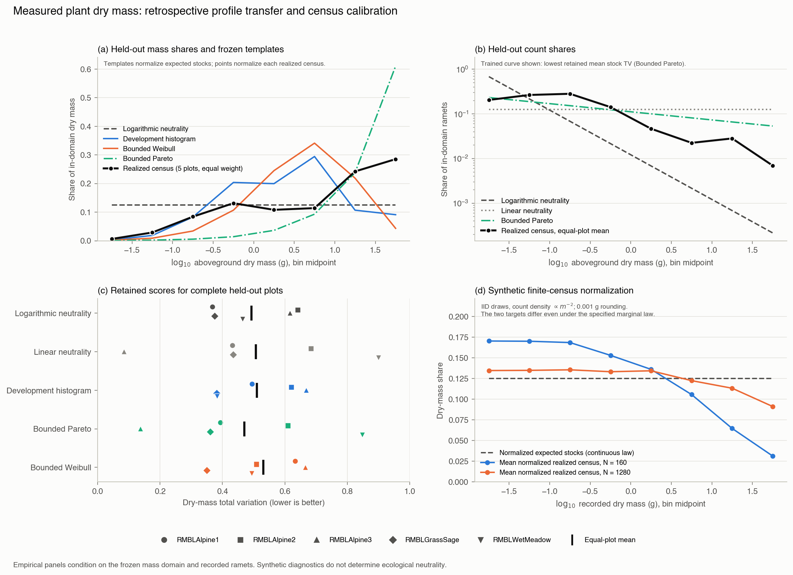

# Coexisting plant dry-mass profiles

Completed retrospective analysis, 3 October 2026; run identifier
`plant-biomass-profile-2026-10-03`. This reanalyses the harvested plant measurements
of [Dillon et al. (2019)](https://doi.org/10.1002/ecs2.2856). No new plants were
sampled. The retained [evaluation](../results/plant-biomass-profile/study.json),
[forecasts](../data/plant-biomass-profile/2026-10-03/frozen-forecasts.json) and
[synthetic calibration](../data/plant-biomass-profile/2026-10-03/calibration.json)
are the numerical sources for this report.

**Result in brief.** Directly weighed coexisting plants have markedly uneven
realized biomass profiles on the declared domain. Logarithmic neutrality is a
poor count template and has mean dry-mass total variation of 0.493. A bounded
Pareto fitted at a different locale reduces this mass discrepancy to 0.470,
but the ordering varies sharply among plots. The ecological neutrality decision
remains **unresolved**: synthetic censuses show large finite-count normalization
effects, and the actual inclusion process, dependence and regional replication
are not calibrated. Prior raw outcome exposure makes this study retrospective,
even though algorithms and templates were frozen before formal scoring.

## Measurements, partition and domain

The source repository is pinned at commit
`defccc3dcbbbf3ba57ff1572377de88fba83ff7f`. Ten herbaceous plots supply
aboveground plants harvested at peak biomass, dried at least 60°C for over a
week and weighed to the nearest 0.001 g. An object is a stem or inseparable
stem cluster, generally a ramet rather than a genet. Forest and desert samples
use allometric masses and are excluded. Roots, soil nutrient stocks, available
budgets, nutrient quotas and time trajectories are absent. These are the
[published measurement methods](https://esajournals.onlinelibrary.wiley.com/doi/10.1002/ecs2.2856).

All five BFEC plots in Ohio develop the templates; all five RMBL plots in
Colorado evaluate them. The development plots are three prairies and two
wetlands; evaluation includes three alpine plots, grass–sage and wet meadow.
The transfer changes both geography and habitat composition. Five plots within
one evaluation locale do not supply independent regional replication, and
individual ramets are not independent ecological replicates.

The lower mass limit, 0.01 g, is ten times the published weighing precision.
The upper limit is the next integer power of ten containing the largest positive
development mass: **100 g**. Evaluation masses do not select this endpoint.
Eight half-decade bins span 0.01–100 g. Bins include the lower endpoint and
exclude the upper, except that the final bin includes 100 g. Every empty bin
is retained. Source values are used as recorded, without forcing them onto a
0.001 g grid; continuous fitting is consequently an approximation to measurement.

Here resource cost is **q(m) = m**, an accounting identity. Summing weighed
mass directly measures aboveground stock in each class and avoids an
abundance-fitted conversion. It does not independently validate a cost exponent
or identify a limiting-resource allocation mechanism.

## Protocol and exposure chronology

The [initial audit](next-dataset-audit.md#outcome-exposure-incident) attempted
to inspect headers but accidentally emitted numeric rows from CR-only CSVs.
Exposure is confirmed for BFEC Wetland 1 and RMBL Wet Meadow; conservatively,
both development wetlands and all evaluation plots are treated as exposed.
The output was truncated, so its exact coverage cannot be reconstructed. The
incident was reported at 08:03:16 UTC on 3 October; this is not its retrieval
time. Published results and preliminary synthetic pilot findings were also
read before the final specification. No later checkpoint restores blinding.

| Checkpoint | Commit or retained time, UTC on 3 October |
|---|---|
| Protocol committed before retained acquisition | `6a2d2b3`, 21:18:00 |
| Source bytes retained | 21:18:04.852–21:18:08.944 |
| Implementation and clarifying amendment committed | `7cad34e`, 21:31:22 |
| Synthetic calibration recorded | 21:31:22.942 |
| Forecasts recorded | 21:34:45.870 |
| Forecasts/calibration committed before scoring | `1258e80`, 21:35:09 |
| Formal evaluation started | 21:35:21.614 |

The [protocol](../configs/plant_biomass_profile_2026-10-03.json) and
[amendment 1](../configs/plant_biomass_profile_2026-10-03_amendment-1.json)
fix models, domain rules, scoring and synthetic diagnostics. The amendment
clarifies smoothing, coverage denominators, optimizer acceptance and the
unrounded reference used for the synthetic envelope. It preceded formal
calibration, development fitting and evaluation. This chronology establishes
the order of formal operations, not unseen outcomes or external preregistration.

## Frozen templates and estimands

Five templates are retained:

- **Logarithmic neutrality:** count density proportional to m⁻²; normalized
  expected mass is 1/8 in each half-decade bin.
- **Linear neutrality:** count density proportional to m⁻¹; expected mass
  shares are proportional to linear bin widths. Counts are 1/8 in these bins.
- **Development histogram:** equal-plot average development mass shares;
  a separate count histogram uses a fixed 0.5 pseudocount in each bin of each
  plot. The count and mass templates are descriptive and do not constitute
  one generative distribution.
- **Bounded Pareto:** continuous count likelihood fitted only on development
  plots, with equal plot weighting and exponent constrained to [−2, 4]. The
  fitted exponent is **1.182263**.
- **Bounded Weibull:** the corresponding truncated count distribution, fitted
  with twelve fixed optimizer starts. All twelve converge; the selected shape
  is **0.431574** and scale **0.356967 g**.

No model is fitted separately to an evaluation plot. Distribution-based mass
templates normalize their expected bin stocks. Observations instead normalize
the realized mass total of each finite census. For bin stocks Sⱼ, these targets
generally differ:

$$
\frac{E[S_j]}{\sum_l E[S_l]}
\ne E\left[\frac{S_j}{\sum_l S_l}\right].
$$

Primary scoring averages dry-mass total variation equally across the five
evaluation plots. TV is half the sum of absolute share differences, between
zero and one. It is a descriptive template discrepancy, not a calibrated
prediction loss for expected normalized census shares. Secondary scores are
count-profile TV and average binned negative log probability per ramet, again
weighted equally by plot. Log loss uses natural logarithms. No significance
threshold or ecological equivalence margin is applied.

## Coverage and missing records

Development membership contains 4,164 positive recorded masses: 4,109 are in
domain and 55 below it. There are no development missing or invalid mass records.
Evaluation membership contains 2,253 records: 2,223 positive finite masses and
**30 missing mass records** (one Alpine 2, eight Grass–Sage and 21 Wet Meadow).
No unparseable, nonfinite or nonpositive mass records are reported. Missing
records have no known mass and cannot enter a mass-coverage denominator.

| Evaluation plot | Positive masses | In domain | Below domain | Above domain | Count coverage | Mass coverage |
|---|---:|---:|---:|---:|---:|---:|
| Alpine 1 | 938 | 883 | 55 | 0 | 94.14% | 99.89% |
| Alpine 2 | 281 | 244 | 37 | 0 | 86.83% | 99.96% |
| Alpine 3 | 160 | 143 | 16 | 1 | 89.38% | **75.48%** |
| Grass–Sage | 226 | 219 | 7 | 0 | 96.90% | 99.97% |
| Wet Meadow | 618 | 589 | 29 | 0 | 95.31% | 99.92% |
| Pooled | 2,223 | 2,078 | 144 | 1 | 93.48% | 93.26% |

The one upper-tail exclusion is an Alpine 3 plant of **112.55 g**, accounting
for about a quarter of that plot's recorded mass. The 144 lower-tail exclusions
total 0.873 g. Scored evaluation mass is 1,569.495 g out of 1,682.918 g of
positive recorded mass. Coverage refers to these known masses, not all living
biomass or missing records. Full source tokens and exclusion reasons remain
in the two membership ledgers.

## Evaluation results



The [PNG](../results/plant-biomass-profile/mass-profile.png) and
[SVG](../results/plant-biomass-profile/mass-profile.svg) show retained stock and
count profiles, per-plot template discrepancies and the finite-census distinction.
The report script performs presentation only.

All five model comparisons, in primary-score order:

| Template | Mean mass TV | Mean count TV | Mean count log loss |
|---|---:|---:|---:|
| Bounded Pareto | **0.470249** | 0.266582 | 1.830156 |
| Logarithmic neutrality | 0.493286 | 0.494986 | 2.422152 |
| Linear neutrality | 0.507195 | 0.412294 | 2.079442 |
| Development histogram | 0.509949 | **0.259781** | **1.829685** |
| Bounded Weibull | 0.530512 | 0.271263 | 1.834827 |

All retained log losses are finite. The three trained templates describe
counts much better than either neutrality template. Their log-loss differences
are small; these point estimates do not establish a meaningful ordering among
them. Logarithmic neutrality is worst on both count scores.

| Plot | Log neutral | Linear neutral | Histogram | Pareto | Weibull |
|---|---:|---:|---:|---:|---:|
| Alpine 1 | **0.368165** | 0.432237 | 0.495141 | 0.393785 | 0.633286 |
| Alpine 2 | 0.641415 | 0.683841 | 0.620783 | 0.610267 | **0.508916** |
| Alpine 3 | 0.616501 | **0.084957** | 0.668608 | 0.137610 | 0.665907 |
| Grass–Sage | 0.375430 | 0.434850 | 0.382010 | 0.361277 | **0.350327** |
| Wet Meadow | 0.464920 | 0.900090 | **0.383202** | 0.848308 | 0.494125 |

These are per-plot mass TV scores. Pareto improves the mean over logarithmic
neutrality by **0.023037** and wins in three plots. Its improvement is dominated
by Alpine 3 (0.478891 lower), while it is much worse in Wet Meadow (0.383388
higher). Logarithmic neutrality beats linear neutrality in four plots, yet
the mean advantage is only 0.013909 because Alpine 3 strongly favors the linear
template. Each plot has a different best mass template. No uniform transferred
resource profile emerges.

The equal-plot mean realized mass shares, from smallest to largest bin, are
**0.006286, 0.028866, 0.084088, 0.131259, 0.108068, 0.114021, 0.242202,
0.285210**. The largest two bins contain 52.74% and the smallest two 3.52%,
compared with 25% each for logarithmically equal expected stocks. Pooling by
mass instead gives **0.005395, 0.023555, 0.067169, 0.101397, 0.085798,
0.115880, 0.327546, 0.273260**. Equal-plot and pooled-mass profiles answer
different questions; pooled mass is not the primary score.

## Synthetic finite-census diagnostics

The calibration uses 24 conditions: counts 160/320/640/1280, perfect repeated
blocks of 1/5/20 objects, and count exponents 2 or 1.5. Each condition has 1,000
synthetic censuses. Four independent reference sets of 2,000 rounded IID
exponent-2 censuses supply a 95th-percentile TV envelope against the unrounded
log-neutral template. In total, 32,000 synthetic censuses are retained.
Masses are rounded to 0.001 g in this diagnostic; source masses are not.

Exact integration over rounding cells gives exponent-2 normalized expected
stock shares close to 1/8, including **0.125006595** in the last bin. Rounding
alone shifts the expected profile by TV **0.000728466**. Normalizing a finite
census has a much larger effect:

| IID exponent-2 diagnostic | n = 160 | n = 1280 |
|---|---:|---:|
| Mean realized last-bin mass share | 0.031310666 | 0.091221998 |
| TV of mean normalized census shares from rounded expected stocks | 0.173361218 | 0.047972294 |
| Mean individual-census TV from log-neutral template | 0.440870138 | 0.243604622 |
| Frequency of at least one empty bin | 100.0% | 87.2% |
| Independent-reference 95% TV threshold | 0.584894097 | 0.372391121 |
| Threshold exceedance | 6.2% | 5.2% |
| Wilson 95% Monte Carlo interval for exceedance | 4.87–7.87% | 3.99–6.76% |

Thus flat expected stocks can produce uneven normalized censuses, rare upper
classes and empty bins at these counts. The listed normalization differences
are simulation estimates, with retained per-bin Monte Carlo standard errors;
the rounded expectations themselves are integrated deterministically.

Perfect repeated blocks of size 20 leave only eight independent mass draws at
n = 160 and 64 at n = 1280. Applying the same IID thresholds then produces
**97.8%** exceedance (Wilson interval 96.69–98.54%) and **99.9%** (99.44–99.98%),
respectively, even though the marginal count law remains exponent 2. These
are dependence stress scenarios, not measurements of dependence in the plants.
For the non-neutral IID exponent-1.5 alternative, exceedance rises from 15.6%
at n = 160 to 98.3% at n = 1280. A wide compatibility envelope can therefore
have poor discrimination at small counts.

The envelope is conditional on fixed count and the specified sampling law.
It is neither a practical-equivalence tolerance nor an empirical plant test.
The simulation omits ecological plot heterogeneity, inclusion errors, missing
tails and count–mass/budget dependence. Perfect mass duplication does not
identify stem grouping or real spatial dependence. Empty bins also obstruct
complete-profile log-bootstrap inference. Wilson intervals describe Monte
Carlo uncertainty only. These limits justify the prespecified **unresolved**
ecological decision; non-rejection would not establish neutrality.

## Scientific contribution and limits

This is a direct audit of realized resource stocks among coexisting objects,
which the separately grown Dunaliella lineages could not supply. The neutral
templates do not describe the observed counts well, and realized mass profiles
are uneven. Those descriptive results do not identify equal expected allocation
under an ecological sampling process, a depleted resource budget, or conditions
that select neutrality. They also cannot establish that neutrality fails in
all natural communities.

The original [Dillon et al. analysis](https://doi.org/10.1002/ecs2.2856) already
found curvilinear size distributions and superior within-site Weibull fits.
This study asks a different question: how development-only templates transfer
across locales when scored on measured stock shares as well as counts. A
Weibull fitted independently at each site is not the single transferred Weibull
evaluated here. The present ordering therefore does not overturn the original
result. Novel value is limited to this audited target, transfer comparison and
observation-model diagnostics; curvature itself is established evidence.

Similarly, [Marshall et al. (2022)](https://doi.org/10.1073/pnas.2200713119)
already used independently measured metabolism to predict population capacity
in evolved bacteria. Cost-to-capacity claims have direct precedents. Here
q(m) = m supplies measured stock accounting but no independently calibrated
resource requirement. A stronger law claim still requires independently stated
eligibility and discriminating predictions under a justified observation design.

## Replay and retained files

Offline verification replays the frozen calibration, templates, membership and
evaluation without changing retained outputs:

```bash
make plant-sources plant-biomass-profile PY=python3.11
```

The first target verifies existing source receipts offline. It does not
repeat the earlier header-only acquisition incident. Source bytes and their
digests are retained under `data/plant-sources/2026-10-03/`; no explicit license
was established for the upstream repository, and this project's MIT license
does not relicense those data.

- Protocol and amendment: `configs/plant_biomass_profile_2026-10-03*.json`.
- Forecasts, calibration and both complete membership ledgers:
  `data/plant-biomass-profile/2026-10-03/`.
- Evaluation and digest manifest: `results/plant-biomass-profile/`.
- Frozen numerical implementations: `src/orthopolity/plant_profiles.py` and
  `src/orthopolity/plant_observation.py`.
- Exposure record: `data/neutrality-audit/2026-10-03/exposure.json`.

The report describes the retained run. Correcting a substantive implementation
error requires a separately recorded analysis, rather than adapting these
frozen outputs to the observed answer.
