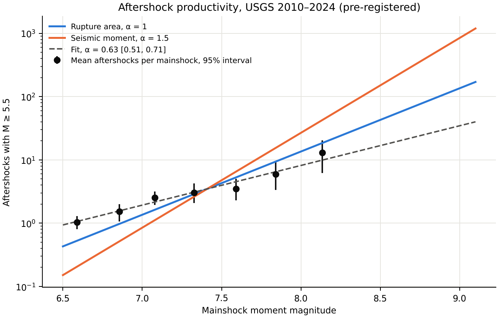

# Pre-registered tests of orthopolic resource readings

Started 8–9 October 2026. These are the first confirmatory tests of the programme in
[research-program.md](research-program.md) and [resource-catalogue.md](resource-catalogue.md).
Each prediction was committed in the catalogue (commit `e4bf526`), then registered with data,
estimator and decision rule (commit `8b9706c`, 23:52 UTC on 8 October) before any outcome was
computed. Registration files are `configs/prereg_2026-10-08_*.json`; their git history is the
record. The `declared_utc` fields say 23:55; the commit time is authoritative.

## Summary

| Test | Orthopolic prediction | Rival | Status | Result |
|---|---|---|---|---|
| Aftershock productivity | rupture area: α = 1.0 | seismic moment: α = 1.5 | **run** | inconclusive by the registered rule: α = 0.63 [0.51, 0.71] excludes both |
| Flare ribbon areas | space-filling territory: α = 2 | fractal area (FD-SOC): α = 7/3 | ready; data not reachable here | — |
| Lake radius of gyration | ζ_R = 2 | inherited from area (e.g. 2.28) | ready; data not reachable here | — |
| b-value against hypocentre dimension | b = D2/2 | b = 1 (FD-SOC) | ready; data not reachable here | — |

The registering session could reach only GitHub and PyPI. The three pending tests have scripts
that print download instructions and run end to end once the data are present; each was
validated on synthetic data before any real data were touched.

## Aftershock productivity (run)

- **Registration:** [configs/prereg_2026-10-08_aftershock_productivity.json](../configs/prereg_2026-10-08_aftershock_productivity.json).
- **Script and output:** [run_aftershocks.py](../experiments/run_aftershocks.py) (`make aftershocks`),
  [aftershock_productivity.json](../results/aftershock_productivity.json),
  
- **Data:** the frozen USGS catalogue (Mw ≥ 5.5, 2010–2024), previously analysed only for b. Prior
  exposure to published productivity values (0.8–1.1) is declared in the registration.

| Analysis | α | 95% interval | Mainshocks | Aftershocks |
|---|---|---|---|---|
| Primary: Gardner–Knopoff windows | 0.63 | [0.51, 0.71] | 427 | 1,015 |
| Rupture-length windows, 365 days | 0.90 | [0.76, 0.97] | 494 | 1,149 |
| First day excluded | 0.64 | [0.51, 0.72] | 427 | 821 |
| Shallow mainshocks (≤ 70 km) | 0.62 | [0.51, 0.71] | 306 | 878 |
| All magnitude types | 0.70 | [0.56, 0.79] | 429 | 1,300 |

Catalogue b = 0.998. Negative-binomial point estimate 0.62, matching the Poisson fit.

**Verdict (registered rule): inconclusive**, because the primary interval contains neither 1.0
nor 1.5. What the test does establish:

- The seismic-moment reading (α = 1.5) is excluded in every analysis.
- The self-similar rupture-area reading (α = 1.0) is also excluded in every analysis, though
  narrowly with rupture-length windows.
- α is below b in every analysis.
- The estimate depends strongly on the window definition (0.63 to 0.90). Gardner–Knopoff distance
  windows (about 128 km at M 9.1) are much smaller than the ruptures of great earthquakes, so the
  primary analysis undercounts their aftershocks and biases α low.

*Exploratory reading, not confirmatory:* the rupture-length estimate, 0.90 [0.76, 0.97], lies in
the range expected for a mixture of self-similar ruptures (α = 1) and width-saturated ruptures
(α = 0.75). A follow-up test should define windows from finite-fault rupture extents, registered
anew with this result disclosed.

## Flare ribbon areas (ready)

- **Registration:** [configs/prereg_2026-10-08_flare_ribbons.json](../configs/prereg_2026-10-08_flare_ribbons.json).
- **What it discriminates:** both hypotheses give the same distribution of linear sizes,
  N(L) ∝ L⁻³. They differ in how measured area scales with size: space-filling (A ∝ L², α_A = 2)
  against fractal (A ∝ L^1.5, α_A = 7/3).
- **Synthetic check:** with about 1,000 tail events, true α = 2 is estimated as 1.98 and supports
  the territory hypothesis; true 7/3 is estimated as 2.30 and supports the fractal one.
- **To run:**
  1. Obtain the RibbonDB flare table (Kazachenko et al. 2017, ApJ 845, 49; reported host
     `http://solarmuri.ssl.berkeley.edu/~kazachenko/RibbonDB/`, verify) as CSV in `data/raw/`;
     add its SHA-256 to `data/snapshot_checksums.json` and provenance to `data/SOURCES.md`.
  2. Record in the registration's `prior_exposure` whether a published ribbon-area index was read.
  3. `python experiments/run_flare_ribbons.py --input data/raw/<file>.csv --column <area column> --secondary <flux column>`
  4. Commit `results/flare_ribbons.json` and update this document and [status.md](status.md).

## Lake radius of gyration (ready)

- **Registration:** [configs/prereg_2026-10-08_lake_gyration.json](../configs/prereg_2026-10-08_lake_gyration.json),
  with Amendment 1.
- **Amendment 1 (before data access):** select lakes directly on radius of gyration, 1–20 km.
  Synthetic validation showed that the registered selection on area biased the fit (true 2.0
  estimated as 1.43); selecting on R recovers 2.00 [1.97, 2.03] and correctly rejects a true 2.3.
- **To run:**
  1. Download `HydroLAKES_polys_v10_shp.zip` (Messager et al. 2016, CC BY 4.0) from
     <https://www.hydrosheds.org/products/hydrolakes> and unzip; record checksum and provenance.
  2. `pip install pyshp pyproj`
  3. `python experiments/run_lake_gyration.py --shapefile <path>/HydroLAKES_polys_v10.shp`
     (writes the per-lake table to `data/derived/`, which is not tracked, then analyses it).
  4. Commit `results/lake_gyration.json` and update the documents.

## b-value against hypocentre dimension (ready)

- **Registration:** [configs/prereg_2026-10-08_volumetric_seismicity.json](../configs/prereg_2026-10-08_volumetric_seismicity.json),
  with Amendment 1.
- **Amendment 1 (before data access):** the correlation-dimension range runs from the 200th-closest
  pair distance (or three location errors) to 0.1 of the 90th-percentile pair distance, and
  clusters spanning less than a factor of 3 are excluded. The registered range was biased by
  boundary effects (planes and volumes both estimated at 1.15–1.74). The amended pipeline
  recovers slope 0.51 [0.47, 0.55] in a simulated territory world and −0.002 [−0.02, 0.02] in a
  simulated b = 1 world.
- **Data requirement found in validation:** a volumetric cluster needs roughly 3,000 events above
  completeness to have a usable scaling range; planar clusters need about 1,000.
- **To run:**
  1. Obtain a relocated catalogue with hypocentres and a cluster identifier, for example the
     Southern California relocated catalogue (Hauksson, Yang and Shearer 2012, updated; SCEDC) with
     nearest-neighbour clusters (Zaliapin and Ben-Zion 2013). Record the catalogue version and the
     cluster definition in the registration first.
  2. Save a CSV with `cluster`, `mag` and either `x_km, y_km, z_km` or `latitude, longitude,
     depth_km` (optionally `loc_err_km`).
  3. `python experiments/run_volumetric_b.py --input <file>.csv`
  4. Commit `results/volumetric_b.json` and update the documents.

## Lessons for later registrations

- Validate every estimator on synthetic data with known answers before registering it. Here the
  validation found two estimator flaws; both were fixed and recorded as amendments before any
  data access.
- When the outcome depends on a nuisance definition (aftershock windows), register the definition
  that matches the physics (rupture extent), not only the conventional one.
- Prior exposure to published values should be declared; tests on frozen, already-analysed data
  are replications, not blind tests.
