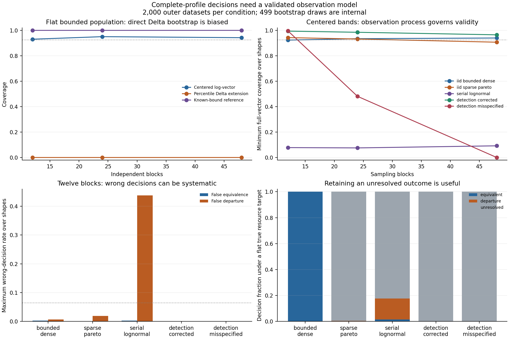

# Calibrating decisions about complete resource profiles

2 October 2026. This benchmark makes **equivalence, material departure, and
unresolved** distinct outcomes, with a practical factor fixed before evaluation.
It tests whole-profile uncertainty against known population targets under
different observation processes. Its main result is a limitation: nominal
bootstrap bands cannot be transferred automatically to twelve seasonal months,
heavy-tailed costs, or incorrectly weighted observations.

The [report](../results/profile-calibration/study.json),
[configuration](../configs/profile_calibration_2026-10-02.json), and
[final source/method freeze](../data/profile-calibration/2026-10-02/frozen-plan.json)
retain the numerical results and provenance. These are generated-data
operating-characteristic tests. They do not show that natural systems select
resource neutrality, and the interval constructions are not claimed as new
statistical methods.

## Target and three outcomes

A complete sampling block supplies resource totals $R_{bj}\ge0$ in every
declared bin $j$, including zeros. Let $w_j>0$ be each bin's logarithmic width,
$W=\sum_jw_j$, and $\mu_j$ the arithmetic mean population resource total per
block. The target is

$$\phi_j=\frac{W\mu_j}{w_j\sum_k\mu_k},\qquad
\Delta=\max_j|\ln\phi_j|.$$

Resource is pooled before normalization. Averaging separately normalized blocks
would give a different estimand. Population total resource must be positive;
a population zero-resource bin has infinite $\Delta$.

The declared factor is $F=1.5$, giving margin $m=\ln1.5$. Given bounds
$[\Delta_L,\Delta_U]$, the decision is equivalent if $\Delta_U<m$, departure
if $\Delta_L>m$, and unresolved otherwise. Equality with the margin remains
unresolved. The factor is an operational exploratory choice, not a universal
definition of approximate equality.

## Methods and their assumptions

**Centered complete-vector bootstrap.** Resample whole block rows with
replacement, recompute the mean-resource profile, and calculate the maximum
absolute log-coordinate error relative to the observed profile. The 95th
percentile supplies a common radius $c$ for
$\ln\hat\phi_j\pm c$ simultaneously across the fixed bins. Map this rectangular
band to bounds for $\Delta$. This bootstraps a smooth normalized mean vector
before applying the nonsmooth maximum, rather than directly bootstrapping
$\Delta$ as though its percentile interval were automatically valid.

It is an approximate method whose usual mean-vector rationale requires an
appropriate independent-block sampling model, positive bin means and moment
regularity. The finite benchmark assesses its actual operating characteristics
for the declared families; it does not supply a distribution-free theorem.
Any observed zero bin produces a broad unbounded centered band and an
unresolved decision. Zero bins are not removed or assigned pseudocounts.

**Historical percentile-maximum component and a separate extension.**
The existing
[flatness_equivalence](../src/orthopolity/goodness_of_fit.py) includes an upper
percentile of bootstrap maximum log departures. The benchmark reproduces that
immutable upper component and reports its equivalence and upper-coverage rates.
The historical function also has slope criteria; those are not included here.
For comparison, a new naive two-sided percentile interval for $\Delta$ supplies
a lower endpoint and a departure decision. That lower endpoint is **not part
of the historical rule**. Its poor two-sided coverage must not be attributed
to an operation the earlier function never performed.

**Known-bound reference.** If the rows are independent and each bin's block
resource has a true externally established bound $0\le R_{bj}\le B_j$, use

$$\epsilon_j=B_j\sqrt{\frac{\ln(2K/\alpha)}{2n}},\qquad
\mu_j\in[\max(0,\hat\mu_j-\epsilon_j),
          \min(B_j,\hat\mu_j+\epsilon_j)].$$

Hoeffding's inequality and a union bound provide simultaneous mean bounds;
independence across bins is unnecessary. Nonidentical independent rows are
permitted when the target is the average of their population means.
See [Hoeffding (1963)](https://www.tandfonline.com/doi/abs/10.1080/01621459.1963.10500830).
Mapping the mean box to each profile coordinate uses the same numerator in its
denominator: the lower ratio places the other means at their upper limits,
and the upper ratio places them at their lower limits. This gives conservative
finite-sample profile bounds under the stated assumptions.

Bounds inferred from the observed maximum are not the required almost-sure
physical bounds. The reference is unavailable for the unbounded families.
It cannot repair an incorrectly specified observation target or correction.

## Frozen observation benchmark

There are six bins with widths proportional to $[1,1,1,1,1,3]$, matching the
calibration-only pooled-bin proportions proposed for the solar application.
There are 12, 24, or 48 sampling blocks, and six population shapes: flat, a
gradient just inside the margin, a gradient on the margin, a gradient just
outside it, a material curved profile, and a structural zero bin. Inside and
outside gradients have departures $0.9m$ and $1.1m$; the curved profile has
departure $2m$.

Five observation families are crossed with these designs:

- Independent dense bounded resource totals, with multiplicative uniform
  variability between 0.7 and 1.3 of each population mean.
- Independent sparse compound-Poisson resources with Pareto event costs of
  shape 1.5. Their means are finite and variances infinite. Resource costs
  and empty block/bin observations are retained.
- Lognormal resources with serial correlation 0.8 between successive blocks.
  They have finite moments, but violate the independent-row bootstrap design.
- Bin-specific inclusion with probabilities $[1,0.9,0.8,0.7,0.6,0.5]$, corrected
  using the known inverse inclusion probabilities.
- The same latent resources and inclusion draws, with that correction omitted.
  Its target remains the true resource profile, making measurement
  misspecification explicit. Entire block/bin resource observations are thinned
  in this experiment; it is not an independent-event detection model.

Corrected and uncorrected detection conditions are paired, so their apparent
agreement is not counted as separate independent data generation. Within each
condition, outer datasets are independent. The generating profiles are imposed;
the purpose is to evaluate inference about them, not discover allocation from
an autonomous mechanism.

Development uses 200 outer datasets per condition and a separate seed. Final
evaluation uses **2,000 outer datasets in each of 90 conditions**, with 499
bootstrap draws inside each dataset. The bootstrap draws are not independent
validation trials. The completed evaluation takes approximately 129 seconds
on the recorded machine.

The original development source was retained before adding output-completion
and integrity guards to the runner. Final evaluation uses the later frozen
source. Observation generators, sampling seeds, methods, scenarios, margins,
and decision criteria were unchanged. Nothing was tuned from final evaluation.

The operational eligibility screen requires, in every frozen shape, false
equivalence and false departure Wilson upper bounds at most 0.065 and coverage
Wilson lower bounds at least 0.925. Centered and known-bound methods use complete
vector coverage; the percentile extension uses $\Delta$ interval coverage.
Row independence and correct observation weighting are separately recorded and
required for a passing eligibility flag. These operational tolerances are not
an exact 95% coverage claim. They impose no minimum power, so an uninformative
but conservative method can pass.

## Results and transfer boundary

Minimum centered-band coverage across all six shapes is:

| Observation family | 12 blocks | 24 blocks | 48 blocks |
|---|---:|---:|---:|
| Independent dense bounded | 92.30% | 93.40% | 93.95% |
| Independent sparse Pareto costs | 94.25% | 93.15% | 90.65% |
| Serial lognormal | 7.80% | 7.55% | 9.20% |
| Corrected detection | 99.35% | 98.45% | 96.45% |
| Misspecified detection | 99.60% | 48.10% | 0.00% |

The declared centered-band screen passes dense bounded observations only at
48 blocks. Its worst-shape coverage interval there is 92.82–94.91%, so it
satisfies the operational lower bound without establishing exact 95% coverage.
Sparse Pareto observations pass at 12 blocks, and corrected detection passes
at all three block counts. Sparse-Pareto passing at 12 does not establish
bootstrap consistency with infinite variance: **99.55%** of its flat-target
decisions and **91.15%** of its material-curvature decisions are unresolved.
At 48 blocks its worst coverage falls to 90.65%, and the screen fails.
The classical limitations of ordinary mean bootstrapping with infinite
variance are relevant; see
[Athreya (1987)](https://doi.org/10.1214/aos/1176350371).
The report's assumptions flag records independence and weighting, rather than
claiming a moment theorem for that Pareto family.

Serial dependence causes more consequential wrong decisions: on the margin
with 12 blocks, false departures occur in **43.75%** of datasets, with Wilson
interval **41.59–45.93%**. Increasing the number of such blocks does not fix
resampling them as independent observations.

Uncorrected detection at 48 blocks falsely declares equivalence in **36.80%**
of the just-outside-gradient datasets, with interval **34.71–38.94%**. The
corresponding corrected condition has no observed false equivalence. The
historical percentile-maximum upper component falsely declares equivalence
in **62.45%** of that uncorrected condition. Here the primary failure is the
observation correction, not just the interval recipe. Broad bands at 12 blocks
can mask this bias and attain high coverage while leaving decisions unresolved;
that does not make the weighting assumption correct.

The naive two-sided percentile-$\Delta$ extension covers the exactly flat
population's $\Delta=0$ in **0%** of dense bounded datasets at every tested block
count. Its positive lower endpoint exposes the problem with directly
bootstrapping a maximum at a flat target. This is a failure of the new
two-sided extension; the historical upper-only component covers zero.

The known-bound reference passes for correctly observed independent bounded
families but leaves every material-curvature case in the dense family
unresolved at the tested block counts. Its guarantee is conservative and
its usefulness limited here. It is not available merely because the observed
resources happened to be finite.

Every conditional rate and its Wilson Monte Carlo interval is retained in
the report, together with zero-bin and unbounded-band rates. The paired
detection conditions and separately retained development results are explicit.

## Application API and solar gate

~~~python
from orthopolity.profile_calibration import profile_decision

result = profile_decision(
    monthly_resource_totals, log_bin_widths,
    factor=1.5, alpha=0.05, bootstrap_replicates=499, seed=123,
)
result["centered_bootstrap"]["decision"]
~~~

The return value includes the pooled point profile, simultaneous log-profile
band, $\Delta$ bounds, zero flags, and the historical upper-only comparator.
`None` represents explicitly flagged unbounded endpoints. To use the bounded
reference, supply independently defensible `resource_upper_bounds`; none are
silently estimated.

For the proposed twelve-month 2025 solar application, independent exchangeable
months, suitable tail behavior, and true monthly fluence bounds have not been
established. Therefore **the robust primary equivalence/departure verdict
remains unresolved**. A bootstrap classification can be reported as a
conditional exploratory diagnostic, alongside the measured profile and forward
forecasts. Passing one simulated observation family does not certify the
physical application's assumptions or justify choosing a family from its
favorable result. The factor, binning, helper source and this gate are fixed
before acquiring the 2025 outcomes.

## Reproduction and retained data

~~~bash
PYTHONPATH=src MPLCONFIGDIR=build/matplotlib python3.11 -m unittest discover -s tests -p 'test_profile_calibration.py' -v
PYTHONPATH=src MPLCONFIGDIR=build/matplotlib python3.11 experiments/run_profile_calibration.py
~~~

Eleven targeted tests cover pooling and unequal widths, zero retention,
strict decision boundaries, conservative shared-ratio bounds, historical-upper
reproduction, scale invariance, batch/API agreement and output tamper detection.
Generated figures were rendered and visually inspected. Default reruns audit
and reuse retained inputs and completed outputs.

Each condition retains all outer estimates, bounds, decisions, bootstrap
radii and zero flags, and the first eight complete block-vector input datasets.
The remaining generated inputs reconstruct exactly from the frozen algorithms,
NumPy version and per-condition SeedSequence recipes; they are **not all saved
as raw arrays**. Inner bootstrap indices likewise regenerate. The complete
retained data occupy approximately 44 MB, split across small per-condition
archives, and manifests hash each file. Completed outputs have their own
integrity manifest, written only after figure generation succeeds.

For fresh Monte Carlo evidence, use a new seed, run ID, data directory and
output directory. Replaying the same seed verifies computation but adds no
independent evidence.
