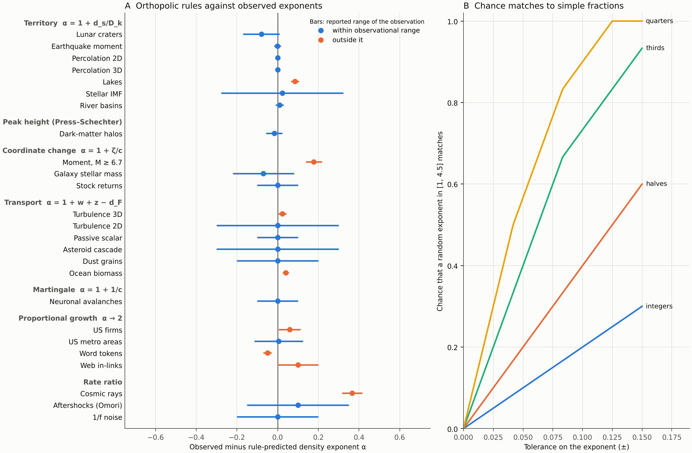

# Orthopolic resource catalogue

Compiled 8 October 2026. This applies the authors' programme: read each power-law exponent as
the signature of an orthopolic resource, try to express that resource as a combination of simpler
ones, and look for regularities across systems. Terms follow the [glossary](glossary.md).

**Method.** Four agents each catalogued 14–15 power laws in one domain (geophysics and
astrophysics, physical laws, biology and ecology, social and information systems), 59 in all. For
each case they computed the resource exponents under both measures, proposed decompositions with
the motivation stated before the comparison, and named a consequence that would test each reading.
An independent checker per domain re-examined every exponent, the algebra and the grade; a final
pass looked for cross-domain patterns. The data are in
[configs/resource_catalogue.json](../configs/resource_catalogue.json);
[run_catalogue.py](../experiments/run_catalogue.py) recomputes every rule prediction and check.

**Verification status.** The shared web-search budget ran out during checking. Of 59 exponents,
28 were confirmed and 6 corrected against abstracts or search extracts; 25 could not be verified
and rest on the checkers' recollection. Treat values as provisional until checked against
primary sources.

## Main findings

1. **Exponents are dimension counts, under the logarithmic measure.** The clearest regularity is
   the **territory rule**: when objects tile a support of dimension $d_s$ and their measured
   content scales as $k\propto L^{D_k}$,

   $$\alpha = 1+\frac{d_s}{D_k}.$$

   This is the authors' "$k^{-3}$ is related to three" in a precise form: craters on a surface
   ($d_s=2$, diameter $D_k=1$) give $\alpha=3$, with the 3 counted as $1+2$. Every $k^{-3}$ case
   with an established mechanism (crater equilibrium, fracture exclusion, percolation
   hyperscaling, enstrophy and wave-slope spectra) takes this logarithmic reading. The linear
   "volume $k^3$" reading has no independent mechanism in the catalogue except Aschwanden's
   scale-free probability conjecture, which is a postulate. Fractional exponents arise as ratios
   of dimensions: 2/3 for seismic moment ($d_s=2$, $M_0\propto L^3$), 187/91 for 2D percolation
   clusters.
2. **A few rules cover most derived cases.**

   | Rule | Exponent | What is equal per class | Examples |
   |---|---|---|---|
   | Territory | $\alpha=1+d_s/D_k$ | the support area or volume claimed | craters, percolation, lakes, river basins, earthquake moment, stellar IMF |
   | Transport | $\alpha=1+w+z-d_F$ | the flux through scale; stock = flux / log-speed | Kolmogorov 5/3, Kraichnan 3, Batchelor 1, Dohnanyi 3.5, ocean biomass |
   | Coordinate change | $\alpha_y=1+\zeta_x/c$ for $y\propto x^c$ | inherited from the carrier $x$ | stock returns 4 (fund assets through trade-size and impact laws), galaxy stellar mass |
   | Proportional growth | $\alpha\to2$, $\zeta-1\approx$ entry/growth | the stock itself | firms, cities, words, web links |
   | Martingale | $\alpha=1+1/c$ | a conserved expectation (Zipf in the carrier) | avalanches 3/2, random-walk return 3/2 |
   | Rate ratio | $\alpha=1+$ ratio of two exponential rates | time per log interval | Omori aftershocks, 1/f noise, shock acceleration |
   | Peak height | linear measure in peak height | mass per unit peak height | dark-matter halos (Press–Schechter) |

3. **The primitive orthopolic quantity is usually a flux or a capacity, rarely a stock.** Of 38
   cases graded derived or motivated, about 15 are fluxes, 14 capacities and 9 stocks. A stock is
   flat per log class exactly when the log-speed does not depend on size, which is what
   proportional growth provides; otherwise the stock carries the rate exponent (Kolmogorov's 2/3
   is the eddy turnover-rate exponent).
4. **Composition calculus.** Products of deterministic cost laws add resource exponents
   (seismic moment = slip $L^1$ × area $L^2$; Stefan–Boltzmann = $T^d$ active modes × $kT$ each).
   A coordinate change $y\propto x^c$ divides survival exponents. Products of independent random
   factors do not add (they give lognormals), and sums of costs give crossovers rather than new
   power laws (curvature in Kleiber's law, seismogenic-width saturation).
5. **A no-reading class exists and can be predicted.** No natural resource appears when no
   quantity is conserved at intermediate scales (wildfires, driven by weather and suppression), when
   the exponent is a renormalization-group eigenvalue (3D Ising), when the law is a sampling
   identity with a free parameter (Taylor's law, Heaps' law, species–area), or in exponential
   regimes. The pattern analysis predicts that exponents in this class drift with region, period
   or cutoff, while those with a conserved quantity stay stable.
6. **One exponent rarely identifies one resource.** The value 3/2 arises from random walks,
   critical branching, coagulation and Euclidean source counts; $k^{-3}$ from area, enstrophy and
   crater saturation. What discriminated readings was never the exponent alone, but a dimension
   series, a prefactor, a joint set of exponents, or an independently measured input.

## Rule checks

*Figure. (A) Observed density exponent minus the value the rule predicts from its stated inputs,
for 25 cases. Bars are the reported range or uncertainty of the observation. (B) The probability
that an exponent drawn at random from [1, 4.5] lies within a tolerance of some simple fraction.*

Seventeen of 25 cases fall within the observational range. The eight outside it are informative:

| Case | Rule value | Observed | Reading |
|---|---|---|---|
| 3D turbulence | 5/3 | 1.69 ± 0.02 | intermittency correction; the exact flux law (4/5) holds |
| Ocean biomass | 2.00 | 2.04 ± 0.015 | canonical transfer efficiency is too coarse; $\lambda=2+q-n$ gives 2.05 |
| Lakes | 2.055 | 2.14 ± 0.02 | percolation hull reading misses by 0.085 |
| US firms, web in-links | 2.00 | 2.06, 2.1 | above 2, as entry predicts; the correction was not measured |
| Word tokens | 2.00 | 1.95 ± 0.02 | depends on the lower cutoff (2.20 at $x_{\min}=1$) |
| Earthquake moment, M ≥ 6.7 | 1.50 | 1.68 ± 0.04 | the area reading fails above width saturation |
| Cosmic rays | 2.33 | 2.70 ± 0.05 | the source index is fitted in practice |

Most rule values restate published derivations, so agreement here measures how much known
physics the rules organize, not new confirmations. Inputs are independent of the observation only
where the configuration says so (for example, the Hack exponent for river basins, the turbulent
velocity spectrum for the IMF, measured stress-drop scaling for earthquakes).

## How much a match is worth

| Candidate resource exponents | ±0.02 | ±0.05 | ±0.1 |
|---|---|---|---|
| Integers | 4% | 10% | 20% |
| Halves | 8% | 20% | 40% |
| Thirds | 16% | 40% | 73% |
| Quarters | 24% | 57% | 90% |
| Sixths | 47% | 87% | 100% |

These are chance-match probabilities over [1, 4.5]. Every exponent also has two readings
($d_{\rm lin}=d_{\log}+1$), and most cases offered several candidate resources, so some simple
reading fits nearly any exponent at typical empirical precision. A match counts as evidence only
when the resource and its inputs were fixed before the exponent was examined and the reading
passes a second, different prediction.

Grades after checking: 23 derived, 15 motivated, 18 suggestive, 3 numerology or none. Physics
supplies 10 of the 23 derived cases, where orthopolic readings re-express known conservation or
packing arguments. New readings proposed for biology and social systems mostly grade suggestive.

| Domain | Derived | Motivated | Suggestive | Numerology or none |
|---|---|---|---|---|
| Geophysics and astrophysics | 5 | 3 | 6 | 1 |
| Physical laws | 10 | 4 | 0 | 0 |
| Biology and ecology | 3 | 2 | 8 | 2 |
| Social and information | 5 | 6 | 4 | 0 |

## Predictions to test before looking

These follow from the rules. Four were then pre-registered and one was run; see
[preregistered-tests.md](preregistered-tests.md) for status and results (aftershock productivity:
inconclusive, seismic-moment reading excluded). They come from
the pattern analysis and need source verification; each has a rival prediction, so the outcome
discriminates.

| System | Orthopolic prediction | Rival |
|---|---|---|
| Volumetric or swarm seismicity | territory in 3D: $b=1.5$ | scale-free probability conjecture: $b=1$ |
| 3D fracture discs | territory: density exponent 4 | linear volume: 3 (one study reports 3–3.6) |
| Solar flare ribbon areas | log-orthopolic in area: $\alpha=2$ | scale-free probability conjecture: 7/3 |
| Lake radius of gyration | $N(>L)\propto L^{-2}$, independent of fractal dimension | — |
| Aftershock productivity | proportional to rupture area: productivity exponent equals $b$ | non-geometric branching values |
| Plant self-thinning in strips vs areas | $N\propto M^{-1/3}$ vs $M^{-2/3}$ | a single universal value |
| Planar colonies and biofilms | metabolic exponent $D/(D+1)=2/3$ | 3/4 |
| Urban scaling by city form | output exponent 1.5, 1.17, 1.08 for 1D, 2D, 3D | a single value 1.15 |
| Urban sum rule | output exponent + network exponent = 2 | independent exponents |
| Wave turbulence | spectral level ∝ flux$^{1/3}$ (four-wave) or $^{1/2}$ (three-wave) | Phillips saturation (no flux dependence) |

Known tensions to report alongside: rock fragmentation ($D\approx2.5$–2.6, where three-dimensional
territory predicts 3); the large-earthquake failure above; firm growth volatility, which falls with
size and violates proportional growth.

## Using the catalogue

- *Exploration.* Any exponent gives candidate resources: `resource_exponents(alpha)` returns
  $d_{\log}=\alpha-1$ and $d_{\rm lin}=\alpha$; `rule_alpha` evaluates the rules above.
- *Confirmation.* Before examining a new system, record $d_s$, $D_k$, any rate exponent $z$, the
  measure, and one second consequence; then compare. Report failures with the same prominence.
- *Choosing the measure.* The catalogue suggests a heuristic: a size moved by multiplicative
  transfer, packing or proportional growth takes the logarithmic measure; an additive coordinate
  traversed at a constant rate (distance at light speed, frequency with equipartition, peak
  height) takes the linear one.

## Appendix: all catalogued cases

Generated from [configs/resource_catalogue.json](../configs/resource_catalogue.json), which also
holds the full readings, alternative decompositions, testable consequences and sources. For
scaling laws the exponent is that of the law, and resource exponents are given in the readings.

| Domain | System | Kind | α or law exponent | d_log | d_lin | Most defensible reading | Grade | Exponent check |
|---|---|---|---|---|---|---|---|---|
| Biology | Pelagic marine and aquatic communities, bacteria to whales | density | 2.04 | 1.04 | 2.04 | Biomass stock is log-orthopolic (d = 1). | derived | confirmed |
| Biology | Neuronal avalanches in cortical slices and cultures | density | 1.5 | 0.5 | 1.5 | Conserved expected activity in a critical branching process (a martingale), log measure. | derived | not verified |
| Biology | Branching transport networks: mammalian arterial trees and … | density | 3.7 | 2.7 | 3.7 | Volumetric flow per vessel, log measure. | derived | not verified |
| Biology | Population density across species: mammalian primary consum… | scaling law | -0.75 | — | — | Energetic equivalence: equal metabolic energy flux per species (discrete measure), D × M^(3/4) = constant. | motivated | not verified |
| Biology | Predator vs prey biomass, and community production vs bioma… | scaling law | 0.75 | — | — | Predator biomass is discretely orthopolic in prey PRODUCTION (a flux): a constant predator stock per unit prey production across ecosystems. | motivated | not verified |
| Biology | Whole-organism metabolic rate across species | scaling law | 0.74 | — | — | The count of size-invariant terminal supply sites fed by a minimum-cost space-filling network (discrete measure; | suggestive | not verified |
| Biology | Resting heart rate and maximum lifespan across mammal speci… | scaling law | -0.25 | — | — | Physiological-time invariance, not a budget being spent. | suggestive | not verified |
| Biology | Species richness vs area | scaling law | 1.27 | — | — | Niche-slot capacity (Southwood, May & Sugihara 2006, discrete measure): species ∝ (extent of niche space)^D, with the size-axis extent set by the lar… | suggestive | corrected |
| Biology | Paralogous gene-family sizes in complete genomes | density | 2.5 | 1.5 | 2.5 | Genes as an additive stock, log measure. | suggestive | not verified |
| Biology | Functional gene-category sizes vs genome size | scaling law | 1.85 | — | — | The Maslov et al. | suggestive | not verified |
| Biology | Taylor's power law of fluctuation scaling | scaling law | 1.5 | — | — | Mean abundance μ is shared equally among a Poisson number λ ∝ μ^(2-b) of independent clusters, each holding ∝ μ^(b-1) individuals (discrete measure). | suggestive | not verified |
| Biology | Home-range area vs body mass | scaling law | 1.03 | — | — | Two simple readings fit equally well:
(a) Flux plus sharing (Jetz et al. | suggestive | not verified |
| Biology | Lévy-flight foraging step lengths | density | 2 | 1 | 2 | Travel effort (distance or time) spread equally over log step-length classes (log measure): no search scale is favoured. | suggestive | not verified |
| Biology | Trees in forest stands | density | 2 | 1 | 2 | Stand metabolic (xylem) flux ∝ D^2, equal per LINEAR diameter interval (Enquist & Niklas; | numerology | not verified |
| Biology | Species per genus | density | 1.45 | 0.45 | 1.45 | No natural resource reading. | numerology | not verified |
| Geo/astro | Fault and joint | density | 2.8 | 1.8 | 2.8 | Capacity reading. | derived | not verified |
| Geo/astro | Impact craters on surfaces in saturation equilibrium | survival | 3 | 2 | 3 | Equal crater-covered surface area per ln D: a 2D territory kept in steady state by area-based (cookie-cutter or degradation-footprint ∝ D^2) erasure. | derived | not verified |
| Geo/astro | Asteroid belt collisional cascade | density | 3.5 | 2.5 | 3.5 | Log-orthopolic in mass flux: m × disruption rate ∝ D^2.5. | derived | not verified |
| Geo/astro | River networks: drainage-area distribution and Hack's law | survival | 1.43 | 0.43 | 1.43 | Drained width W = A/l(A) ∝ A^(1-h). | derived | not verified |
| Geo/astro | Dark-matter halo mass function, low-mass end | density | 1.9 | 0.9 | 1.9 | Field halos: Lagrangian-volume (mass) log-orthopolity tilted by the spectral slope. | derived | not verified |
| Geo/astro | Global lakes | density | 2.14 | 1.14 | 2.14 | Log-orthopolic in gyration territory L^2. | motivated | not verified |
| Geo/astro | Stellar initial mass function above the turnover | density | 2.35 | 1.35 | 2.35 | A 3D territory of self-similar turbulent structures (count ∝ L^-3), with core mass ∝ L^(4-beta) from MHD shock compression (Padoan & Nordlund 2002). | motivated | not verified |
| Geo/astro | Galaxy stellar mass function, faint end | density | 1.47 | 0.47 | 1.47 | Halo near-orthopolity (zeta_h ≈ 0.9) viewed through M* ∝ M_h^(5/3) from energy-driven feedback (Dekel & Silk 1986; | motivated | not verified |
| Geo/astro | Earthquakes, global shallow seismicity | survival | 1.66 | 0.65 | 1.65 | The event flux is log-orthopolic in a 2D territory L^2, meaning equal ruptured fault area per unit time per ln L. | suggestive | confirmed |
| Geo/astro | Interstellar dust grains | density | 3.5 | 2.5 | 3.5 | A steady grain-shattering cascade with constant mass flux (mass × collision rate ∝ a^2.5), as in Dohnanyi. | suggestive | not verified |
| Geo/astro | Islands | survival | 1.65 | 0.65 | 1.65 | Count = (2D slots ∝ L^-2) × (probability that the water level falls within an L-patch's relief ∝ L^H), so q ∝ L^(2-H) = A^(1-H/2), read as area per u… | suggestive | not verified |
| Geo/astro | Landslides | density | 2.4 | 1.4 | 2.4 | Log-orthopolic in mobilized volume V = A × depth, with depth ∝ A^(gamma - 1). | suggestive | not verified |
| Geo/astro | Solar flares | density | 1.8 | 0.8 | 1.8 | No single reading fits. | suggestive | corrected |
| Geo/astro | Galactic cosmic rays below the knee | spectrum | 2.7 | 1.7 | 2.7 | Leaky box N = Q × tau_esc. | suggestive | corrected |
| Geo/astro | Wildfires | density | 1.4 | 0.4 | 1.4 | No natural reading. | none | not verified |
| Physics | Point-source radiation intensity; | scaling law | 2 | — | — | The conserved flux (P, or the Gauss flux q/eps0, 4 pi G M) is shared equally among the area cells of every enclosing sphere. | derived | confirmed |
| Physics | Thermal | scaling law | 4 | — | — | The number of active slots (the k-space volume inside the thermal radius k_T ∝ T, ∝ T^d, a capacity) times an equal energy kT per active slot. | derived | confirmed |
| Physics | Low-temperature heat capacity from gapless excitations: pho… | scaling law | 3 | — | — | The number of thermally active modes (the DOS integrated up to kT, a capacity) times one kB of heat capacity per active mode (discrete equipartition … | derived | confirmed |
| Physics | Two-body Newtonian orbits | scaling law | 3 | — | — | Dilution: T^2 = 3 pi/(G rho_bar(<a)). | derived | confirmed |
| Physics | 3D homogeneous isotropic turbulence, inertial range | spectrum | 1.6667 | 0.6667 | 1.6667 | Constant energy flux eps through each log-wavenumber. | derived | confirmed |
| Physics | 2D turbulence | spectrum | 3 | 2 | 3 | Constant enstrophy flux eta with a scale-independent (non-local, large-scale) strain rate. | derived | confirmed |
| Physics | Passive scalar | spectrum | 1 | 0 | 1 | Scalar variance per ln k = conserved variance flux chi / scale-independent strain rate. | derived | confirmed |
| Physics | Relative dispersion of fluid-particle pairs in the inertial… | scaling law | 3 | — | — | Residence time per log separation equals the eddy turnover time tau(r) ∝ eps^(-1/3) r^(2/3). | derived | confirmed |
| Physics | Critical percolation clusters | density | 2.0549 | 1.0549 | 2.0549 | Log-orthopolic in span volume R^d ∝ s^(d/D_f). | derived | corrected |
| Physics | Critical branching processes and mean-field avalanches: neu… | density | 1.5 | 0.5 | 1.5 | The expected population (a martingale at branching ratio 1) is conserved per generation and shared among the surviving lineages (Kolmogorov and Yaglo… | derived | confirmed |
| Physics | Resistance | spectrum | 1 | 0 | 1 | Equal fluctuator variance per log relaxation time. | motivated | confirmed |
| Physics | Unbiased random walk or Brownian motion: first return | density | 1.5 | 0.5 | 1.5 | For a 1D finite-variance walk: optional stopping of the position martingale gives P(reach L before return) = 1/L, i.e. | motivated | confirmed |
| Physics | Earthquake aftershock sequences | density | 1.1 | 0.1 | 1.1 | Dieterich rate-and-state nucleation. | motivated | confirmed |
| Physics | Wind-generated ocean surface gravity waves; | spectrum | 4 | 3 | 4 | Energy flux through scales via four-wave resonances (the Kolmogorov-Zakharov solution). | motivated | confirmed |
| Social/info | Vocabulary growth in texts and corpora | scaling law | 1.5 | — | — | Heaps' law has no resource of its own. | derived | confirmed |
| Social/info | US metropolitan areas | survival | 2.005 | 1.005 | 2.005 | Residents (q = k) under the log measure, with Gibrat growth and a lower barrier or entry. | derived | confirmed |
| Social/info | US firms with employees | survival | 2.059 | 1.059 | 2.059 | Workers (q = k) under the log measure, with Gibrat growth plus entry and exit. | derived | confirmed |
| Social/info | Growth-rate volatility of firms | scaling law | -0.2 | — | — | Absolute growth variance is additive over effectively independent sub-units. | derived | corrected |
| Social/info | Journals contributing articles on a subject | rank | 2 | 1 | 2 | Discrete log-orthopolity of articles over geometric rank zones. | derived | confirmed |
| Social/info | Word tokens in written texts and corpora | rank | 1.95 | 0.95 | 1.95 | The tokens themselves (q = k), under the log measure. | motivated | confirmed |
| Social/info | Urban systems: US metropolitan statistical areas and other … | scaling law | 1.15 | — | — | Output per resident equals social interactions per resident, so d = 1 + δ with δ = H/(D(D+H)). | motivated | corrected |
| Social/info | Richest US individuals | survival | 2.49 | 1.49 | 2.49 | Wealth (q = k) under multiplicative returns with size-independent exit (Kesten/Gibrat). | motivated | confirmed |
| Social/info | Citations to scientific papers | density | 3 | 2 | 3 | Relative age (exposure time) is exactly log-orthopolic because papers enter at a steady rate. | motivated | confirmed |
| Social/info | World Wide Web pages | density | 2.1 | 1.1 | 2.1 | In-links (q = k) under the log measure, with preferential attachment and small initial attractiveness. | motivated | confirmed |
| Social/info | US stocks | survival | 4 | 3 | 4 | The assets of trading institutions, a stock assumed to be Zipf, seen through the optimal trade size V ∝ S^(2/3) and square-root impact r ∝ V^(1/2). | motivated | confirmed |
| Social/info | US top personal incomes from IRS tabulations, 1916–2019, sp… | survival | 3 | 2 | 3 | For capital income: a flux r·W drawn from the near-Zipf wealth stock (motivated; | suggestive | confirmed |
| Social/info | Authors of scientific papers | density | 2 | 1 | 2 | Papers (q = k) under the log measure, with cumulative advantage and steady newcomer entry. | suggestive | confirmed |
| Social/info | Interstate wars, Correlates of War 1823–2003 | density | 1.53 | 0.53 | 1.53 | α = 3/2 is equivalent to ζ = 1/2, i.e. | suggestive | confirmed |
| Social/info | Terrorist attacks worldwide | density | 2.4 | 1.4 | 2.4 | Coalescence–fragmentation of attack units. | suggestive | confirmed |
