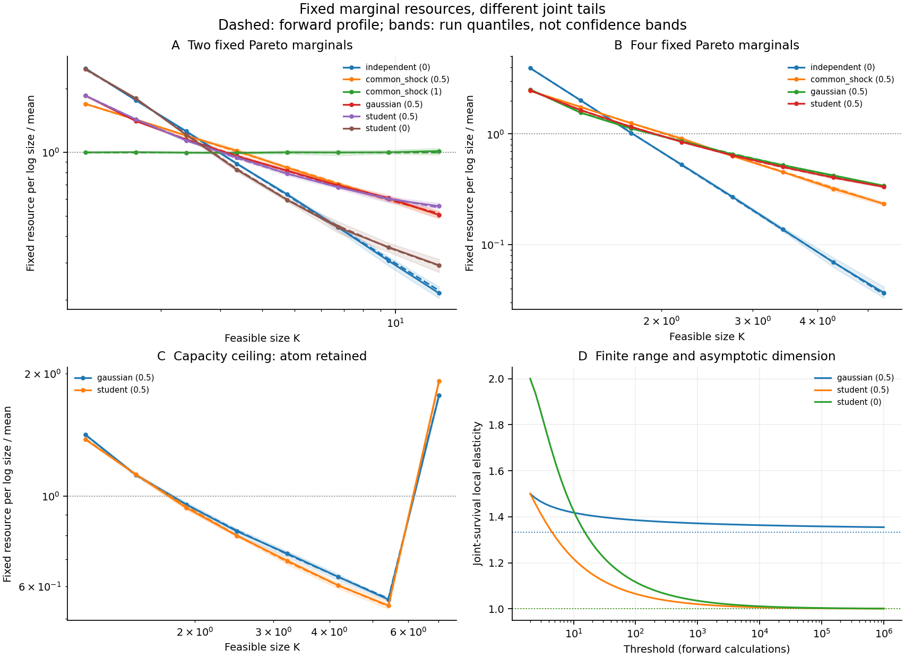

# Resource dimensionality: definitions and a dependence benchmark

1 October 2026. This is exploratory theory and a reproducible benchmark of known
probability models. It does not introduce natural-system measurements, establish
a new allocation law, or claim priority for copula tail theory.

## 1. The dimensional interpretation needs two distinct quantities

For an independently specified mean additive cost $q(k)>0$, define its local
scaling dimension

$$
D_q(k)=\frac{d\log q(k)}{d\log k}.
$$

For the abundance density $n(k)=dN/dk$ and resource per log interval
$O(k)=kq(k)n(k)$, accounting gives

$$
\alpha(k)-1=D_q(k)-\beta(k),\qquad
\alpha=-\frac{d\log n}{d\log k},\quad
\beta=\frac{d\log O}{d\log k}.
$$

Thus the abundance exponent measures the cost dimension under the independently
specified allocation condition $\beta=0$. Volume has dimension three relative
to length, and one relative to volume itself. The coordinate must be declared.
Several input types do not automatically increase this cost dimension: additive
linear input costs still have dimension one. A multiplicative cost of linearly
scaling factors has degree equal to the number of factors even if their
scale-independent random coefficients are correlated. Dependence alone does not
therefore explain every fractional cost exponent.

A different dimension concerns simultaneous feasibility. Let $B_a$ be measured
available budgets and $q_a(k)$ independently calibrated increasing resource
requirements. Define capacity $X_a=q_a^{-1}(B_a)$. A proposed bottleneck mechanism
predicts the largest realizable size

$$
K=\min_a X_a,\qquad S(k)=P(K\ge k)=P(X_1\ge k,\ldots,X_m\ge k).
$$

The *joint-feasibility dimension* is the survival elasticity

$$
\kappa(k)=-\frac{d\log S(k)}{d\log k},
$$

or an asymptotic survival index when a regularly varying tail exists. In this
benchmark $K$ is defined to be the bottleneck. In a physical experiment the
observed size must be measured independently and this mechanism tested: available
capacity alone does not establish that it is fully realized.

### Precise bridge from feasibility to allocation

When $S$ is positive and differentiable with $\kappa(k)>0$, its density is
$f(k)=S(k)\kappa(k)/k$. Therefore the exact local identities are

$$
\alpha(k)=1+\kappa(k)-\frac{d\log\kappa(k)}{d\log k},\qquad
\beta(k)=D_q(k)-\kappa(k)+\frac{d\log\kappa(k)}{d\log k}.
$$

For a pure survival power $S(k)\propto k^{-\kappa}$, these reduce to
$\alpha=1+\kappa$ and $\beta=D_q-\kappa$. The asymptotic versions require
regularity of the density as well as regular variation of survival; arbitrary
oscillating derivatives need not obey the naive density mapping. Primary
resource neutrality consequently requires $\kappa=D_q$ in that regime. A
fractional feasibility index can coexist with an additive cost dimension of one
and a non-flat resource profile.

The two interpretations are connected, but they are not interchangeable. This
benchmark keeps the audited cost $q(K)=K$ fixed, rather than changing it to
$K^{\text{fitted exponent}}$ to enforce neutrality.

## 2. Dependence mechanisms with exactly the same marginal laws

Each uncapped capacity has $P(X_a\ge k)=1/k$ for $k\ge1$. All its uncapped
means are infinite; finite sampled totals are not finite population expectations.
Our resource profiles use bounded declared domains. A capacity ceiling explicitly
changes the idealized model and supplies finite means.

### Independent capacities and common shocks

Independence gives $S(k)=k^{-m}$. For the common-shock construction, let
$Z\sim\operatorname{Exp}(\theta)$ and independent
$U_a\sim\operatorname{Exp}(1-\theta)$, and set
$X_a=\exp[\min(Z,U_a)]$. Zero rates mean infinite waiting times. Then

$$
P(X_a\ge k)=k^{-1},\qquad
S(k)=k^{-[m-(m-1)\theta]}.
$$

This supplies exact fractional feasibility powers with unchanged marginals.
It is an elementary specialization of the exponential shock construction of
[Marshall and Olkin (1967)](https://doi.org/10.1080/01621459.1967.10482885),
not a new multivariate distribution discovered here. Its parameter is a shared
hazard fraction, not a generic correlation coefficient.

### Gaussian dependence and slow corrections

Let $Y_a=\sqrt\rho Z+\sqrt{1-\rho}E_a$, with independent standard normals,
and set $X_a=1/\overline\Phi(Y_a)$. This gives fixed unit-Pareto margins.
For $0\le\rho<1$, the equicorrelated joint tail has index

$$
\kappa_\infty=\frac{m}{1+(m-1)\rho}.
$$

To see the origin of this expression, the normal correlation matrix satisfies
$\mathbf1^T R^{-1}\mathbf1=m/[1+(m-1)\rho]$. A Laplace expansion at a common
large positive normal threshold $z$ gives the joint orthant probability
proportional to $z^{-m}\exp[-\kappa_\infty z^2/2]$. Combining this with
$\overline\Phi(z)\sim\phi(z)/z=1/k$ yields

$$
S(k)\sim C\,k^{-\kappa_\infty}
(\log k)^{-(m-\kappa_\infty)/2}.
$$

The logarithmic factor matters: finite-range elasticity is not the limiting
index. The bivariate regular-variation result is established in
[Fung and Seneta (2011)](https://doi.org/10.1016/j.spl.2011.06.003), and the
bivariate index and diagonal-path qualification appear in
[Furman et al. (2016)](https://arxiv.org/abs/1607.04736).
The multivariate equicorrelation calculation above is a standard normal-tail
specialization, with no mathematical-priority claim.

### Student dependence with the same rank dependence

Replace the Gaussian latent vector by $T_a=Y_a/\sqrt{W/\nu}$, where
$W\sim\chi^2_\nu$ is shared and independent, and use
$X_a=1/\overline F_\nu(T_a)$. The margins are still unit Pareto. Gaussian
and Student copulas have the same pairwise Kendall correlation
$\tau=2\arcsin(\rho)/\pi$, yet their extreme dependence differs.

The bivariate Student upper-tail coefficient is

$$
\lambda_U=2F_{\nu+1}
\left[-\sqrt{\frac{(\nu+1)(1-\rho)}{1+\rho}}\right]>0,
$$

so $S(k)\sim\lambda_U/k$ and $\kappa_\infty=1$. For the positive-definite
equicorrelated multivariate construction, its common heavy scale also gives a
positive joint orthant tail coefficient and index one; increasing the number
of required inputs changes the coefficient and finite-range behaviour.
The mixture construction, Kendall relation, and bivariate coefficient are
given by [Demarta and McNeil (2005)](https://doi.org/10.1111/j.1751-5823.2005.tb00254.x),
with an accessible [author manuscript](https://www.planchet.net/EXT/ISFA/1226.nsf/0/303eb11b4d617b79c1257b0800744575/$FILE/t%20copula%20demarta%20mcneil.pdf).

Student latent correlation zero is not independence: the common random scale
still couples extremes. Similar ordinary rank dependence can therefore imply
different feasibility dimensions. The relevant object is the full joint-tail
law, not a universal scalar correction based on correlation strength.

## 3. Forward benchmark and its statistical target

The [configuration](../configs/dependence_study_2026-10-01.json) was fixed before
this benchmark run. It specifies twelve scenarios, six independent validation
runs per scenario, 60,000 observations per run, 16,000 separate capacity-training
observations, and eight bins. It is an illustrative local specification, not
an external preregistration or a blinded discovery protocol.

Two- and four-input systems compare resource count, fixed marginals, and different
dependence constructions. Gaussian and Student cases share latent correlation
0.5. Student degrees of freedom are fixed at four. Additional scenarios impose
a capacity ceiling of eight. This is clipping, not conditioning on being below
a threshold: it retains an atom at the ceiling. That atom contributes actual
resource to the final bin. A capped system has no asymptotic tail above its cap.

Predictions come from the capacity laws, not an exponent estimated from size
counts. Independence and common shocks have exact survival functions. Gaussian
predictions use a one-dimensional normal-factor integral. Student predictions
use their normal/chi-square mixture, with Gauss-Hermite integration for the normal
factor and adaptive integration for the scale. A separate conditional Student
integral checks the bivariate calculation, and changed quadrature orders check
the numerical results.

For each bin $[a,b)$, expected resource is obtained from survival directly:

$$
E[K^d;\ a\le K<b]=a^dS(a)-b^dS(b)
+d\int_a^b x^{d-1}S(x)\,dx.
$$

The final bin additionally includes a possible cap atom. These predictions
retain curvature and finite-range corrections; they do not substitute an
asymptotic power for the finite distribution.

The second forecast estimates dependence from separate capacity observations:
Kendall correlation is inverted for Gaussian/Student models, while a fixed
joint-exceedance threshold of two estimates the common-shock hazard. Copula
family, marginal distributions, and Student degrees of freedom are assumed
known. Training occurs before the ceiling intervention, so clipping ties do
not enter the Kendall fit. Family misspecification and uncertainty in resource
cost calibration remain outside this benchmark. Training uncertainty is not
propagated into its displayed run quantiles.

Raw resource profiles are pooled over equal validation exposure and normalized
once on the declared domain. Run shading is the 10th-to-90th percentile relative
to that common normalizer; it is not a simultaneous confidence band. Numerical
tail predictions up to $10^6$ illustrate theoretical convergence, not what
the finite sampled counts establish. No abundance exponent or law-confirmation
probability is fitted.

## 4. Results and interpretation

Full output is in [dependence-study.json](../results/dependence/dependence-study.json),
with scenario-identified [profiles.csv](../results/dependence/profiles.csv).
The held-out pooled resource profiles have log root-mean-square errors of
approximately 0.003–0.014 against their forward predictions. This is an
implementation and constructed-model compatibility result, not validation
on independently observed physical units.

Forecasts using independently trained capacity parameters have log-profile errors
of 0.004–0.021. Their additional error includes finite training information; the
uncertainty of that fit is not represented by validation-run shading. The
bivariate Student mixture calculation agrees with the independent conditional
integral within approximately $7\times10^{-12}$ relative error at the audited
thresholds. Changed normal quadrature orders yield negligible differences for
the specified parameters; this is a numerical check, not a universal error bound.

| Fixed marginal capacities | Inputs | Limiting feasibility dimension | Forward dimension at threshold 10 |
|---|---:|---:|---:|
| Independent | 2 | 2 | 2 |
| Common shock, shared hazard 0.5 | 2 | 1.5 | 1.5 |
| Gaussian, latent correlation 0.5 | 2 | 1.333 | 1.418 |
| Student, same latent correlation, four degrees of freedom | 2 | 1 | 1.217 |
| Student, zero latent correlation | 2 | 1 | 1.425 |
| Independent | 4 | 4 | 4 |
| Common shock, shared hazard 0.5 | 4 | 2.5 | 2.5 |
| Gaussian, latent correlation 0.5 | 4 | 1.6 | 1.837 |
| Student, same latent correlation, four degrees of freedom | 4 | 1 | 1.384 |

These are calculations of survival elasticity. They are not estimates of a
count-density exponent or a geometrical dimension from the finite samples.
Increasing input count can change an exact exponent, a limiting exponent, or
only its coefficient and finite-range behaviour, depending on the joint law.
The ceiling changes the complete profile and creates a measurable endpoint
mass rather than leaving an unlimited scaling law intact.



The substantive research hypothesis is consequently narrower and stronger:
independently measured resource requirements and the joint availability law
can predict feasible-size distributions and their response to interventions.
Whether realized objects follow that feasibility constraint is an empirical
question. Testing it, comparing plausible competing mechanisms, and measuring
allocation tilt could establish when observed exponents identify a meaningful
resource dimension.

## Reproduction

```bash
PYTHONPATH=src MPLCONFIGDIR=/tmp/orthopolity-mpl python3.11 experiments/run_dependence.py
PYTHONPATH=src python3.11 -m unittest discover -s tests -p 'test_dependence.py' -v
```

The nine targeted tests check fixed marginals at several thresholds, exact
joint laws, independent numerical survival calculations, cap atoms, resource
integrals, training parameters, reproducibility, and finite-versus-asymptotic
dimensions. Passing these checks supplies computational evidence only.
