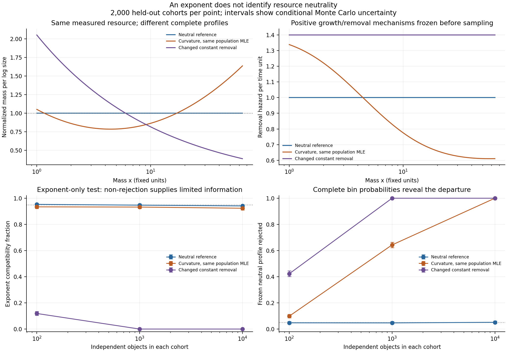

# What an exponent can and cannot identify

1 October 2026. This new simulation keeps the coordinate and physical resource
fixed, but constructs two stationary populations with **exactly the same
population power-law maximum-likelihood exponent** and different resource
profiles. It quantifies how often an exponent-only screen misses the difference.
A specified growth/removal equation supplies an explicit viable mechanism.
The identities used here are standard calculations; no mathematical priority
or new natural law is claimed.

The [configuration](../configs/resource_identification_2026-10-01.json),
[prediction freeze](../data/resource-identification/2026-10-01-final/frozen-plan.json),
and [numerical report](../results/resource-identification/study.json) retain
the parameters, algorithms, software versions, seeds, and data hashes.
This is a local exploratory specification, not an external preregistration.

## Fixed resource and a specified physical mechanism

Let $x$ denote mass in fixed units, $u=\ln x$, and
$0\le u\le L=\ln64$. Every object carries the independently specified stock
resource $q(x)=x$. Its cost exponent relative to mass remains $D=1$ in every
condition. Objects enter at the lower boundary, grow at constant log-size rate
$g=1$, and leave at the upper boundary or are removed at hazard $h(u)$.
The size-structured number density satisfies

$$\partial_t n+g\partial_u n=-h(u)n.$$

At stationarity, $n(u)\propto\exp[-\int_0^u h(v)/g\,dv]$.
The transport/removal structure is a direct specialization of the established
McKendrick–von Foerster framework; see
[Chou and Greenman (2016), section 2.1](https://link.springer.com/article/10.1007/s10955-016-1524-x).
The particular removal interventions and the moment-matched counterexample
below are constructions for this benchmark, rather than an application claimed
by that paper.

This model has an external entry flux, growth, removal, and boundary exit.
Its mass is not a conserved closed-system budget. We simulate independent
stationary cross sections conditional on cohort size, using the known
stationary law; we do not numerically evolve full interacting populations.

The neutral reference has $h/g=1$, so its object density per log size is
$p_0(u)=e^{-u}/Z$, $Z=1-e^{-L}$. The continuous density per unit mass is
proportional to $x^{-2}$, and mass per log size is constant.

## A different profile with exactly the same fitted exponent

Choose a quadratic

$$H(u)=\frac{u^2-au-b}{s},\qquad
\int_0^L e^{-u}H(u)\,du=0,\qquad
\int_0^L ue^{-u}H(u)\,du=0.$$

The coefficients are $a=2.981905081243$, $b=-1.191630161707$, and
$s=6.086544064196$, with $\max|H|=1$. Define

$$p_1(u)=p_0(u)[1+0.8H(u)].$$

It is positive and normalized, and has precisely the same mean log size as
$p_0$. Independent quadrature checks give mean log size
$0.933985982804$ for both populations.

For the bounded continuous power family
$p_\kappa(u)=e^{-\kappa u}/Z_\kappa$, the likelihood score depends only on
mean log size:

$$E_\kappa[u]=\frac1\kappa-\frac{L}{e^{\kappa L}-1}.$$

The population maximum-likelihood solution therefore has $\kappa=1$ and
mass-density exponent $\alpha=1+\kappa=2$ in both populations. This is the
exact continuous likelihood, not a regression on bin midpoints or resource
slopes. The curved population is not a pure power law: matching its fitted
exponent does not establish power-law goodness of fit.

Its stationary removal mechanism is explicitly

$$h_1(u)=g\left[1-\frac{0.8H'(u)}{1+0.8H(u)}\right].$$

Its hazard lies between **0.610067 and 1.338860**, so the construction does not
require negative removal. Tests verify the transport equation and the analytic
hazard extrema independently.

Mass per log size is proportional to $1+0.8H(u)$, and is consequently non-flat.
In the declared twelve equal log bins its normalized maximum log departure is
$0.426234>\ln1.5$, and its maximum/minimum resource ratio is **1.94340**.
The practical factor of 1.5 was fixed before sampling. A secondary intervention
sets the constant removal rate to 1.4, producing an exact power density with
$\alpha=2.4$ while keeping the physical mass cost $q(x)=x$ unchanged. Its
binned mass profile has maximum log departure 0.874422 and ratio 4.59479.

## Frozen decisions and independent validation

For each population and sample size 100, 1,000, or 10,000, we simulate 4,000
null-calibration cohorts and then 2,000 independent held-out cohorts. Both
statistics use the same continuous observations within a held-out cohort:

- The **exponent-only screen** tests absolute deviation of the bounded
  continuous power-law MLE from the frozen neutral exponent 2.
- The **complete-profile screen** tests multinomial deviance from the frozen
  neutral object probabilities across all twelve bins. Those probabilities
  follow from the independently fixed mass cost and neutral mass per log size.
  No exponent or bin probabilities are fitted to the validation outcomes.
- A separate **forward-mechanism check** compares the same observations with
  their own frozen growth/removal prediction.

Each screen uses an upper-tail Monte Carlo rank
$p=(1+\#\{T_{\rm calibration}\ge T_{\rm observed}\})/(4000+1)$ and threshold
0.05. This provides a finite-sample rank test under an exchangeable null,
unconditionally over both calibration and validation draws; ties are
conservative. The screens target different properties and are reported
separately, without a combined familywise error claim. Non-rejection means
compatibility and is not a resource-equivalence decision.

Sampling retains every bin, including zeros. The raw arrays retain each
cohort's exact log-size sum, twelve counts, and twelve exact mass totals;
individual sizes are not retained. These statistics reconstruct the MLE,
count deviance, and observed mass profile without within-bin midpoint
approximations. The curved inverse-CDF sampler has 65,537 knots and maximum
audited midpoint CDF error $7.92\times10^{-10}$; this is a numerical midpoint
audit, not a proof of a global error bound.

## Results

| Population | Objects per cohort | Exponent compatible | Neutral complete profile rejected |
|---|---:|---:|---:|
| Neutral reference | 100 | 95.30% | 4.75% |
| Curved, same population exponent | 100 | 93.40% | 9.85% |
| Removal rate 1.4 | 100 | 11.90% | 42.25% |
| Neutral reference | 1,000 | 94.70% | 4.70% |
| Curved, same population exponent | 1,000 | 93.25% | 64.30% |
| Removal rate 1.4 | 1,000 | 0.00% | 100.00% |
| Neutral reference | 10,000 | 94.10% | 5.15% |
| Curved, same population exponent | 10,000 | **92.35%** | **100.00%** |
| Removal rate 1.4 | 10,000 | 0.00% | 100.00% |

At 10,000 objects, the curved population's mean fitted exponent is 2.000145.
In **92.35% of the very same cohorts**, the exponent remains compatible while
the complete neutral profile is rejected. Increasing the sample size cannot
make a population exponent distinguish these moment-matched populations.
Changing its sampling variance can affect an exponent test's rejection rate;
it does not make that scalar summary identify the full resource profile.

The own-mechanism checks reject between 4.35% and 6.10% across these conditions.
The numerical report supplies conditional Wilson intervals for every rate.
They quantify held-out Monte Carlo error for the frozen calibration
realization, and do not include variation in that calibration or establish
calibration for arbitrary physical observation designs.

All population profiles and likelihood exponents here concern the declared
bounded domain. They do not identify an unlimited asymptotic tail exponent.

## Implications for dimensionality

For the constant-removal intervention, setting a new post hoc cost
$q_*(x)=x^{1.4}$ would make resource per log size flat. It would represent a
newly chosen resource. The originally declared mass remains $q(x)=x$ with
$D=1$. More generally, defining $q_*(x)\propto1/p_u(\ln x)$ will flatten any
strictly positive object profile. This representation is an accounting
identity; independent support for that cost as a physical resource is what
makes a test scientifically informative.

The code also transports the same objects and mass under $y=x^c$:
$\alpha_y=1+(\alpha_x-1)/c$, $D_y=D_x/c$, and resource density per log
coordinate acquires a constant Jacobian $1/c$. Its normalized profile remains
unchanged at corresponding transformed bin edges. Fractional exponents from
that coordinate change do not introduce dependency among resource inputs.
The general input-dependence question needs a separately specified mechanism;
this benchmark addresses the sufficiency of an observed exponent.

The useful scientific result is an identification boundary and a concrete
test design: independently declare the resource and coordinate, predict the
whole profile under specified restrictions, and compare the resulting
observations with both neutrality and forward mechanisms. This benchmark
supports that methodology; it is not evidence that Nature universally chooses
equal allocation.

## Reproduction and retained interruption

~~~bash
PYTHONPATH=src python3.11 -m unittest discover -s tests -p 'test_resource_identification.py' -v
PYTHONPATH=src MPLCONFIGDIR=build/matplotlib python3.11 experiments/run_resource_identification.py
~~~

Existing data and results are verified and reused without overwriting them.
For genuinely new cohorts, supply a new configuration with new seed and run ID,
plus new `--directory` and `--output` paths. The source and NumPy-version
guards preserve the frozen sampling implementation.

The [first numerical run](../data/resource-identification/2026-10-01/) completed
but rendering encountered a Wilson-interval endpoint rounding error, producing
a negative plotting distance of at most $2.22\times10^{-16}$. Its raw data,
numerical results, configuration, and original exact source snapshots are
retained. The final run clips plotting distances at zero; the stored Wilson
intervals, hypotheses, decisions, tolerances, and random seeds are unchanged.
It is a **computational replay**, not another independent replication. Both
run IDs are available to the [central registry](run-registry.md).
