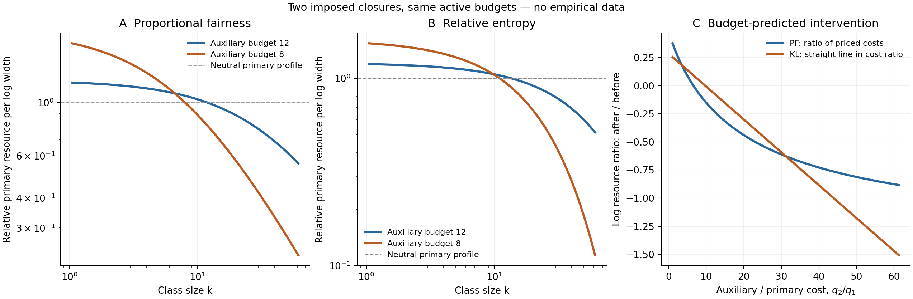
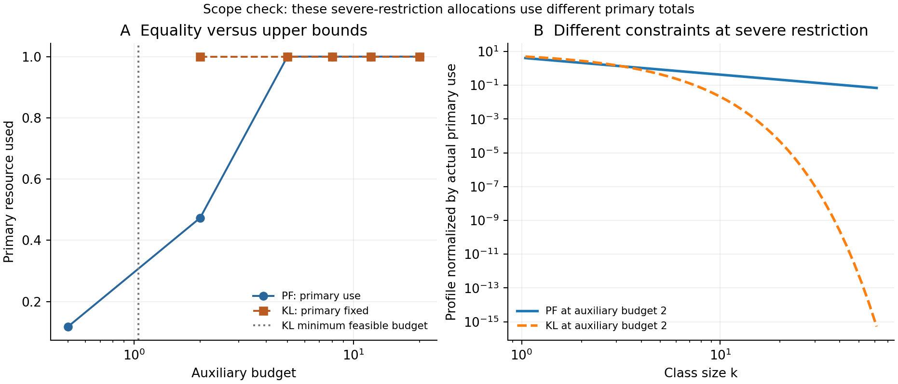

# Two budgets: competing predictions for resource restrictions

This deterministic benchmark, run on 1 October 2026, implements two explicit
allocation models developed in the [scientific assessment](scientific-assessment.md).
Both start from the same finite logarithmic classes and independently declared
costs. Changing an auxiliary budget produces different full-profile responses.
The results establish mathematical predictions of imposed objectives; they do
not establish that Nature chooses either objective.

The [configuration](../configs/restriction_study_2026-10-01.json) fixes 48
logarithmic classes on $k\in[1,64]$, midpoint costs $q_1(k)=k^2$ and
$q_2(k)=k^3$, and class weights $w_j=\Delta\ln k_j$. These midpoint costs define
the finite problem exactly. The experiment is not a continuum quadrature
accuracy study. Counts are continuous allocations or expectations, not rounded
integer organisms. No multiplier is fitted to a target profile.

## Proportional fairness with upper budgets

The first model maximizes $\sum_j w_j\ln N_j$ subject to
$\sum_jq_{1j}N_j\le1$ and $\sum_jq_{2j}N_j\le B_2$. It gives

$$N_j=\frac{w_j}{\lambda_1q_{1j}+\lambda_2q_{2j}},\qquad
\lambda_a\ge0,\qquad
\lambda_a\left(B_a-\sum_jq_{aj}N_j\right)=0.$$

The solver determines the multipliers from these budgets and verifies primal
feasibility and complementary slackness. The module supports additional positive
resource budgets through the convex dual, including redundant constraints.
Redundancy can make multipliers nonunique while leaving the optimal counts unique.
This is established proportional-fairness mathematics; see
[Kelly, Maulloo and Tan (1998)](https://www.statslab.cam.ac.uk/~frank/rate.pdf).

For the two declared costs, primary resource per log width is proportional to
$1/(\lambda_1+\lambda_2k)$. The effective priced cost is
$q_{\mathrm{eff}}=\lambda_1k^2+\lambda_2k^3$; when both multipliers are positive,
its local scaling exponent is

$$d_{\mathrm{eff}}(k)=2+\frac{\lambda_2k}{\lambda_1+\lambda_2k}.$$

Equivalently this is $(2\lambda_1k^2+3\lambda_2k^3)/(\lambda_1k^2+\lambda_2k^3)$.
The allocation identity is exactly $q_{\mathrm{eff},j}N_j=w_j$. For a smooth
continuum closure with logarithmic classes, the local linear-size count-density
exponent is $\alpha(k)=1+d_{\mathrm{eff}}(k)$, moving between 3 and 4. This
continuum interpretation is not a fit of one power to the finite classes.

The prospective crossover scale $\lambda_1/\lambda_2$ moves from approximately
50.30 at $B_2=12$ to 8.00 at $B_2=8$. This describes the cost combination
selected by this optimization model. It does not say that the number of
resource variables is its dimension.

## Relative entropy with fixed primary resource

The second model fixes $\sum_jq_{1j}N_j=R_1=1$. Write
$P_j=q_{1j}N_j/R_1$, $P_{0j}=w_j/\sum_iw_i$, and $r_j=q_{2j}/q_{1j}=k_j$.
Minimizing $D_{\mathrm{KL}}(P\Vert P_0)$ subject to $\sum_jP_j=1$ and
$E_P[r]\le B_2/R_1$ gives, for an interior active auxiliary constraint,

$$P_j=\frac{P_{0j}e^{-\lambda r_j}}{Z(\lambda)},\qquad
N_j=\frac{R_1P_j}{q_{1j}}.$$

The multiplier solves the measured budget-ratio equation
$E_{P_\lambda}[r]=B_2/R_1$. A feasible nonbinding budget gives $\lambda=0$.
At the minimum feasible budget, the solution lies on the minimum-ratio
classes and has no finite multiplier. Below that budget no fixed-primary
allocation exists. The solver handles these cases separately.

The reference measure and choice of objective are substantive assumptions.
[Banavar and Maritan (2007)](https://arxiv.org/abs/cond-mat/0703622) explain why
relative entropy needs a suitable reference and why changing the level of
description matters. This benchmark compares two closures; it does not derive
one uniquely from conservation or ignorance.

## Results and their scope

The finite-class neutral auxiliary total is 15.14356066. The primary budget
remains binding in proportional fairness down to $B_2=4.22621875$. The minimum
feasible auxiliary budget for the fixed-primary entropy model is 1.04427378.

| Auxiliary budget | PF primary use | PF auxiliary use | Entropy tilt | Comparison |
|---:|---:|---:|---:|---|
| 20 | 1.000000 | 15.143561 | 0 | Both neutral; auxiliary bound unused |
| 12 | 1.000000 | 12.000000 | 0.01393217 | Same active totals, different objectives |
| 8 | 1.000000 | 8.000000 | 0.04318006 | Same active totals, different objectives |
| 5 | 1.000000 | 5.000000 | 0.09850330 | Same active totals, stronger shape difference |
| 2 | 0.473236 | 2.000000 | 0.61053928 | PF leaves primary unused; entropy fixes it at 1 |
| 0.5 | 0.118309 | 0.500000 | Infeasible | Entropy cannot allocate its fixed primary total |

The primary resource profiles below are normalized by actual primary use and
log width. The common-total comparison is restricted to budgets for which PF
uses the full primary total. Under severe restrictions, comparing normalized
shapes does not make the underlying constraints identical.





## A discriminating intervention

The declared intervention changes only $B_2$ from 12 to 8. Both models have
the same active primary and auxiliary totals before and after this change.
For the entropy closure,

$$\ln\frac{P_{\mathrm{after},j}}{P_{\mathrm{before},j}}
=\ln\frac{Z_{\mathrm{before}}}{Z_{\mathrm{after}}}
-(\lambda_{\mathrm{after}}-\lambda_{\mathrm{before}})r_j.$$

Here the slope coefficient is $-0.02924790$, determined entirely by the
budgets. The intercept is determined by normalization. The prediction is a
straight line in independently measured cost ratio, not generally in log size.
Proportional fairness instead predicts

$$\ln\frac{N_{\mathrm{after},j}}{N_{\mathrm{before},j}}
=\ln\frac{\lambda_{1,\mathrm{before}}q_{1j}
 +\lambda_{2,\mathrm{before}}q_{2j}}
 {\lambda_{1,\mathrm{after}}q_{1j}
 +\lambda_{2,\mathrm{after}}q_{2j}}.$$

The predicted responses differ by a root mean square log-ratio of 0.170651
across the 48 declared classes. This is a deterministic descriptive
discrepancy, not a statistical significance or power calculation. Agreement
between each solution and its own prescribed response is numerical to
$1.2\times10^{-15}$ or better. That agreement validates implementation of the
imposed models, not either model's applicability to real observations.

An empirical test would measure costs, budgets, and full profiles independently;
change the auxiliary budget; propagate measurement and observation uncertainty;
and compare frozen predictions. Eligibility, permitted calibration, and the
possibility that both models fail must be specified before the intervention.
Stock, time-integrated allocation, and flux require different measurement designs.

## Reproduction and validation

```bash
PYTHONPATH=src python3.11 -m unittest discover -s tests -p test_restrictions.py -v
PYTHONPATH=src MPLCONFIGDIR=build/matplotlib python3.11 experiments/run_restrictions.py
```

Eight targeted tests passed: analytic one-budget allocation, two active budgets
and independently generated feasible competitors, primary slack, redundant
additional budgets, neutral/boundary/infeasible entropy cases, response
predictions, primary-total scaling, and invalid inputs. The maximum PF
feasibility/complementarity residual in the six benchmark cases was
$5.6\times10^{-16}$. Figures were rendered and visually inspected.

Outputs are [the full numerical record](../results/restrictions/study.json),
[class-level profiles](../results/restrictions/profiles.csv), and PNG/SVG figures
in [results/restrictions](../results/restrictions). The JSON preserves class
definitions, costs, multipliers, budgets used, feasibility labels, and response
diagnostics. No empirical dataset or random sampling model enters this benchmark.
