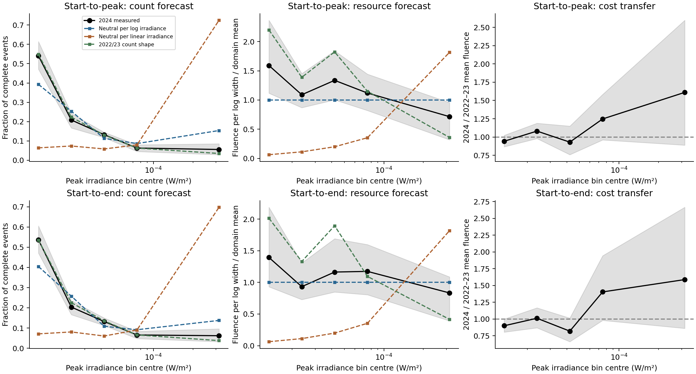

# Solar fluence costs and held-out full profiles

The measured solar-flare catalogue supplies a useful test that does not require
a power-law cost model. Training mean fluence on 2022–2023 and predicting 2024
shows that logarithmic resource neutrality predicts counts much better than
linear-irradiance neutrality. The historical count profile predicts counts
better at the point estimate, while its advantage over logarithmic neutrality
is uncertain under month-block resampling. These results neither establish
neutrality nor identify a geometric dimension.

This is a **retrospective temporal holdout by fitting**. The original analyses
already inspected 2022, 2023 and 2024. The new configuration, training costs,
bin-pooling rule, complete forecasts and source/input hashes were saved before
the new driver loaded 2024 outcomes, but that ordering does not make previously
seen observations blinded or newly collected. No remote dataset was downloaded
or changed for this run.

## Independently specified measurements and domain

Inputs are the retained NOAA GOES XRS annual flare-report snapshots for
[2022](../data/raw/noaa_2022.csv), [2023](../data/raw/noaa_2023.csv) and
[2024](../data/raw/noaa_2024.csv). Their existing checksum catalogue is checked
before execution. NOAA's [source directory](https://data.ngdc.noaa.gov/platforms/solar-space-observing-satellites/goes/multi/l2/data/xrsf-l2-flrpt_science/csv/)
and the retained [metadata](../data/raw/noaa_metadata.json) identify the
measurements and units; the live directory can change, so the analysis uses
the retained bytes and metadata.

The coordinate is finite, positive, unsaturated peak irradiance in W/m².
The closed domain remains $[10^{-5},10^{-3}]$ W/m², the physically interpretable
M/X-scale band used in the earlier protocol. There is no completeness or
exposure correction, and calling it a physical band does not establish
catalogue completeness.

The primary resource is supplied start-to-peak integrated irradiance in J/m².
The sensitivity uses supplied start-to-end integrated irradiance. No additional
background subtraction is applied. These are fluences in the XRS band received
at the instrument over catalogue event windows, rather than total flare energy.
The end window stops according to the catalogue's irradiance-decline criterion;
it is not an integration over an entire physical eruption. Each resource sample
requires finite positive fluence and a strictly positive corresponding window
duration. The two samples consequently have separate counts and forecasts.

## Calibration-only support and frozen prediction

Eight quarter-decade fine bins were specified before fitting. Training support
was insufficient in the upper tail:

| Fine bin, low to high | 1 | 2 | 3 | 4 | 5 | 6 | 7 | 8 |
|---|---:|---:|---:|---:|---:|---:|---:|---:|
| Start-to-peak complete events | 314 | 128 | 75 | 36 | 14 | 5 | 1 | 0 |
| Start-to-end complete events | 285 | 120 | 72 | 35 | 14 | 5 | 1 | 0 |

A declared rule merges neighboring bins downward from the upper boundary
until each pooled class contains at least 20 complete training events for
both resources. An undersupported remainder at the bottom would merge into
its neighbor. It preserves the outer domain, never uses validation counts,
and never imputes a cost for an empty fine bin. The resulting five intervals
have boundaries $10^{-5},10^{-4.75},10^{-4.5},10^{-4.25},10^{-4},10^{-3}$.
The last class spans a decade; the other four each span a quarter decade.
This broad tail class is a limitation: its mean cost can change when its
within-class composition changes.

For each pooled class $j$, the cost estimate $\bar q_j$ is the arithmetic mean
measured training fluence. The three frozen count-share predictions are

$$p_j^{\log}\propto\frac{\Delta\log k_j}{\bar q_j},\qquad
p_j^{\mathrm{linear}}\propto\frac{\Delta k_j}{\bar q_j},\qquad
p_j^{\mathrm{history}}=\frac{N_j^{\mathrm{train}}}{\sum_lN_l^{\mathrm{train}}}.$$

Each is normalized to sum to one. The neutral forecasts use measured costs
without fitting abundance. The historical comparator learns the training
count shape. Expected resource shares are $p_j\bar q_j/\sum_lp_l\bar q_l$.
Unequal pooled widths are retained: logarithmic neutrality predicts one half
of domain resource in the last class and one eighth in each other class,
rather than equal resources in all five classes.

These predictions concern shape conditional on the eligible evaluation
event count. They do not predict the absolute flare rate or total fluence.
They do not assume a fitted power-law cost, infer a density exponent from a
straight line, or change the domain to obtain a preferred result.

## Results

Primary training contains 573 events and validation contains 936. Every
in-domain unsaturated peak event has valid rise fluence and duration under
the stated rules. The full count-profile and resource-share results are:

| Resource and forecast | Count cross entropy, nats/event ↓ | Count total variation ↓ | Resource-share total variation ↓ |
|---|---:|---:|---:|
| Start-to-peak, logarithmic neutrality | 1.338 | 0.167 | 0.142 |
| Start-to-peak, linear neutrality | 2.583 | 0.685 | 0.552 |
| Start-to-peak, historical count shape | 1.268 | 0.022 | 0.178 |
| Start-to-end, logarithmic neutrality | 1.335 | 0.156 | 0.092 |
| Start-to-end, linear neutrality | 2.484 | 0.661 | 0.492 |
| Start-to-end, historical count shape | 1.284 | 0.025 | 0.219 |

Total variation is half the sum of absolute share differences. A count TV
of 0.167 means reallocating 16.7% of probability mass would match the observed
count distribution. Resource-share TV compares the measured fluence fractions
with the predicted fractions, with all classes retained.

For the primary resource, the linear-minus-logarithmic count cross-entropy
difference is **1.245**, with nominal 95% month-block interval **[0.997, 1.539]**.
The historical-minus-logarithmic difference is **−0.070**, with interval
**[−0.163, 0.009]**. Thus the point estimate favors historical counts, but
the interval includes a reversal of that smaller comparison. The corresponding
end-fluence differences are 1.150 [0.900, 1.459] and −0.051 [−0.139, 0.024].

The primary logarithmic forecast's count TV interval is [0.095, 0.251], and
its resource-share TV interval is [0.038, 0.341]. These are uncertainty summaries
around empirical discrepancies. A nonzero bootstrap TV interval is not a
calibrated rejection test of exact neutrality: even an exactly neutral
population generally produces positive empirical TV through sampling error.
Resampling that empirical distribution does not remove this norm bias or
generate a neutral null distribution. No null simulation or equivalence margin
was specified here.

Temporal cost transfer is assessed separately. The primary evaluation/training
mean-cost ratios in the five classes are **0.942, 1.081, 0.930, 1.247, 1.610**.
For the broad tail class the nominal interval is [0.889, 2.597]. Changes in
mean cost, resource allocation, and within-class composition can all affect
count predictions. The actual resource-share profile does not require the
cost-transfer assumption to be computed.

The end-fluence sample contains 532 training and 825 evaluation events. Missing
or invalid end-resource fractions rise from **7.16%** to **11.86%**. Missingness
varies across peak classes; no missing-at-random claim or correction is made.
Using complete rise fluence improves observability for that resource but does
not repair the different end-fluence measurement.

The resource panels divide each share by its logarithmic-width share, so
neutrality is a horizontal value of one even after pooling. Shading represents
nominal pointwise month-block intervals. The count and resource scores can
rank models differently because the tail has greater mean resource cost.

## Uncertainty and scientific implication

The 2,000 seeded bootstrap draws resample all 12 calendar months with replacement
within each year. The two training years are sampled separately; validation
months are sampled independently of training. The same sampled months are used
across forecasts and resource definitions, preserving paired comparisons.
All 2,000 draws have supported training costs for both resources. Zero observed
validation bins would remain zero; an unsupported training bin would invalidate
that resource's draw rather than trigger smoothing or omission.

The intervals do not cover catalogue completeness, instrument calibration,
overlapping events, all temporal dependence or an entire solar cycle. They
are nominal percentile intervals, not simultaneous profile tests. The broad
tail class limits fine-scale discrimination and the coordinate/fluence pair
shares instrument measurements and event definitions.

This study adds full-profile prediction, an explicit comparison of reference
measures, a nonparametric measured-cost model, and a separate transfer diagnostic
to the earlier exponent-gap analysis. It provides evidence that the reference
measure matters empirically. Logarithmic neutrality has a substantially better
forecast here than the declared linear alternative, while historical counts
provide a strong competing account. The result is a comparison on one retained
solar catalogue, not an independently replicated natural law. It supplies no
measurement of spatial, geometric or fractal dimension.

## Retained records and reproduction

The [configuration](../configs/solar_resource_transfer_2026-10-01.json),
[source module](../src/orthopolity/solar_resource_transfer.py),
[driver](../experiments/run_solar_resource_transfer.py), and
[frozen plan](../data/solar-resource-transfer/2026-10-01/frozen-plan.json)
retain the support rule, training summaries, predictions, source/configuration
hashes, metadata definitions and input snapshot digests. Row-index/flare-ID
membership manifests preserve all selected and excluded source rows for
[training](../data/solar-resource-transfer/2026-10-01/training-membership.csv)
and [validation](../data/solar-resource-transfer/2026-10-01/validation-membership.csv).
The [result record](../results/solar-resource-transfer/study.json), per-resource
profile tables, all bootstrap scores, PNG and SVG are retained under
`results/solar-resource-transfer/`. The result record also hashes generated
artifacts. Historical inputs and analyses remain untouched.

~~~bash
PYTHONPATH=src MPLCONFIGDIR=build/matplotlib python3.11 \
  experiments/run_solar_resource_transfer.py --stage freeze
PYTHONPATH=src MPLCONFIGDIR=build/matplotlib python3.11 \
  experiments/run_solar_resource_transfer.py --stage analyse
PYTHONPATH=src MPLCONFIGDIR=build/matplotlib python3.11 \
  -m unittest discover -s tests -p test_solar_resource_transfer.py
~~~

An existing matching run is verified and preserved. Changed frozen inputs
fail rather than replacing prior results. Reanalysis with changed assumptions
requires a separate run/configuration/data/output directory and identifier.
The implementation uses standard-library CSV, NumPy and Matplotlib; no new
environment dependency was installed. Twelve targeted tests cover reference
measures, calibration-only support, unit invariance, exclusions, zero bins,
paired month resampling and input-integrity checks.
