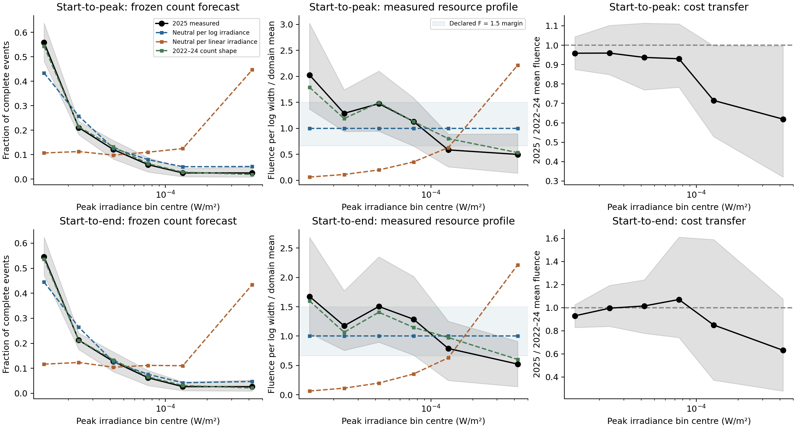

# Frozen forecasts for NOAA solar flares in 2025

The frozen 2025 test finds that logarithmic resource neutrality predicts counts
much better than the declared linear alternative. Historical counts predict
the validation counts and resources better at the point estimates; their small
count log-score advantage remains uncertain. The measured primary resource
profile ranges from about half to twice its logarithmic-width mean.

Resource-cost forecasts and the full-profile assessment were fixed before this
analysis acquired or inspected NOAA's 2025 event bytes. Development uses the
already inspected 2022–2024 snapshots. The 2025 catalogue describes already
measured public observations: a local forecast freeze does not make this
prospective observation, external preregistration, or independently verified
global blinding.

The complete conditional count and measured resource profiles are the targets.
The sampling assumptions required for a formal neutrality verdict are not
established in this observational design. That application gate is fixed before
acquisition, so the formal verdict remains **unresolved** regardless of the
conditional candidate band or point estimate. Frozen forecasts can still be
scored and their transfer limitations measured.

## Fixed measurements, domain and costs

The coordinate is unsaturated finite positive peak XRS irradiance in W/m² in
the original closed interval $[10^{-5},10^{-3}]$. The primary resource is supplied
start-to-peak integrated XRS-B irradiance in J/m². Supplied start-to-end
fluence is a separate sensitivity. Neither is total radiated flare energy.
No extra background subtraction, detection-completeness correction, exposure
correction, declustering or overlap correction is applied.

Resource-specific complete cases require finite positive fluence and a positive
corresponding event-window duration. All source rows and exclusions are retained
in membership manifests. End-fluence missingness is reported independently.
If primary fluence is missing among eligible peak events, the complete-case
resource profile cannot establish a catalogue-wide statement.

Eight fine quarter-decade bins are initially specified. Starting from the upper
edge, neighboring bins are merged downward until each pooled class has at least
20 complete development events for both resources. Any undersupported lowest
remainder merges into its neighbor. Pooling depends only on 2022–2024 support,
keeps the outer domain, and preserves actual logarithmic and linear widths.
No pooling, cutoff change, smoothing or exclusion is chosen from 2025 outcomes.

The development support yields six classes. The first five span quarter decades;
the last spans three quarter decades. Development rise/end counts in the eight
fine classes are [820, 323, 199, 95, 43, 17, 7, 5] and
[728, 288, 181, 89, 42, 17, 7, 5]. The last three fine classes are pooled.

For arithmetic mean development cost $\bar q_j$, the frozen forecasts are

$$p_j^{\log}\propto\Delta\log k_j/\bar q_j,\qquad
p_j^{\mathrm{linear}}\propto\Delta k_j/\bar q_j,\qquad
p_j^{\mathrm{history}}=N_j^{\mathrm{dev}}/\sum_l N_l^{\mathrm{dev}}.$$

Each count-share vector sums to one. The neutral forecasts learn measured costs
without fitting abundance. Historical counts are an explicit competing model.
Predicted resource shares are $p_j\bar q_j/\sum_l p_l\bar q_l$. The forecast
conditions on the eligible 2025 event total; it predicts neither the annual
event rate nor total fluence. No power-law resource-cost curve is assumed.

## Fixed margin and application gate

The profile is

$$\phi_j=\frac{\sum_{i\in j}q_i/\sum_iq_i}
{\Delta\log k_j/\sum_l\Delta\log k_l},\qquad
\Delta=\max_j|\log\phi_j|.$$

The exploratory operational margin is **$F=1.5$**, fixed before acquisition.
Approximate neutrality requires every class to have $2/3\le\phi_j\le1.5$, or
$\Delta\le\log1.5$. This allows a sustained 50% excess or 33% deficit as the
boundary of the declared coarse approximation. It is a transparent practical
choice, not a margin derived from instrument accuracy, an established natural
law, or the unseen evaluation outcomes. Any future scientific application
should justify its own margin independently.

The candidate method is a centered-bootstrap simultaneous band for the complete
log profile, with 499 bootstrap resamples to match its simulation calibration.
The candidate benchmark is completed and retained before the solar freeze.
Twelve validation calendar months provide resource-total vectors across all
six classes. Potentially seasonal, serially dependent months and heavy-tailed
fluence do not automatically satisfy the method's assumptions. Development
diagnostics report month support, the largest monthly contribution per class
and year-to-year variation; they do not prove exchangeability.

The application gate independently records that independent exchangeable
validation months and a defensible physical bound on monthly resource totals
are unavailable. An observed maximum is not a physical upper bound. Simulation
success cannot establish sampling assumptions for the solar catalogue.
Therefore conditional candidate labels are reported with the formal verdict
unresolved, rather than being promoted into a calibrated observational test.
Empty evaluation resource classes remain empty and prevent a finite log-profile
band. No class is dropped to obtain a verdict.

## Forecast scores and uncertainty

Count cross entropy and total variation compare complete predicted and observed
count-share vectors. Resource-share TV compares observed fluence fractions with
the frozen resource forecast. A positive TV interval is not a neutrality-null
test; empirical distances are positive from sampling variation even under
equality, and ordinary resampling does not generate the neutral null.

Four thousand score bootstrap draws independently resample 12 complete
calendar-month vectors within each development year and within the evaluation
year. The same draws are shared across forecasts and resource definitions.
The paired historical-minus-log-neutral count cross-entropy difference assesses
forecast ranking. Unsupported development cost draws are recorded as invalid,
rather than smoothed or dropping their classes. Intervals are explicitly
conditional nominal summaries, separate from the application-gated neutrality
verdict. Measured mean-cost transfer by class is a separate endpoint.

## Freeze, acquisition and reproducibility

The [configuration](../configs/solar_validation_2026-10-02.json),
[module](../src/orthopolity/solar_validation.py) and
[driver](../experiments/run_solar_validation.py) implement distinct `freeze`,
`acquire` and `analyse` stages. The freeze saves all forecasts, development
summaries, fixed widths/margin, candidate benchmark references, the solar
application gate, exact source/configuration digests and byte copies. It fails
if validation bytes already exist in the new run directory. Acquisition is
an explicit later step and refuses changed frozen sources or inputs.

The source is NOAA's
[annual 2025 v1-0-1 report](https://data.ngdc.noaa.gov/platforms/solar-space-observing-satellites/goes/multi/l2/data/xrsf-l2-flrpt_science/csv/sci_xrsf-l2-flrpt_geo_y2025_v1-0-1.csv).
Only its directory listing was seen before the freeze. Downloaded event bytes,
SHA-256, access UTC, response headers, redirect information and failed attempts
are retained under `data/solar-validation/2026-10-02/`. This new snapshot never
replaces historical inputs or their checksum catalogue.

Replaying `analyse` uses the retained 2025 file entirely offline and verifies
saved artifacts. Replaying `acquire` after a matching receipt performs no
download. Different sources, configurations or outcomes require another run.
The tests cover pre-acquisition freeze enforcement, source-byte guards,
archived sources, failure logs, acquisition replay, missingness, zero-bin JSON
and nonpromotion of an ineligible conditional verdict.

The completed benchmark is retained in
[study.json](../results/profile-calibration/study.json). The
[solar freeze](../data/solar-validation/2026-10-02/frozen-plan.json), saved at
2026-10-02 08:55:48 UTC, has SHA-256
`9c9a5954214a03a877cf97d3f0f8f4b87d21301affc44ce4271dc4c271ac6795`.
Development contains 1,509 primary and 1,357 end-fluence complete cases.
The freeze and implementation can be verified without acquiring validation data:

~~~bash
PYTHONPATH=src MPLCONFIGDIR=build/matplotlib python3.11 \
  experiments/run_solar_validation.py --stage freeze \
  --benchmark-gate results/profile-calibration/study.json \
  --benchmark-study results/profile-calibration/study.json
PYTHONPATH=src MPLCONFIGDIR=build/matplotlib python3.11 \
  -m unittest discover -s tests -p test_solar_validation.py
~~~

The pre-acquisition protocol, method benchmark, source copies, development
inputs and tests were also retained in Git checkpoint
[`390856c`](https://github.com/ttm/orthopolity/commit/390856c49597f4e8f04f3b0667bc675bae765358)
before the approved download. This strengthens the local ordering record but
does not independently establish that anyone was globally blinded.

## Acquisition and measured validation population

The successful HTTPS acquisition completed at **2026-10-02 08:58:49 UTC**,
after the 08:55:48 UTC forecast freeze and the checkpoint commit. The response
reported HTTP 200 and last modification 25 June 2026, 16:43:53 GMT. The
[retained 2025 file](../data/solar-validation/2026-10-02/noaa_2025.csv) contains
626,081 bytes and has SHA-256
`287c9ee0961e221368f3580c6e159e8dc17ef7607d02442dabf3ab48fa8c6c88`.
The [receipt](../data/solar-validation/2026-10-02/acquisition.json) records
response headers, verified TLS trust metadata, access UTC and the matching
forecast-plan hash. An initial sandbox DNS failure and the subsequently
successful authorized request are both preserved in the
[attempt log](../data/solar-validation/2026-10-02/retrieval-attempts.jsonl).
No certificate or hostname check was disabled.

The raw catalogue contains **3,277 rows**, with peak times from 1 January to
31 December 2025 and events in every calendar month. There are **356** eligible
in-domain peak events, all with valid primary rise fluence. End fluence has
**339** complete cases: 17 missing or invalid cases, or **4.78%**, compared with
10.07% in development. Calendar coverage does not establish catalogue
completeness. The primary complete-case counts in the six pooled classes are
[199, 75, 43, 21, 9, 9]; the end counts are [185, 72, 43, 21, 9, 9].
Every source row's membership and exclusion status is retained in the
[validation manifest](../data/solar-validation/2026-10-02/validation-membership.csv).

## Frozen forecast results

All scores below are complete-profile point estimates; lower is better.

| Resource and forecast | Count cross entropy, nats/event | Count TV | Resource-share TV |
|---|---:|---:|---:|
| Start-to-peak, logarithmic neutrality | 1.302 | 0.125 | 0.240 |
| Start-to-peak, linear neutrality | 2.193 | 0.573 | 0.649 |
| Start-to-peak, historical count shape | 1.263 | 0.022 | 0.043 |
| Start-to-end, logarithmic neutrality | 1.313 | 0.102 | 0.205 |
| Start-to-end, linear neutrality | 2.122 | 0.541 | 0.635 |
| Start-to-end, historical count shape | 1.288 | 0.015 | 0.053 |

For the primary resource, linear-minus-logarithmic count cross entropy is
**0.891 nats/event**, with nominal paired month-bootstrap interval
**[0.726, 1.126]**. The historical forecast's log-score advantage over the
logarithmic neutral forecast is **0.0383 nats/event**, with interval
**[−0.0166, 0.0944]**. Its total conditional log-score advantage is 13.626 nats
over 356 events. That total is a sum of event-category scoring terms, not a
calibrated independent-event likelihood-ratio test or a Bayes factor.

The corresponding end-fluence comparisons are 0.809 [0.638, 1.067] for
linear-minus-logarithmic cross entropy and a historical log-score advantage
of 0.0249 [−0.0166, 0.0725] nats/event. Thus logarithmic neutrality beats the
linear alternative in the conditional forecast comparison. Historical counts
are the stronger point forecast, while both signed historical comparisons
include zero under the declared nominal uncertainty procedure. All 4,000
score-bootstrap draws are valid for both resources.

## Full resource profile and cost transfer

The primary measured relative resource-density profile is
**[2.027, 1.288, 1.474, 1.131, 0.585, 0.498]**. Its point departure is
$\Delta=0.707$, greater than the frozen margin $\log1.5=0.405$. This is a
measured point discrepancy, not a population rejection. The conditional
centered-bootstrap simultaneous departure interval is **[0, 1.915]**, which
does not establish either equivalence or departure at the stated margin.
The end-fluence point profile is
[1.677, 1.175, 1.504, 1.287, 0.789, 0.523], with departure 0.649 and
conditional simultaneous departure interval **[0, 1.933]**.

**Both conditional candidate decisions and both formal verdicts are
unresolved.** The formal verdict was restricted by the application gate
before acquisition; no favorable result could have overridden that gate.
The factor, bins, resource definitions and domain remain exactly those of
the freeze.

The primary 2025/development mean-cost ratios by class are
**[0.959, 0.959, 0.937, 0.930, 0.715, 0.619]**. The largest pooled class has a
nominal ratio interval [0.320, 0.996]. End-fluence ratios are
[0.929, 0.995, 1.014, 1.070, 0.850, 0.630], with a largest-class interval
[0.278, 1.075]. Changing within-class composition or duration can affect these
costs. This is a separate temporal-transfer diagnostic: a count-forecast
discrepancy does not isolate resource-allocation failure from cost-transfer
failure. Computing the observed resource profile itself does not require
the cost-transfer assumption.

The [posthoc independent audit](../results/solar-validation/independent-audit.json)
also found a change in instrument composition. Development's 1,509 eligible
peaks included 1,478 GOES-16, 24 GOES-18, three GOES-17 and four GOES-19 records.
The 356 validation peaks included 118 GOES-16, 233 GOES-18 and five GOES-19
records. These temporal cost changes cannot isolate physical flare behavior
from instrument or catalogue composition. The audit independently recomputes
selection, pooling, costs and all three frozen forecasts; it introduces no new
primary hypothesis or forecast fitting. It also distinguishes raw resource-share
ratios from width-corrected density ratios in the unequal pooled classes.

The resource panels divide resource shares by logarithmic-width shares;
neutrality therefore equals one even for unequal pooled classes. Blue shading
marks the frozen factor-1.5 margin. Gray shading shows conditional **pointwise
percentile** intervals from the 4,000 score-bootstrap draws, not the distinct
499-draw simultaneous candidate band. The latter is retained in the
[rise candidate record](../results/solar-validation/rise-candidate-profile.json)
and [end candidate record](../results/solar-validation/end-candidate-profile.json).

## What this adds and how to audit it

This is an additional year of measured observations evaluated against forecasts
fixed before this analysis acquired their bytes. It reproduces the advantage
of the logarithmic reference over the declared linear alternative without
selecting a resource exponent from validation counts. It also preserves a
strong historical-abundance alternative and separates transfer of measured
costs from the allocation profile. It does not establish a natural law,
geometric dimension or a cosmological principle.

The [result record](../results/solar-validation/study.json) hashes the validation
membership, all tables, bootstrap score draws, conditional candidate records,
monthly resource vectors and figures. Historical inputs and earlier studies
are unchanged. The six-panel PNG was inspected visually. The 13 targeted
tests passed before acquisition; existing acquisition and analysis were
replayed offline with matching hashes and preserved results.
The independent [audit algorithm](../experiments/audit_solar_validation.py)
retains 28 input hashes and also cross-checks the runtime study's CPU accounting.

~~~bash
PYTHONPATH=src MPLCONFIGDIR=build/matplotlib python3.11 \
  experiments/run_solar_validation.py --stage analyse
~~~

For a new acquisition on a previously frozen run, use the explicit `--stage
acquire`. The ordinary analysis command above never fetches data. Retain the
same source snapshots and configuration when reproducing this run; changing
scientific assumptions requires a separate identifier and output directory.
