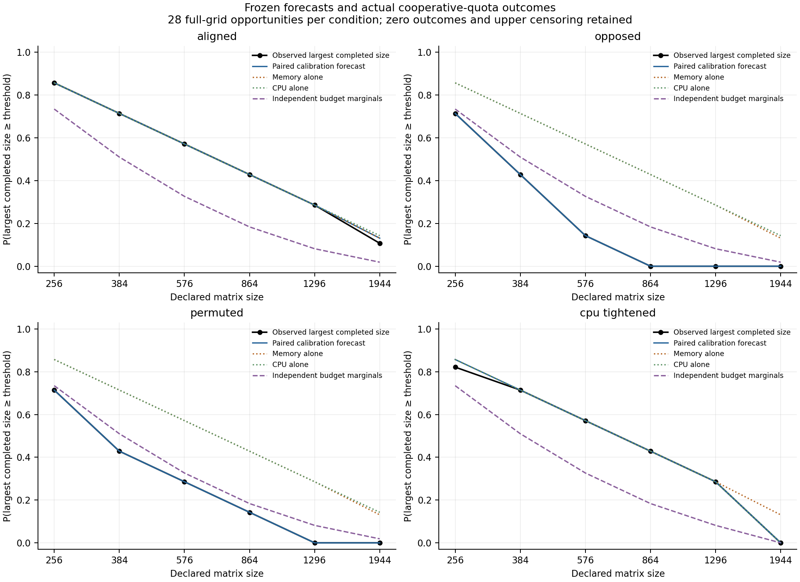

# Measured workload outcomes under assigned resource quotas

1 October 2026. A local hardware pilot of the
[empirical protocol](empirical-protocol.md) completed 72 calibration tasks and
672 later validation tasks. Separately measured costs predicted the finite
completion profiles and quota-intervention responses within the four tolerances
frozen before validation. This is an exploratory controlled experiment, without
external preregistration or a claim of a new natural law.

## Question and scope

Can separately measured memory and CPU requirements predict whether a fixed
numerical workload will be accepted under an assigned pair of quotas, including
a change in quota pairing or a reduction of one quota?

Each task executes in a fresh child process. The workload uses float64 matrices,
repeated matrix multiplication, a fixed warm-up policy, and requested BLAS thread
settings. The recorded outcome comes from execution, numerical-result verification, and
cooperative quota checks after allocations and multiplication phases. It is not
entered as the minimum of fitted capacities.

The quotas are acceptance criteria implemented by the worker. They are not
operating-system hard limits: a phase may use resources beyond its quota before
the next check rejects it. A rejected task can therefore have consumed CPU or
memory. This experiment tests transfer of measured cost models to later execution
and stochastic completion under the declared criteria. It does not discover
spontaneous allocation, a power-law exponent, resource neutrality, or a new law
of Nature. Availability and task opportunities are assigned experimentally.

## Resource definitions and platform conventions

The memory quantity is total process lifetime peak resident-set size. It includes
interpreter imports and warm-up as well as matrices and temporary allocations.
The CPU quantity is elapsed process CPU time from a post-warm-up reference point.
Calibration and validation use those same quantities and units.

[Python's resource documentation](https://docs.python.org/3.11/library/resource.html)
defines `getrusage(RUSAGE_SELF)` for the current process, including its threads,
and `ru_maxrss` as its maximum resident-set size. The worker records its own usage;
aggregated parent/child accounting is a different observable. A lifetime maximum
cannot be reset by subtracting an earlier maximum, so this pilot does not call
that difference workload-only memory.

On Darwin, `ru_maxrss` is in bytes, as stated in
[Apple's Darwin source manual](https://github.com/apple-oss-distributions/xnu/blob/main/bsd/man/man2/getrusage.2).
On Linux it is in KiB and must be multiplied by 1024 for bytes, according to the
[Linux getrusage manual](https://man7.org/linux/man-pages/man2/getrusage.2.html).
Other operating systems require their own measurement validation.

[Python's time documentation](https://docs.python.org/3.11/library/time.html#time.process_time)
defines `process_time()` as current-process user plus system CPU time, excluding
sleep, and distinguishes it from elapsed `perf_counter()` time. The worker
implements its CPU charge using the corresponding differences in `ru_utime`
plus `ru_stime` from the post-warm-up reference, and records `perf_counter()`
wall time separately. Wall time is not substituted for CPU quota.

Peak RSS is an operational per-task memory charge. Summing peaks from serial
processes does not measure a conserved simultaneous memory stock. Memory reuse
and failed-task consumption must not be interpreted as neutral resource
allocation across an autonomous population.

A full-grid opportunity also consumes CPU in its smaller and rejected attempts.
Its total CPU charge is not the calibrated single-task cost of the largest
accepted size. The largest-size spectrum is a completion observable; it does not
partition all resources consumed by the measurement procedure.

## Calibration, freeze, and validation

The [configuration](../configs/workload_pilot_2026-10-01.json) declares matrix
sizes 256, 384, 576, 864, 1296, and 1944; three multiplication phases; warm-up size
64; twelve complete calibration blocks; and four validation repetitions in each
budget stratum. Seven quota levels are formed below, between, and above the
monotone median calibration costs. Aligned, reversed, and cyclically permuted
quota pairings preserve each quota marginal; the separate CPU intervention
multiplies aligned CPU quotas by 0.65. These are balanced finite quota designs,
not sampled natural resource-availability laws.

A development instrumentation check at size 128 found total RSS equal to its
import/warm-up baseline. The grid was expanded before calibration and before
validation so that memory requirements could vary visibly. The final maximum
remains within the worker's declared matrix-size cap of 2048. This development
choice precedes the saved cost model and forecasts.

This gives 72 calibration tasks and 672 validation tasks: 28 matched validation
blocks, with four conditions and all six sizes in each block. The six-size domain
spans less than one decade; this pilot does not estimate an asymptotic exponent.
The local NumPy build uses Apple Accelerate. Six thread environment settings,
including `VECLIB_MAXIMUM_THREADS=1`, are frozen requests. Runtime threadpool
inspection is unavailable, so single-thread execution is not verified. Process
CPU accounting still includes all worker threads.

All three phases repeat the same deterministic product at a given size. Each
product is checked by comparing its action on a separately seeded probe with
the two successive input-matrix/vector products, at relative tolerance $10^{-10}$.
That is a numerical consistency check of actual results, not exhaustive
element-by-element verification. Its CPU and memory costs are included in the
declared workload interval and checkpoints.

Calibration records paired memory/CPU costs over every size within each block.
The main forecast replays whole measured profiles under the assigned quota pairs.
Comparators use monotone median costs, memory alone, CPU alone, independently
combined resource-cost profiles, or independently combined quota marginals. The
last two break different dependencies: cost fluctuations versus assigned budgets.
The saved forecasts concern the complete finite completion/size profile.

Before validation, the [frozen plan](../data/workload-pilot/2026-10-01/frozen-plan.json)
saved those predictions, paired quotas, analysis criteria, and input/source
hashes. Every validation record references that exact plan and occurs after its
freeze. Tasks and conditions were randomized within each matched block.

The primary outcome is the largest accepted size across the complete declared
grid, zero when no size is accepted, and upper-censored when the grid maximum
succeeds. Replaying a calibration block uses that same maximum over accepted
sizes. A prediction based only on completion at one threshold additionally assumes
monotonic completion; exceptions are retained and audited. Different sizes within
one opportunity are related observations, not independent population units.

The declared design calculation draws whole calibration profiles in 2,000
simulations of the balanced quota strata. Before validation, it freezes each
condition's 95th percentile of maximum absolute survival-profile error, with a
minimum tolerance of one observation quantum, $1/28$. This is a conditional
exploratory tolerance, not a guaranteed false-positive rate. Comparator gains
are also calculated before outcomes; actual improvements must still be reported
alongside uncertainty rather than inferred from the design simulation alone.

## Measured calibration costs

All 72 calibration tasks completed and passed their numerical checks. On this
Darwin arm64 session with Python 3.11.6 and NumPy 2.3.5, the measurements were:

| Matrix size | Median total peak RSS (MiB) | Observed peak-RSS range (MiB) | Median charged CPU (ms) |
|---:|---:|---:|---:|
| 256 | 33.55 | 32.73–34.30 | 1.475 |
| 384 | 35.48 | 34.75–36.25 | 3.321 |
| 576 | 39.98 | 38.72–40.78 | 9.047 |
| 864 | 51.30 | 50.25–52.27 | 25.618 |
| 1296 | 87.18 | 77.61–94.09 | 77.874 |
| 1944 | 138.30 | 128.45–147.06 | 243.998 |

Import/warm-up baseline peaks ranged from 31.42 to 33.38 MiB. Baseline therefore
dominates the smallest task's total RSS; larger tasks show additional variation
from matrix storage and execution. Neither resource's measured cost decreased
with size within any complete calibration block. Variability remains measurable,
especially in larger-task memory peaks, and is retained by the paired replay.

Three float64 matrix buffers have nominal storage $24k^2$ bytes, and dense
multiplication has a cubic arithmetic-operation count. Those intrinsic storage
and operation scalings are not measured total RSS or elapsed CPU seconds. The
forecast uses measured costs, including overhead and verification, rather than
assigning them exponents two and three. A resource-cost dimension inferred from
this short finite grid would likewise be conditional on the declared observable.

## Validation results

Of the 672 validation tasks, 242 completed all three verified products, 337 were
rejected by the memory quota, and 93 by the CPU quota. No numerical-failure status
occurred. The 28 opportunities per condition gave:

| Condition | Main maximum survival error | Independent-quota maximum error | Zero completion | Upper-censored |
|---|---:|---:|---:|---:|
| Aligned quotas | 0.02381 | 0.24490 | 4/28 | 3/28 |
| Opposed quotas | 0 | 0.18367 | 8/28 | 0/28 |
| Permuted quotas | 0 | 0.08163 | 8/28 | 0/28 |
| CPU quotas × 0.65 | 0.03571 | 0.24490 | 5/28 | 0/28 |

All four main errors were at or below the frozen tolerance $1/28=0.03571$; the
CPU-tightened condition reached that boundary. No opportunity had a higher-size
success after a lower-size failure. Successful completion at the top grid point
remains censoring of the unlimited largest-size target, not a measured endpoint.

Holding quota marginals fixed while reversing their pairing reduced observed
survival at size 864 from $12/28$ to zero, as predicted. The maximum intervention
contrast errors relative to aligned quotas were 0.02381 for opposed and permuted
pairings, and 0.03571 for CPU tightening. Single-resource predictions had maximum
errors about 0.42857 in the opposed condition and 0.28571 in the permuted condition.
The result supports using both quotas and their actual pairing for these
completion forecasts.

Monotone median costs and independently combined resource-cost profiles gave
essentially the same predictions as paired empirical replay. This experiment
therefore does not identify an empirical cost copula or establish that the
more detailed fluctuation model is necessary. Some single-resource comparators
also coincide with the joint prediction where the other quota is nonbinding.
Those ties are retained in the full numerical record.

## Dependence and interpretation of uncertainty

Fresh processes isolate lifetime counters and much process-local state. Serial
tasks on one machine still share temperature, frequency policy, background load,
and time trends. Randomized execution order reduces confounding; it does not
establish independent and identically distributed opportunities. The records
retain execution order, timestamps, child runtime, and block/stratum identifiers.

The 2,000 analysis bootstrap replicates resample whole calibration blocks and
matched validation blocks within quota strata. Conditions remain paired, and
their six-size paths remain intact. These pointwise nominal intervals are
conditional on the twelve calibration blocks and one machine/session; they are
not validated population-level coverage guarantees. Four validation repetitions
per stratum give little information about rare failures. Temporal drift and
dependence across blocks remain possible, and an IID interpretation would be
optimistic. The frozen tolerance comparison is a descriptive prospective check.

The achieved evidence is transfer of an independently measured cost model to
later actual execution under the declared acceptance rule. The quotas and rule
are assigned. This does not establish that natural systems select equality
between resource-cost dimension and feasibility dimension. Allocation selection
remains a separate empirical endpoint.

## Run record and next step

The [study record](../results/workload-pilot/study.json) retains predictions,
observations, comparator errors, contrasts, conditional intervals, software and
platform metadata, and measurement/freeze hashes. Raw
[calibration](../data/workload-pilot/2026-10-01/calibration.jsonl) and
[validation](../data/workload-pilot/2026-10-01/validation.jsonl) measurements,
the [calibration manifest](../data/workload-pilot/2026-10-01/calibration-manifest.json),
and [opportunity table](../results/workload-pilot/opportunities.csv) retain the
underlying record. Separate [cost](../results/workload-pilot/calibration.png)
and [intervention-contrast](../results/workload-pilot/contrasts.png) figures are
available in PNG and SVG. The complete suite passes 157 tests, including 26
workload and protocol checks; tests validate implementation rather than a natural law.

Reanalyse saved measurements without launching new workers:

~~~bash
PYTHONPATH=src MPLCONFIGDIR=build/matplotlib python3.11 experiments/run_workload_pilot.py --stage analyse --output build/reproductions/workload-pilot
~~~

A new full measurement run uses a new directory and output destination:

~~~bash
PYTHONPATH=src MPLCONFIGDIR=build/matplotlib python3.11 experiments/run_workload_pilot.py --directory data/workload-pilot/new-session --output results/workload-pilot-new-session
~~~

The runner resumes existing files and rejects changed frozen inputs; it does
not silently replace measurements or predictions. The available stages are
`calibrate`, `freeze`, `validate`, `analyse`, and `all`.

The next informative replication changes the measurement session or machine
while retaining the frozen cost/observation definitions, or deliberately introduces
a declared unmodelled requirement. It tests a forecast's transfer boundary rather
than accumulating more constructed power-law examples.

The [fresh-launch transfer comparison](workload-transfer.md) now executes that
test with the original forecasts, quotas and tolerances unchanged, alongside
prospective local recalibration. The original forecast fails two conditions;
local recalibration recovers one. This does not alter the original pilot's
observations. Both studies and an incomplete attempt are retained in the
[central registry](run-registry.md). Registered outputs must remain unchanged;
the reanalysis command above writes a separate copy.
