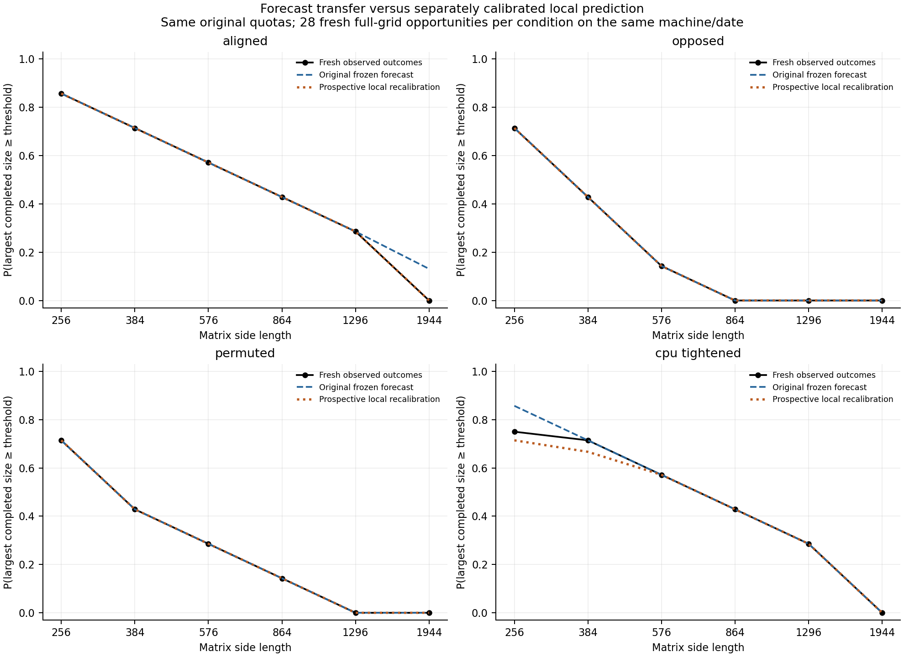
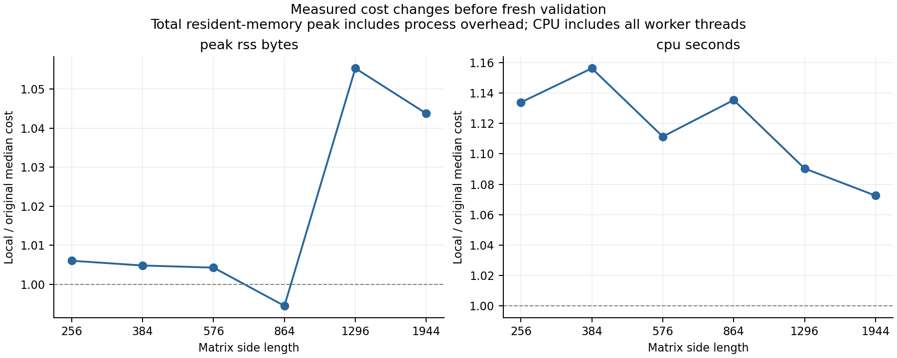

# Transfer of a frozen workload forecast across launches

1 October 2026. This follow-up evaluates the original
[workload pilot](workload-pilot.md) forecast against a fresh execution session.
It also evaluates a separately recalibrated forecast against those same outcomes.
The original measured data and hashed measurement/forecast implementations remain
the reference. The completed replication found failures of the original
forecast in two conditions. Local recalibration improved them, but did not
recover the CPU-tightened criterion.

## Question and declared comparison

Does the original cost calibration predict later completion under exactly the
original memory/CPU quota pairs? If its prediction changes in accuracy, does a
new calibration improve it without changing the tasks, budgets, or acceptance
rule?

The reference is the original frozen forecast, including its assigned quota
pairs and four maximum survival-error tolerances of $1/28$. The follow-up does
not derive new quotas from its local costs. A new local calibration supplies a
second forecast for the same fixed opportunities. Both forecasts are saved
before fresh validation begins, and both are evaluated against the same
validation records. This separates transfer of an existing forecast from
recalibration to the current launch.

The physical task remains a fresh child process executing three verified
float64 matrix products at sizes 256, 384, 576, 864, 1296, and 1944, with the
original warm-up and cooperative quota checks. The cost definitions remain
total process lifetime peak RSS in bytes, including imports/warm-up, and user
plus system CPU seconds after warm-up, including input construction, execution,
and numerical verification. Wall time remains a diagnostic. The task seed and
probe preserve the original matrix contents; the new experiment seed
`202610015` governs experimental ordering and analysis draws.

Twelve new complete calibration blocks give 72 measurements. The validation
design retains seven quota strata, four repetitions per stratum, four conditions
and all six sizes: 28 matched blocks and 672 fresh task executions. Aligned,
opposed and permuted budget pairings, and the CPU allowance multiplied by 0.65,
retain exactly their original meaning and quota values. Recalibration cannot
change their marginal distributions or select more favourable opportunities.

## Endpoints and analysis

For every opportunity, the endpoint is the largest accepted declared size, zero
when none is accepted. Acceptance at size 1944 remains upper censoring of an
unlimited-size endpoint. All individual task outcomes are retained, including
quota rejection, numerical failure and nonmonotone acceptance paths.

The primary transfer diagnostic is each original forecast's maximum absolute
survival-profile error on the six sizes compared with its original frozen
tolerance. The local calibration is a prospective comparator. It does not
replace the reference criterion after the outcomes are seen. The analysis also
reports paired changes in forecast error, full observed/predicted profiles,
quota-intervention contrasts, zero and censored opportunity counts, and actual
task statuses. A boundary equality or a failed comparison is reported as such.

Uncertainty for each forecast propagates its own whole calibration profiles.
Bootstrap comparisons resample the same matched validation blocks within quota
strata for both forecasts, preserving the pairing of conditions and complete
six-size paths. The old and new calibration sets are resampled separately.
These are conditional nominal intervals, not a guarantee of simultaneous
coverage or an independent-sample population inference. Serial executions on
the same machine can share thermal, frequency, memory-management and background
load variation.

## Results

The comparison freeze was saved at 20:59:28 UTC; all 672 validation records
follow it, from 20:59:43 to 21:01:06 UTC. The 72 new calibration tasks form a
separate sample from the original pilot and from the retained incomplete
precheck attempt. The [result JSON](../results/workload-transfer/study.json),
[comparison table](../results/workload-transfer/comparison.csv), and
[opportunity table](../results/workload-transfer/opportunities.csv) retain full
profiles and numerical results.

Each condition keeps the original tolerance $1/28=0.0357143$. Errors are maximum
absolute differences between observed and predicted survival on the six sizes.

| Condition | Original forecast on original pilot | Original forecast on fresh validation | Local forecast on that same fresh validation | Original / local criterion |
|---|---:|---:|---:|---|
| Aligned | 0.023810 | 0.130952 | 0 | Fail / pass |
| Opposed | 0 | 0 | 0 | Pass / pass |
| Permuted | 0 | 0 | 0 | Pass / pass |
| CPU tightened | 0.035714 | 0.107143 | 0.047619 | Fail / fail |

The original aligned forecast assigns probability 0.130952 to completion at
size 1944. Fresh aligned opportunities have no completion there. All four
attempts at that size under the highest aligned budget end at a CPU checkpoint;
the other 24 end at a memory checkpoint. The local calibration had already
predicted zero largest-size completion before these observations.

In the CPU-tightened condition, the observed survival at size 256 is 0.75,
compared with 0.857143 originally and 0.714286 locally. At size 384 the local
forecast is 0.666667 and the observed/original value is 0.714286. The improved
local forecast consequently still exceeds the unchanged criterion. The local
median-cost comparator reaches the criterion boundary, so these data do not
identify the empirical whole-block replay as the uniquely necessary model.

The paired mean-squared-error improvement from local recalibration is 0.002858
for aligned, with nominal bootstrap interval [0.001913, 0.003401]. It is 0.001323
for CPU-tightened, with interval [−0.002079, 0.003307]. The second interval
includes zero; a beneficial expected recalibration effect in that condition is
not established by this conditional comparison. Opposed/permuted predictions
coincide and their paired improvement is zero. Degenerate intervals at zero
reflect repeatable outcomes at these fixed strata, not population certainty.

Local median CPU costs are 7.3% to 15.6% higher than the original calibration,
depending on size. Median peak RSS ratios range from 0.9945 to 1.0553. At size
1944 median CPU rises from 0.243998 to 0.261692 seconds, exceeding the original
highest aligned CPU allowance of 0.256198 seconds. This is consistent with the
completion loss. The experiment does not identify whether background load,
thermal state, frequency, threading or another cause produced the change.

Validation statuses are 237 completed, 336 memory-quota rejections and 99
CPU-quota rejections, with no numerical-error status. There are no nonmonotone
opportunities and no largest-grid censoring. Zero-completion fractions are
0.142857, 0.285714, 0.285714 and 0.25 in the four conditions. The analysis retains
these zero outcomes instead of conditioning on success.

Joint cost replay and resource-independent cost replay still produce identical
profiles in each condition. Single-resource models miss opposed profiles by
0.428571 and permuted profiles by 0.285714. Budget-independence errors remain
0.244898, 0.183673, 0.081633 and 0.244898. Thus paired quota availability matters
in this design, while a unique dependence structure of measured costs is not
identified. Interventions relative to aligned are also retained: original
contrast errors are 0.130952; local errors are zero for opposed/permuted and
0.047619 for CPU tightening.

## What this experiment establishes

This is a later software launch on the same machine and date. It tests transfer
across launches under the declared task and quota definitions. It is not a
different-machine replication or evidence of day-to-day stability.

The original forecasts transfer exactly for opposed/permuted quotas, but fail
their original exploratory criterion for aligned and CPU-tightened quotas.
Recalibration recovers aligned prediction and improves the point error under
CPU tightening without recovering that criterion. A single successful pilot
therefore did not establish stable accuracy even across launches on this same
machine/date. The residual CPU-tightened error motivates further measurement
of execution drift or a richer cost model; it is not removed by widening the
tolerance after observing it.

The acceptance criteria and resource budgets are assigned. These results do not
measure spontaneous allocation, establish resource neutrality, or infer a power
law. For the broader dimensionality proposal, the experiment checks whether
independent resource measurements support forecasts before outcomes; selecting
a natural allocation profile remains a separate empirical question.

## Provenance and reproducibility

The follow-up records parent-run lineage, the immutable original plan and
calibration hashes, its own calibration and prospective comparison freeze,
all fresh task observations, the numerical analysis and figures. Source hashes
identify the preserved measurement and forecast algorithms; transfer orchestration
has its own hash. Hardware/software fingerprints describe the new session and
allow differences from the reference to be inspected.

The [raw run directory](../data/workload-transfer/2026-10-01b/) retains the
specification, calibration, comparison freeze, validation and registry entry.
Its [hardware record](../data/workload-transfer/2026-10-01b/hardware-metadata.json)
reports Apple M1 Max, 10 logical CPUs, 32 GiB RAM, Darwin 25.6.0, macOS 26.6.2
build 25G83, Python 3.11.6, NumPy 2.3.5 and Accelerate BLAS. This fingerprint was
collected before calibration and does not fill missing historical facts for the
first pilot. The original measurement-source hashes remain unchanged.

An earlier 72-task calibration is retained separately in
`data/workload-transfer/2026-10-01/`. An exact resource-description check rejected
“import” versus “imports” wording before a comparison freeze or validation.
It was registered as incomplete and not used to choose or fit the completed
run's predictions. The [central registry](run-registry.md) retains this attempt,
the original pilot and the clean replication with separate identifiers and
source/configuration snapshots.

Input matrices are regenerated from the unchanged deterministic seed and
preserved source/NumPy version; full arrays are not archived. Requested BLAS
thread settings are retained. On this Apple Accelerate installation the actual
runtime thread count is not verified, and process CPU still accounts for all
worker threads. The archive supports reanalysis and repeating the declared
task; identical execution performance is not guaranteed.

To inspect/reuse the retained comparison without collecting measurements or
overwriting its output bytes:

~~~bash
make workload-transfer-report PY=python3.11
make registry-verify PY=python3.11
~~~

To collect another transfer comparison on new hardware or in a later session,
retain the original reference and select new data/output directories:

~~~bash
PYTHONPATH=src MPLCONFIGDIR=build/matplotlib python3.11 \
  experiments/run_workload_transfer.py --stage all \
  --directory data/workload-transfer/NEW-ID \
  --output results/workload-transfer-NEW-ID
~~~

This gathers its own local calibration, freezes both forecasts on original
quotas, executes validation, reports the comparison and appends a new run.
The registry must already contain the original reference (`make run-registry`).
The preserved runner requires its original source hashes and NumPy version
so regenerated task inputs retain the declared identity. A different algorithm
or NumPy version needs a separately specified study with its own input identity.
